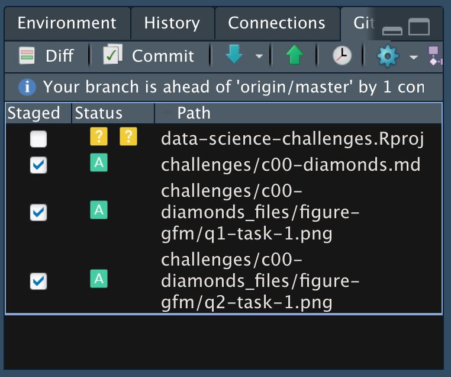

*Purpose*: Throughout this course, you'll complete a large number of *exercises* and *challenges*. Exercises are meant to introduce content with easy-to-solve problems, while challenges are meant to make you think more deeply about and apply the content. The challenges will start out highly-scaffolded, and become progressively open-ended.

In this challenge, you will go through the process of exploring, documenting, and sharing an analysis of a dataset. We will use these skills again and again in each challenge.

*Note*: You will have seen all of these steps in `e-vis00-basics`. This challenge is *primarily* a practice run of the submission system. The Data Exploration part should be very simple.

<!-- include-rubric -->

# Grading Rubric

<!-- -------------------------------------------------- -->

Unlike exercises, **challenges will be graded**. The following rubrics define how you will be graded, both on an individual and team basis.

## Individual

<!-- ------------------------- -->

| Category | Needs Improvement | Satisfactory |
|------------------------|------------------------|------------------------|
| Effort | Some task **q**'s left unattempted | All task **q**'s attempted |
| Observed | Did not document observations, or observations incorrect | Documented correct observations based on analysis |
| Supported | Some observations not clearly supported by analysis | All observations clearly supported by analysis (table, graph, etc.) |
| Assessed | Observations include claims not supported by the data, or reflect a level of certainty not warranted by the data | Observations are appropriately qualified by the quality & relevance of the data and (in)conclusiveness of the support |
| Specified | Uses the phrase "more data are necessary" without clarification | Any statement that "more data are necessary" specifies which *specific* data are needed to answer what *specific* question |
| Code Styled | Violations of the [style guide](https://style.tidyverse.org/) hinder readability | Code sufficiently close to the [style guide](https://style.tidyverse.org/) |

## Submission

<!-- ------------------------- -->

Make sure to commit both the challenge report (`report.md` file) and supporting files (`report_files/` folder) when you are done! Then submit a link to Canvas. **Your Challenge submission is not complete without all files uploaded to GitHub.**

```{r setup}
library(tidyverse)
```

# Data Exploration

<!-- -------------------------------------------------- -->

In this first stage, you will explore the `diamonds` dataset and document your observations.

### **q1** Create a plot of `price` vs `carat` of the `diamonds` dataset below. Document your observations from the visual.

*Hint*: We learned how to do this in `e-vis00-basics`!

```{r q1-task}
## TASK: Plot `price` vs `carat` below
diamonds %>% 
ggplot() +
  geom_point(aes(carat, price))
```

**Observations**:

-   The price and the carat have some relation where as carat increases, the price increases as well.
-   However, this is a messy relation and there is a lot of variation within the pricing per carat (as we saw in past exercises, this is likely due to differences in quality and clarity).

### **q2** Create a visualization showing variables `carat`, `price`, and `cut` simultaneously. Experiment with which variable you assign to which aesthetic (`x`, `y`, etc.) to find an effective visual.

```{r q2-task}
## TASK: Plot `price`, `carat`, and `cut` below
diamonds %>% 
ggplot() +
  geom_point(aes(x = carat, y = price, color = cut))
```

**Observations**:

-   There is a a messy relationship between price and carat that exemplifies an overall trend where as carat increases so does price. However, within each carat there is a lot of variance with pricing. By mapping cut, we can see that the differences in cut have a large impact on the price. That is, those with a "fair" or "good" cut have a much lower price compared to those with a "premium" or "ideal" cut which have a much higher price. By mapping all three of these variables on the same plot, we are able to better breakdown the trend between carat and price and understand that the relationship is not simply two variables.

# Communication

<!-- -------------------------------------------------- -->

In this next stage, you will render your data exploration, push it to GitHub to share with others, and link your observations within our [Data Science Wiki](https://olin-data-science.fandom.com/wiki/Olin_Data_Science_Wiki).

### **q3** *Knit* your document in order to create a report.

You can do this by clicking the "Knit" button at the top of your document in RStudio.


This will create a local `.md` file, and RStudio will automatically open a preview window so you can view your knitted document.

### **q4** *Push* your knitted document to GitHub.


You will need to stage both the `.md` file, as well as the `_files` folder. Note that the `_files` folder, when staged, will expand to include all the files under that directory.



### **q5** *Submit* your work to Canvas

Navigate to your GitHub repository's website and find the URL that corresponds to your report. Submit this to Canvas to complete the assignment.

### **q6** *Prepare* to present your team's findings!

If your team is on-deck, you are responsible for putting together a discussion of the challenge. I'll demonstrate how to do this by leading the discussion of Challenge 0.
