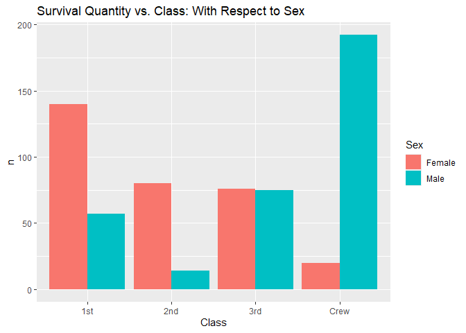
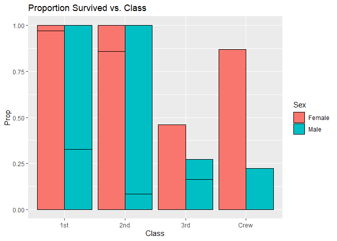
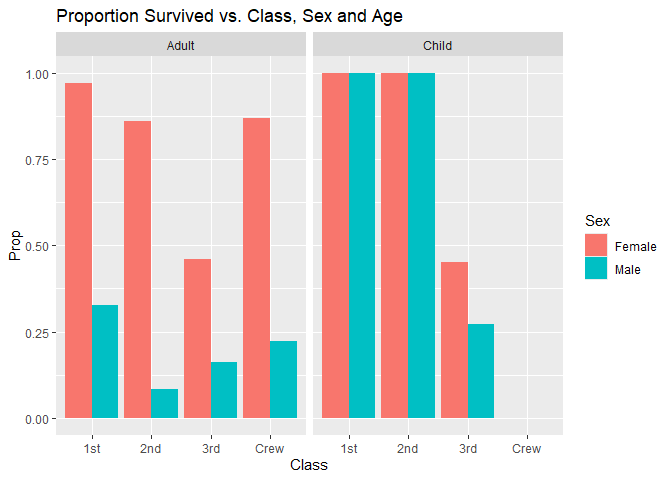
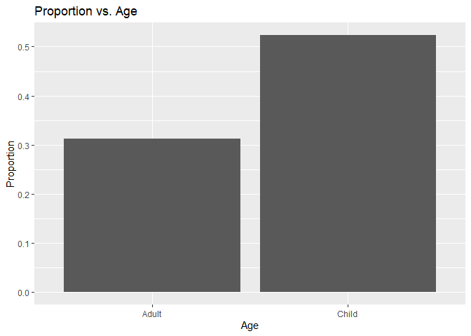
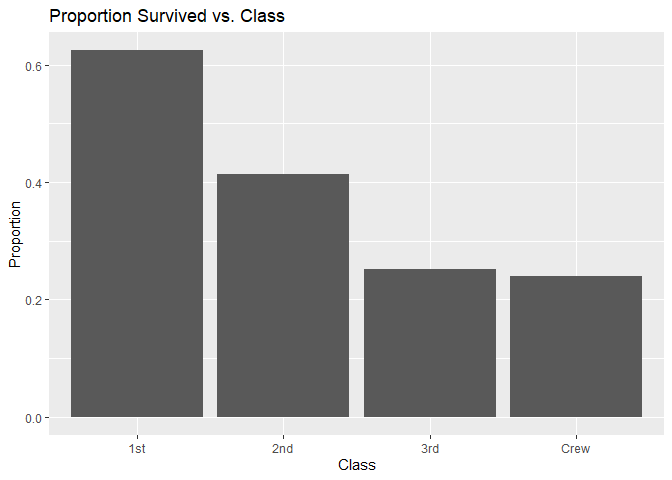
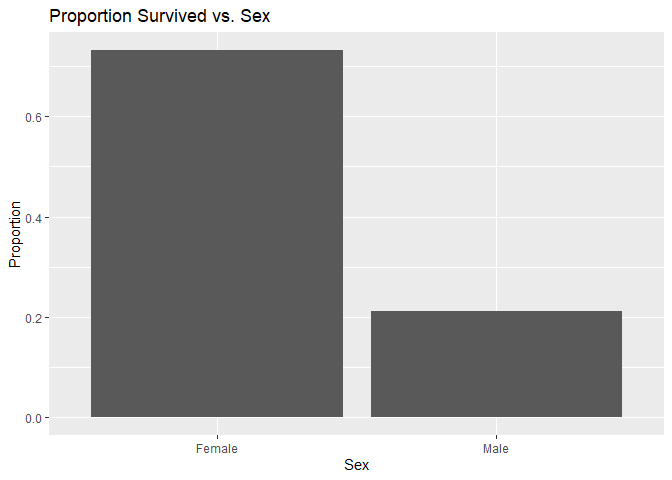

RMS Titanic
================
Katherine Danielson
02-02-2025

- [Grading Rubric](#grading-rubric)
  - [Individual](#individual)
  - [Submission](#submission)
- [First Look](#first-look)
  - [**q1** Perform a glimpse of `df_titanic`. What variables are in
    this
    dataset?](#q1-perform-a-glimpse-of-df_titanic-what-variables-are-in-this-dataset)
  - [**q2** Skim the Wikipedia article on the RMS Titanic, and look for
    a total count of souls aboard. Compare against the total computed
    below. Are there any differences? Are those differences large or
    small? What might account for those
    differences?](#q2-skim-the-wikipedia-article-on-the-rms-titanic-and-look-for-a-total-count-of-souls-aboard-compare-against-the-total-computed-below-are-there-any-differences-are-those-differences-large-or-small-what-might-account-for-those-differences)
  - [**q3** Create a plot showing the count of persons who *did*
    survive, along with aesthetics for `Class` and `Sex`. Document your
    observations
    below.](#q3-create-a-plot-showing-the-count-of-persons-who-did-survive-along-with-aesthetics-for-class-and-sex-document-your-observations-below)
- [Deeper Look](#deeper-look)
  - [**q4** Replicate your visual from q3, but display `Prop` in place
    of `n`. Document your observations, and note any new/different
    observations you make in comparison with q3. Is there anything
    *fishy* in your
    plot?](#q4-replicate-your-visual-from-q3-but-display-prop-in-place-of-n-document-your-observations-and-note-any-newdifferent-observations-you-make-in-comparison-with-q3-is-there-anything-fishy-in-your-plot)
  - [**q5** Create a plot showing the group-proportion of occupants who
    *did* survive, along with aesthetics for `Class`, `Sex`, *and*
    `Age`. Document your observations
    below.](#q5-create-a-plot-showing-the-group-proportion-of-occupants-who-did-survive-along-with-aesthetics-for-class-sex-and-age-document-your-observations-below)
  - [Work and Manipulations for
    Presentation](#work-and-manipulations-for-presentation)
- [Notes](#notes)

*Purpose*: Most datasets have at least a few variables. Part of our task
in analyzing a dataset is to understand trends as they vary across these
different variables. Unless we’re careful and thorough, we can easily
miss these patterns. In this challenge you’ll analyze a dataset with a
small number of categorical variables and try to find differences among
the groups.

*Reading*: (Optional) [Wikipedia
article](https://en.wikipedia.org/wiki/RMS_Titanic) on the RMS Titanic.

<!-- include-rubric -->

# Grading Rubric

<!-- -------------------------------------------------- -->

Unlike exercises, **challenges will be graded**. The following rubrics
define how you will be graded, both on an individual and team basis.

## Individual

<!-- ------------------------- -->

| Category | Needs Improvement | Satisfactory |
|----|----|----|
| Effort | Some task **q**’s left unattempted | All task **q**’s attempted |
| Observed | Did not document observations, or observations incorrect | Documented correct observations based on analysis |
| Supported | Some observations not clearly supported by analysis | All observations clearly supported by analysis (table, graph, etc.) |
| Assessed | Observations include claims not supported by the data, or reflect a level of certainty not warranted by the data | Observations are appropriately qualified by the quality & relevance of the data and (in)conclusiveness of the support |
| Specified | Uses the phrase “more data are necessary” without clarification | Any statement that “more data are necessary” specifies which *specific* data are needed to answer what *specific* question |
| Code Styled | Violations of the [style guide](https://style.tidyverse.org/) hinder readability | Code sufficiently close to the [style guide](https://style.tidyverse.org/) |

## Submission

<!-- ------------------------- -->

Make sure to commit both the challenge report (`report.md` file) and
supporting files (`report_files/` folder) when you are done! Then submit
a link to Canvas. **Your Challenge submission is not complete without
all files uploaded to GitHub.**

``` r
library(tidyverse)
```

    ## ── Attaching core tidyverse packages ──────────────────────── tidyverse 2.0.0 ──
    ## ✔ dplyr     1.1.4     ✔ readr     2.1.5
    ## ✔ forcats   1.0.0     ✔ stringr   1.5.1
    ## ✔ ggplot2   3.5.1     ✔ tibble    3.2.1
    ## ✔ lubridate 1.9.4     ✔ tidyr     1.3.1
    ## ✔ purrr     1.0.2     
    ## ── Conflicts ────────────────────────────────────────── tidyverse_conflicts() ──
    ## ✖ dplyr::filter() masks stats::filter()
    ## ✖ dplyr::lag()    masks stats::lag()
    ## ℹ Use the conflicted package (<http://conflicted.r-lib.org/>) to force all conflicts to become errors

``` r
df_titanic <- as_tibble(Titanic)
```

*Background*: The RMS Titanic sank on its maiden voyage in 1912; about
67% of its passengers died.

# First Look

<!-- -------------------------------------------------- -->

### **q1** Perform a glimpse of `df_titanic`. What variables are in this dataset?

``` r
## TASK: Perform a `glimpse` of df_titanic
df_titanic %>% 
  glimpse()
```

    ## Rows: 32
    ## Columns: 5
    ## $ Class    <chr> "1st", "2nd", "3rd", "Crew", "1st", "2nd", "3rd", "Crew", "1s…
    ## $ Sex      <chr> "Male", "Male", "Male", "Male", "Female", "Female", "Female",…
    ## $ Age      <chr> "Child", "Child", "Child", "Child", "Child", "Child", "Child"…
    ## $ Survived <chr> "No", "No", "No", "No", "No", "No", "No", "No", "No", "No", "…
    ## $ n        <dbl> 0, 0, 35, 0, 0, 0, 17, 0, 118, 154, 387, 670, 4, 13, 89, 3, 5…

**Observations**:

- The main variables in the df_titanic() dataset are Class, Sex, Age,
  Survived, and “n” which denotes the number of people on the Titanic
  that fell under a certain classification. The “Class” variable is
  formed of four main facets: 1st class, 2nd class, 3rd class and crew.
  The “Sex” variable is a binary of male and female. The “Age” variable
  is broken down into two categories adult and child. The survived
  category simply notes a “yes” or “no” on whether or not people
  survived. When combining these different variables, we get a
  classification of a person based, and the “n” variable notes how many
  people that fit that exact classification survived. For example, there
  were no people who were a 1st class male child that did not survive.
- There are 5 columns and 32 rows – suggesting 32 different
  classifications of individuals. Looking briefly, it appears a large
  portion of individuals died.

### **q2** Skim the [Wikipedia article](https://en.wikipedia.org/wiki/RMS_Titanic) on the RMS Titanic, and look for a total count of souls aboard. Compare against the total computed below. Are there any differences? Are those differences large or small? What might account for those differences?

``` r
## NOTE: No need to edit! We'll cover how to
## do this calculation in a later exercise.
df_titanic %>% summarize(total = sum(n))
```

    ## # A tibble: 1 × 1
    ##   total
    ##   <dbl>
    ## 1  2201

**Observations**:

- The Wikipedia article notes that there were an estimated 2,224
  passengers and crew aboard. Out of this, they express approximately
  1,500 individuals died. Comparatively, the Titanic data set only
  accounts for 2,201 individuals.
- Are there any differences?
  - There are differences between the Wikipedia article and df_titanic()
    data set. As the Wikipedia expresses there were 2,224 passengers and
    crew on board and the data set expresses only 2,201 people on board,
    there is a difference of 23 individuals. This means that there is a
    small difference of 23 people. Assuming the Wikipedia numbers are
    correct, the data set is missing only ~1% of its individuals.
- If yes, what might account for those differences?
  - As the data set has a variety of different variables, it is possible
    that for the 23 people not accounted for, certain or all variables
    may not have been able to be found as tracking during that time was
    limited. Other possibilities for the differences in the data set
    quantity of individuals may be due to faulty numbers on Wikipedia.
    As Wikipedia is not the most trusted source, these numbers may be
    slightly off and the data set could be pulling from a different
    location.

### **q3** Create a plot showing the count of persons who *did* survive, along with aesthetics for `Class` and `Sex`. Document your observations below.

*Note*: There are many ways to do this.

``` r
## TASK: Visualize counts against `Class` and `Sex`
df_titanic %>% 
  filter (Survived == "Yes") %>%       #filter by survived
  ggplot(aes(Class, n, fill = Sex)) +  #assigns variables
  geom_col(position = "dodge")  +      #unstacks male and female data
  labs(title = "Survival Quantity vs. Class: With Respect to Sex ")
```

<!-- -->

``` r
#You do not need to group_by or sum(n) as when plotting with aes it will be filtering the categories and pulling anyone who fits the sex, class together -- inherently summing n
```

**Observations**:

- 2nd Class had the least number of survivors while the Crew had the
  greatest number of survivors. (The fact that the largest number of
  survivors was from the crew surprised me–I wonder if they knew the
  boat better and how to get off, if they were given priority or if they
  were the largest number of people on board. To determine this, we
  could look at the proportion of the crew to the rest of the
  occupants.) Out of all of the other classes, 1st Class having the
  highest level of survival makes sense to me as I feel they would have
  been given priority.

- In 1st and 2nd Class, the majority of individuals who survived were
  female while in 3rd Class, the division between male and female
  survivors seemed fairly equal. The Crew had many more male survivors
  than females. It would be interesting to look into the sex makeup
  (proportion) of the passengers and crew to see if maybe the majority
  of the crew was male, so the low female survival was not due to many
  dying, but rather few females as crew. This could also be further
  analyzed by looking at the proportion of survival within sex to see if
  there was a social prioritization of females over males.

- By diving deeper and looking at the proportions overall and seeing how
  many people were actually in each class as well would be interesting.
  While this graph is useful, it does not contextualize the data in the
  larger whole and leaves a lot to be wondered.

# Deeper Look

<!-- -------------------------------------------------- -->

Raw counts give us a sense of totals, but they are not as useful for
understanding differences between groups. This is because the
differences we see in counts could be due to either the relative size of
the group OR differences in outcomes for those groups. To make
comparisons between groups, we should also consider *proportions*.\[1\]

The following code computes proportions within each `Class, Sex, Age`
group.

``` r
## NOTE: No need to edit! We'll cover how to
## do this calculation in a later exercise.
df_prop <-
  df_titanic %>%
  group_by(Class, Sex, Age) %>%
  mutate(
    Total = sum(n),
    Prop = n / Total
  ) %>%
  ungroup()
df_prop
```

    ## # A tibble: 32 × 7
    ##    Class Sex    Age   Survived     n Total    Prop
    ##    <chr> <chr>  <chr> <chr>    <dbl> <dbl>   <dbl>
    ##  1 1st   Male   Child No           0     5   0    
    ##  2 2nd   Male   Child No           0    11   0    
    ##  3 3rd   Male   Child No          35    48   0.729
    ##  4 Crew  Male   Child No           0     0 NaN    
    ##  5 1st   Female Child No           0     1   0    
    ##  6 2nd   Female Child No           0    13   0    
    ##  7 3rd   Female Child No          17    31   0.548
    ##  8 Crew  Female Child No           0     0 NaN    
    ##  9 1st   Male   Adult No         118   175   0.674
    ## 10 2nd   Male   Adult No         154   168   0.917
    ## # ℹ 22 more rows

### **q4** Replicate your visual from q3, but display `Prop` in place of `n`. Document your observations, and note any new/different observations you make in comparison with q3. Is there anything *fishy* in your plot?

``` r
df_prop %>% 
  filter(Survived == "Yes") %>% 
  ggplot(aes(Class, Prop, fill = Sex)) +
  geom_col(position = "dodge", color = "black") +  #black outlines and shows adults and children overlayed
  labs(title = "Proportion Survived vs. Class")
```

    ## Warning: Removed 2 rows containing missing values or values outside the scale range
    ## (`geom_col()`).

<!-- -->

**Observations**:

- The proportions of female vs. male are independent of one another and
  are thus best represented when using position = “dodge” as they
  compare who did survive to who didn’t survive within the sex and
  class.
- From this, we can see that it looks like 100% of males and females in
  both 1st and 2nd class survived (This may seem highly surprising at
  first; however, as we will see later in question 5, this is not
  actually the case as the data of adult and child is being overlayed.
  This overlapping of proportion of survival in both child and adult
  makes the proportions appear much higher. By having the feature col =
  “black” in the geom_col code, we can see where exactly the bars
  overlap. Note that there is no overlap for crew as there were no
  children in crew, and there appears no overlap for third class females
  as the female child and female adult survival is about the same.). In
  third class, less than 50% of females in this class survived, and
  roughly only 25% of males survived. In third class, there was a lower
  proportion of surviving individuals. Due to a lack of
  conceptualization in total numbers of individuals, you cannot compare
  the proportions between classes and know for sure if less females
  survived in third class than in crew (which had a much higher survival
  rate) as the total population of females in third class could be much
  larger than that in crew. This is much more visible in the prior graph
  where it shows the total number of individuals who survived because
  you can compare the survival between classes. However, the first graph
  does not actually show the proportion of individuals who survived. It
  would be ideal to combine these graphs to see what proportion of the
  original whole survived in relation to the original numbers.
- Is there anything *fishy* going on in your plot?
  - This graph truly highlights the ratio of male-to-female survival and
    a bit of class-to-class survival. When looking at both third class
    and crew, a much higher proportion of the women present in that
    class survived. This highlights the social and cultural dynamic of
    women and children first in emergencies. Further, you can see a bit
    of class prioritization as well. Those who were in higher classes
    (first and second) had a much higher proportion of survivors. This
    can not only be viewed in the sense of prioritization of class, but
    also of status and money: people with more money essentially could
    pay to survive. To understand this fully, more data is necessary. We
    could better understand this by including age in the graphs and
    seeing if that has an influence on proportions of survival and
    breaking the data down a bit further.

### **q5** Create a plot showing the group-proportion of occupants who *did* survive, along with aesthetics for `Class`, `Sex`, *and* `Age`. Document your observations below.

*Hint*: Don’t forget that you can use `facet_grid` to help consider
additional variables!

``` r
df_prop %>% 
  filter(Survived == "Yes") %>% 
  ggplot(aes(Class, Prop, fill = Sex)) +
  geom_col(position = "dodge") +
  facet_grid(~Age) +
  labs(title = "Proportion Survived vs. Class, Sex and Age")
```

    ## Warning: Removed 2 rows containing missing values or values outside the scale range
    ## (`geom_col()`).

<!-- -->

**Observations**:

- This graph is the most descriptive and useful graph as it breaks down
  the indivudals who survived the titanic into class, age and sex. An
  overarching trend of more females than males surviving in all classes
  is seen. When viewing this graph, it can be seen that in first and
  second class, all of the children survived – both male and female.
  Largely, this visualization of the data suggests that children had a
  higher proportion of survival. Another trend that is exhibited is the
  trend based on class. It appears as though the higher the class, or
  the more money you paid, the more likely you are to survive. One last
  thing to note is that there were no children in crew.
- An important thing to note is that this graph creates a bit of
  confusion with the dataset and possible code computations. When
  looking at the Q4 graph, it makes it appear as though everyone in
  first and second class survived. However, this is problematic as when
  you look at the df_prop data set and the graph created in Q5, not all
  adults, especially male, in first and second class survived. This
  could possibly due to the fact that children in both of those classes
  had a 100% survival rate – these proportions, when combined with
  adults (who had very low survival rates), if not manipulated correctly
  could lead to skewing in the data set. By separating the variable
  “Age” it unoverlaps the two graphs and makes the proportions appear
  correctly. (See commentary on coloring and overlapping from Q4 for
  more detail.)
- If you saw something *fishy* in q4 above, use your new plot to explain
  the fishy-ness.
  - My hypothesis about there being a social and cultural bias of
    prioritizing females and children and those with wealth was proven
    correct by looking at this graph. This graph shows that a much
    higher proportion of females survived than the proportion of males,
    and a much higher proportion of children survived than adults. As
    mentioned before this is likely because children and women are put
    first due to cultural norms. Further, as seen, especially within the
    adult’s section of the graphs, class came into play when looking at
    the proportion of survival. A higher proportion of the men and women
    in first class survived than those in second and than those in
    third. This is likely because those of higher status and class are
    protected in society.

## Work and Manipulations for Presentation

Disregard for challenge grading. These graphs and manipulations are only
beneficial for the challenge presentation.

``` r
df_titanic %>%
  filter(Age == "Child") %>%
  summarize(total_kids = sum(n))
```

    ## # A tibble: 1 × 1
    ##   total_kids
    ##        <dbl>
    ## 1        109

``` r
df_titanic %>%
  filter(Age == "Child", Survived == "Yes") %>%
  summarize(survived_kids = sum(n))
```

    ## # A tibble: 1 × 1
    ##   survived_kids
    ##           <dbl>
    ## 1            57

``` r
df_prop2 <-
  df_titanic %>%
  select(Age, Survived, n)%>%
  group_by(Age) %>%
  mutate(
    Total2 = sum(n),
    Proportion = n / Total2
  ) %>%
  ungroup()
df_prop2
```

    ## # A tibble: 32 × 5
    ##    Age   Survived     n Total2 Proportion
    ##    <chr> <chr>    <dbl>  <dbl>      <dbl>
    ##  1 Child No           0    109     0     
    ##  2 Child No           0    109     0     
    ##  3 Child No          35    109     0.321 
    ##  4 Child No           0    109     0     
    ##  5 Child No           0    109     0     
    ##  6 Child No           0    109     0     
    ##  7 Child No          17    109     0.156 
    ##  8 Child No           0    109     0     
    ##  9 Adult No         118   2092     0.0564
    ## 10 Adult No         154   2092     0.0736
    ## # ℹ 22 more rows

``` r
df_prop2 %>% 
  filter(Survived == "Yes") %>%
  ggplot(aes(Age, Proportion)) +
  geom_col() +
  labs(title = "Proportion vs. Age")
```

<!-- -->

``` r
df_prop3 <-
  df_titanic %>%
  select(Class, Survived, n)%>%
  group_by(Class) %>%
  mutate(
    Total3 = sum(n),
    Proportion = n / Total3
  ) %>%
  ungroup()
df_prop3
```

    ## # A tibble: 32 × 5
    ##    Class Survived     n Total3 Proportion
    ##    <chr> <chr>    <dbl>  <dbl>      <dbl>
    ##  1 1st   No           0    325     0     
    ##  2 2nd   No           0    285     0     
    ##  3 3rd   No          35    706     0.0496
    ##  4 Crew  No           0    885     0     
    ##  5 1st   No           0    325     0     
    ##  6 2nd   No           0    285     0     
    ##  7 3rd   No          17    706     0.0241
    ##  8 Crew  No           0    885     0     
    ##  9 1st   No         118    325     0.363 
    ## 10 2nd   No         154    285     0.540 
    ## # ℹ 22 more rows

``` r
df_prop3 %>% 
  filter(Survived == "Yes") %>%
  ggplot(aes(Class, Proportion)) +
  geom_col() +
  labs(title = "Proportion Survived vs. Class")
```

<!-- -->

``` r
df_prop4 <-
  df_titanic %>%
  select(Sex, Survived, n)%>%
  group_by(Sex) %>%
  mutate(
    Total4 = sum(n),
    Proportion = n / Total4
  ) %>%
  ungroup()
df_prop4
```

    ## # A tibble: 32 × 5
    ##    Sex    Survived     n Total4 Proportion
    ##    <chr>  <chr>    <dbl>  <dbl>      <dbl>
    ##  1 Male   No           0   1731     0     
    ##  2 Male   No           0   1731     0     
    ##  3 Male   No          35   1731     0.0202
    ##  4 Male   No           0   1731     0     
    ##  5 Female No           0    470     0     
    ##  6 Female No           0    470     0     
    ##  7 Female No          17    470     0.0362
    ##  8 Female No           0    470     0     
    ##  9 Male   No         118   1731     0.0682
    ## 10 Male   No         154   1731     0.0890
    ## # ℹ 22 more rows

``` r
df_prop4 %>% 
  filter(Survived == "Yes") %>%
  ggplot(aes(Sex, Proportion)) +
  geom_col() +
  labs(title = "Proportion Survived vs. Sex")
```

<!-- -->

# Notes

<!-- -------------------------------------------------- -->

\[1\] This is basically the same idea as [Dimensional
Analysis](https://en.wikipedia.org/wiki/Dimensional_analysis); computing
proportions is akin to non-dimensionalizing a quantity.
