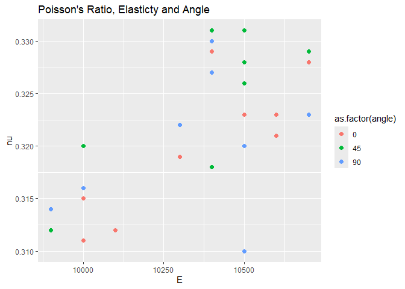

Aluminum Data
================
Katherine Danielson
02-11-2025

- [Grading Rubric](#grading-rubric)
  - [Individual](#individual)
  - [Submission](#submission)
- [Loading and Wrangle](#loading-and-wrangle)
  - [**q1** Tidy `df_stang` to produce `df_stang_long`. You should have
    column names `thick, alloy, angle, E, nu`. Make sure the `angle`
    variable is of correct type. Filter out any invalid
    values.](#q1-tidy-df_stang-to-produce-df_stang_long-you-should-have-column-names-thick-alloy-angle-e-nu-make-sure-the-angle-variable-is-of-correct-type-filter-out-any-invalid-values)
- [EDA](#eda)
  - [Initial checks](#initial-checks)
    - [**q2** Perform a basic EDA on the aluminum data *without
      visualization*. Use your analysis to answer the questions under
      *observations* below. In addition, add your own *specific*
      question that you’d like to answer about the data—you’ll answer it
      below in
      q3.](#q2-perform-a-basic-eda-on-the-aluminum-data-without-visualization-use-your-analysis-to-answer-the-questions-under-observations-below-in-addition-add-your-own-specific-question-that-youd-like-to-answer-about-the-datayoull-answer-it-below-in-q3)
  - [Visualize](#visualize)
    - [**q3** Create a visualization to investigate your question from
      q2 above. Can you find an answer to your question using the
      dataset? Would you need additional information to answer your
      question?](#q3-create-a-visualization-to-investigate-your-question-from-q2-above-can-you-find-an-answer-to-your-question-using-the-dataset-would-you-need-additional-information-to-answer-your-question)
    - [**q4** Consider the following
      statement:](#q4-consider-the-following-statement)
- [References](#references)

*Purpose*: When designing structures such as bridges, boats, and planes,
the design team needs data about *material properties*. Often when we
engineers first learn about material properties through coursework, we
talk about abstract ideas and look up values in tables without ever
looking at the data that gave rise to published properties. In this
challenge you’ll study an aluminum alloy dataset: Studying these data
will give you a better sense of the challenges underlying published
material values.

In this challenge, you will load a real dataset, wrangle it into tidy
form, and perform EDA to learn more about the data.

<!-- include-rubric -->

# Grading Rubric

<!-- -------------------------------------------------- -->

Unlike exercises, **challenges will be graded**. The following rubrics
define how you will be graded, both on an individual and team basis.

## Individual

<!-- ------------------------- -->

| Category | Needs Improvement | Satisfactory |
|----|----|----|
| Effort | Some task **q**’s left unattempted | All task **q**’s attempted |
| Observed | Did not document observations, or observations incorrect | Documented correct observations based on analysis |
| Supported | Some observations not clearly supported by analysis | All observations clearly supported by analysis (table, graph, etc.) |
| Assessed | Observations include claims not supported by the data, or reflect a level of certainty not warranted by the data | Observations are appropriately qualified by the quality & relevance of the data and (in)conclusiveness of the support |
| Specified | Uses the phrase “more data are necessary” without clarification | Any statement that “more data are necessary” specifies which *specific* data are needed to answer what *specific* question |
| Code Styled | Violations of the [style guide](https://style.tidyverse.org/) hinder readability | Code sufficiently close to the [style guide](https://style.tidyverse.org/) |

## Submission

<!-- ------------------------- -->

Make sure to commit both the challenge report (`report.md` file) and
supporting files (`report_files/` folder) when you are done! Then submit
a link to Canvas. **Your Challenge submission is not complete without
all files uploaded to GitHub.**

``` r
library(tidyverse)
```

    ## ── Attaching core tidyverse packages ──────────────────────── tidyverse 2.0.0 ──
    ## ✔ dplyr     1.1.4     ✔ readr     2.1.5
    ## ✔ forcats   1.0.0     ✔ stringr   1.5.1
    ## ✔ ggplot2   3.5.1     ✔ tibble    3.2.1
    ## ✔ lubridate 1.9.4     ✔ tidyr     1.3.1
    ## ✔ purrr     1.0.2     
    ## ── Conflicts ────────────────────────────────────────── tidyverse_conflicts() ──
    ## ✖ dplyr::filter() masks stats::filter()
    ## ✖ dplyr::lag()    masks stats::lag()
    ## ℹ Use the conflicted package (<http://conflicted.r-lib.org/>) to force all conflicts to become errors

*Background*: In 1946, scientists at the Bureau of Standards tested a
number of Aluminum plates to determine their
[elasticity](https://en.wikipedia.org/wiki/Elastic_modulus) and
[Poisson’s ratio](https://en.wikipedia.org/wiki/Poisson%27s_ratio).
These are key quantities used in the design of structural members, such
as aircraft skin under [buckling
loads](https://en.wikipedia.org/wiki/Buckling). These scientists tested
plats of various thicknesses, and at different angles with respect to
the [rolling](https://en.wikipedia.org/wiki/Rolling_(metalworking))
direction.

# Loading and Wrangle

<!-- -------------------------------------------------- -->

The `readr` package in the Tidyverse contains functions to load data
form many sources. The `read_csv()` function will help us load the data
for this challenge.

``` r
## NOTE: If you extracted all challenges to the same location,
## you shouldn't have to change this filename
filename <- "./data/stang.csv"

## Load the data
df_stang <- read_csv(filename)
```

    ## Rows: 9 Columns: 8
    ## ── Column specification ────────────────────────────────────────────────────────
    ## Delimiter: ","
    ## chr (1): alloy
    ## dbl (7): thick, E_00, nu_00, E_45, nu_45, E_90, nu_90
    ## 
    ## ℹ Use `spec()` to retrieve the full column specification for this data.
    ## ℹ Specify the column types or set `show_col_types = FALSE` to quiet this message.

``` r
df_stang
```

    ## # A tibble: 9 × 8
    ##   thick  E_00 nu_00  E_45  nu_45  E_90 nu_90 alloy  
    ##   <dbl> <dbl> <dbl> <dbl>  <dbl> <dbl> <dbl> <chr>  
    ## 1 0.022 10600 0.321 10700  0.329 10500 0.31  al_24st
    ## 2 0.022 10600 0.323 10500  0.331 10700 0.323 al_24st
    ## 3 0.032 10400 0.329 10400  0.318 10300 0.322 al_24st
    ## 4 0.032 10300 0.319 10500  0.326 10400 0.33  al_24st
    ## 5 0.064 10500 0.323 10400  0.331 10400 0.327 al_24st
    ## 6 0.064 10700 0.328 10500  0.328 10500 0.32  al_24st
    ## 7 0.081 10000 0.315 10000  0.32   9900 0.314 al_24st
    ## 8 0.081 10100 0.312  9900  0.312 10000 0.316 al_24st
    ## 9 0.081 10000 0.311    -1 -1      9900 0.314 al_24st

Note that these data are not tidy! The data in this form are convenient
for reporting in a table, but are not ideal for analysis.

### **q1** Tidy `df_stang` to produce `df_stang_long`. You should have column names `thick, alloy, angle, E, nu`. Make sure the `angle` variable is of correct type. Filter out any invalid values.

*Hint*: You can reshape in one `pivot` using the `".value"` special
value for `names_to`.

``` r
## TASK: Tidy `df_stang`
df_stang_long <-
  df_stang %>% 
  pivot_longer(
    names_to = c(".value", "angle"),                       #keeps the values and the first part of the name
    names_sep = "_",                                             #says what to separate the name by
    cols = c("E_00", "E_45", "E_90", "nu_00", "nu_45", "nu_90")  #what columns to take from
  ) %>% 
  mutate(angle = as.integer(angle)) %>%                    #ensures all angles are integers
  filter(E >= 0, nu >= 0)                                  #filters out invalid values
df_stang_long
```

    ## # A tibble: 26 × 5
    ##    thick alloy   angle     E    nu
    ##    <dbl> <chr>   <int> <dbl> <dbl>
    ##  1 0.022 al_24st     0 10600 0.321
    ##  2 0.022 al_24st    45 10700 0.329
    ##  3 0.022 al_24st    90 10500 0.31 
    ##  4 0.022 al_24st     0 10600 0.323
    ##  5 0.022 al_24st    45 10500 0.331
    ##  6 0.022 al_24st    90 10700 0.323
    ##  7 0.032 al_24st     0 10400 0.329
    ##  8 0.032 al_24st    45 10400 0.318
    ##  9 0.032 al_24st    90 10300 0.322
    ## 10 0.032 al_24st     0 10300 0.319
    ## # ℹ 16 more rows

Use the following tests to check your work.

``` r
## NOTE: No need to change this
## Names
assertthat::assert_that(
              setequal(
                df_stang_long %>% names,
                c("thick", "alloy", "angle", "E", "nu")
              )
            )
```

    ## [1] TRUE

``` r
## Dimensions
assertthat::assert_that(all(dim(df_stang_long) == c(26, 5)))
```

    ## [1] TRUE

``` r
## Type
assertthat::assert_that(
              (df_stang_long %>% pull(angle) %>% typeof()) == "integer"
            )
```

    ## [1] TRUE

``` r
print("Very good!")
```

    ## [1] "Very good!"

# EDA

<!-- -------------------------------------------------- -->

## Initial checks

<!-- ------------------------- -->

### **q2** Perform a basic EDA on the aluminum data *without visualization*. Use your analysis to answer the questions under *observations* below. In addition, add your own *specific* question that you’d like to answer about the data—you’ll answer it below in q3.

``` r
glimpse(df_stang_long)
```

    ## Rows: 26
    ## Columns: 5
    ## $ thick <dbl> 0.022, 0.022, 0.022, 0.022, 0.022, 0.022, 0.032, 0.032, 0.032, 0…
    ## $ alloy <chr> "al_24st", "al_24st", "al_24st", "al_24st", "al_24st", "al_24st"…
    ## $ angle <int> 0, 45, 90, 0, 45, 90, 0, 45, 90, 0, 45, 90, 0, 45, 90, 0, 45, 90…
    ## $ E     <dbl> 10600, 10700, 10500, 10600, 10500, 10700, 10400, 10400, 10300, 1…
    ## $ nu    <dbl> 0.321, 0.329, 0.310, 0.323, 0.331, 0.323, 0.329, 0.318, 0.322, 0…

``` r
df_stang_long %>%       #shows there is not one set of material properties for the Aluminum
  filter(angle == 0)    #filters only by angle 0
```

    ## # A tibble: 9 × 5
    ##   thick alloy   angle     E    nu
    ##   <dbl> <chr>   <int> <dbl> <dbl>
    ## 1 0.022 al_24st     0 10600 0.321
    ## 2 0.022 al_24st     0 10600 0.323
    ## 3 0.032 al_24st     0 10400 0.329
    ## 4 0.032 al_24st     0 10300 0.319
    ## 5 0.064 al_24st     0 10500 0.323
    ## 6 0.064 al_24st     0 10700 0.328
    ## 7 0.081 al_24st     0 10000 0.315
    ## 8 0.081 al_24st     0 10100 0.312
    ## 9 0.081 al_24st     0 10000 0.311

``` r
df_stang_long %>%       #shows there is only one alloy
  distinct(alloy)
```

    ## # A tibble: 1 × 1
    ##   alloy  
    ##   <chr>  
    ## 1 al_24st

``` r
df_stang_long %>%       #shows there are 3 angles
  distinct(angle)
```

    ## # A tibble: 3 × 1
    ##   angle
    ##   <int>
    ## 1     0
    ## 2    45
    ## 3    90

``` r
df_stang_long %>%       #shows there are 4 thicknesses
  distinct(thick)
```

    ## # A tibble: 4 × 1
    ##   thick
    ##   <dbl>
    ## 1 0.022
    ## 2 0.032
    ## 3 0.064
    ## 4 0.081

**Observations**:

- Is there “one true value” for the material properties of Aluminum?
  - No, there is not “one true value” for the material properties of
    Aluminum. There are multiple different elasticity (E) and Poisson
    ratio (nu) values for the same thickness and angle. For example,
    when filtering for angle == 0, at thickness 0.022, there are two
    different values for nu, and at thickness 0.032, there are different
    E and nu values.
- How many aluminum alloys are in this dataset? How do you know?
  - There is only one aluminum alloy in the dataset. I know this as when
    analyzing the alloy column, “al_24st” is the only distinct value.
- What angles were tested?
  - There were only three angles tested: 0 degrees, 45 degrees and 90
    degrees.
- What thicknesses were tested?
  - The thicknesses that were tested are 0.022, 0.032, 0.064 and 0.081.
- My Question:
  - What is the relationship between Poisson’s ratio and elasticity?
    Does angle impact this relationship?

## Visualize

<!-- ------------------------- -->

### **q3** Create a visualization to investigate your question from q2 above. Can you find an answer to your question using the dataset? Would you need additional information to answer your question?

``` r
df_stang_long %>% 
  ggplot(aes(E, nu, color = as.factor(angle))) +     #plots nu vs. E with angle as a factor
  geom_point(size = 2) +                             #changes dot size for viewing
  labs(title = "Poisson's Ratio, Elasticty and Angle")
```

<!-- -->

**Observations**:

- *What is the relationship between Poisson’s ratio and elasticity? Does
  angle impact this relationship?*
  - Using the dataset, my answer can be found. There appears to be a
    weak positive linear relationship between Poisson’s ratio(nu) and
    the elasticity (E). There is a large amount of variability between
    the values of nu and E but, generally, as E increases nu increases
    as well. By adding in angle, it can be determined that there is not
    an impact from angle on the relationship between Poisson’s ratio and
    elasticity–there are a lot of similar measurements between differing
    angles. All angles have a lot of variability within their
    measurements and none have clear trends. For example, when the angle
    is 90 degrees there is large variability in nu at high E values.
    Additionally, when the angle is 45 degrees, there is a grouping of
    the same/similar E values but differing nu values. At angle 0, there
    appears to be slightly less variation, but there is still a wide
    spread of data. No angle has a strong impact on the relationship
    between nu and E. It would be interesting to explore more data and
    visualizations that bring in the variable thickness. This may help
    to explain things like the point with the high E value and low nu
    value with a 90-degree angle–maybe thickness or the fact that there
    is a large amount of variability within materials due to processing
    can explain the large variability.

### **q4** Consider the following statement:

> “A material’s property (or material property) is an intensive property
> of some material, i.e. a physical property that does not depend on the
> amount of the material.”\[2\]

Note that the “amount of material” would vary with the thickness of a
tested plate. Does the following graph support or contradict the claim
that “elasticity `E` is an intensive material property.” Why or why not?
Is this evidence *conclusive* one way or another? Why or why not?

``` r
## NOTE: No need to change; run this chunk
df_stang_long %>%

  ggplot(aes(nu, E, color = as_factor(thick))) +
  geom_point(size = 3) +
  theme_minimal()
```

<!-- -->

**Observations**:

- Does this graph support or contradict the claim above?
  - This graph contradicts the claim above that the physical properties
    are not influenced by the amount of material. Looking at the graph
    above, there is a similar grouping of E and nu values for
    thicknesses 0.022, 0.032 and 0.064. There is still variability
    within these thicknesses–each grouping has a wide range of nu values
    and a range of E values. Additionally, there is some level of
    distinctness between the groups where those with a thickness of
    0.022 appear to generally have a higher E value than those of
    thickness 0.032. However, the group that truly contradicts the claim
    above is thickness 0.081. At thickness 0.081, there is a much lower
    group of E values and a lower set of nu values compared to that of
    the other thicknesses.
- Is this evidence *conclusive* one way or another?
  - I do not believe that this evidence is conclusive one way or another
    even though it contradicts the claim. The data we are looking at is
    one alloy al_24st, one material Aluminum, and is one set of data. It
    would be a stretch to say that one “isolated” incident is conclusive
    of all materials in relation to their material properties changing
    with amount of material present. Additionally, the level of
    “difference” in material properties could be viewed as minimal. Each
    thickness has a large amount of variability within itself. For
    example, when looking at the 0.022 thickness, the nu value ranges a
    little over 0.02. Similarly, when looking at thickness 0.064, there
    appears to be a wide variance (almost 250) in its E values between
    its highest and lowest point. Thus, while we may believe that the
    spacing between the 0.022, 0.032 and 0.064 compared to the 0.081
    spacing is large, it may not actually be a significant difference in
    material properties. Further, as we are only looking at four
    thickness values (0.022, 0.032, 0.064 and 0.081), we can not see a
    comprehensive level of variance and spread for thickness. By
    including more thickness values within the dataset, we could better
    understand if this variance level is large. However, this 0.081
    thickness could be an outlier–we need to look to more materials,
    alloys, and other al_24st samples to truly draw conclusions.

# References

<!-- -------------------------------------------------- -->

\[1\] Stang, Greenspan, and Newman, “Poisson’s ratio of some structural
alloys for large strains” (1946) Journal of Research of the National
Bureau of Standards, (pdf
link)\[<https://nvlpubs.nist.gov/nistpubs/jres/37/jresv37n4p211_A1b.pdf>\]

\[2\] Wikipedia, *List of material properties*, accessed 2020-06-26,
(link)\[<https://en.wikipedia.org/wiki/List_of_materials_properties>\]
