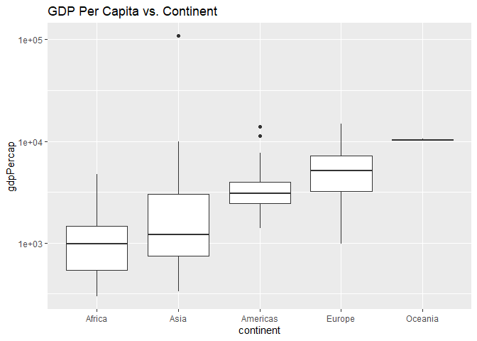
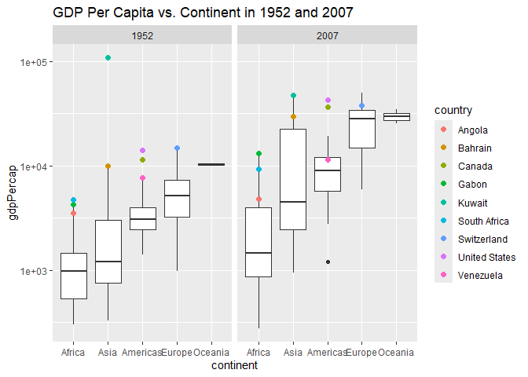
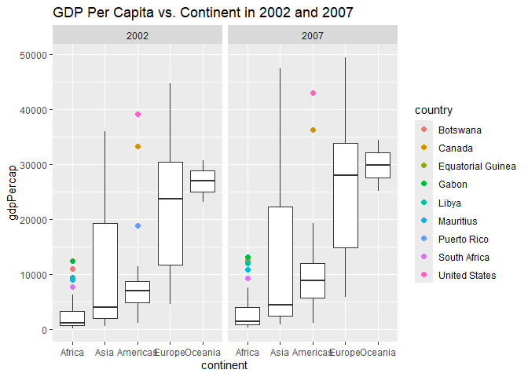
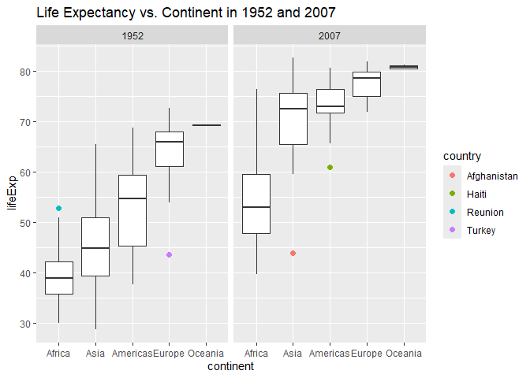
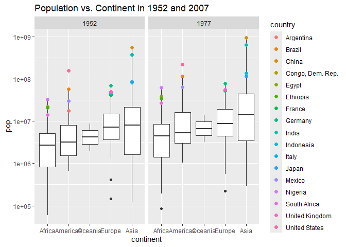

Gapminder
================
Katherine Danielson
2-15-2025 (Resubmitted 3-5-25)

- [Grading Rubric](#grading-rubric)
  - [Individual](#individual)
  - [Submission](#submission)
- [Guided EDA](#guided-eda)
  - [**q0** Perform your “first checks” on the dataset. What variables
    are in this
    dataset?](#q0-perform-your-first-checks-on-the-dataset-what-variables-are-in-this-dataset)
  - [**q1** Determine the most and least recent years in the `gapminder`
    dataset.](#q1-determine-the-most-and-least-recent-years-in-the-gapminder-dataset)
  - [**q2** Filter on years matching `year_min`, and make a plot of the
    GDP per capita against continent. Choose an appropriate `geom_` to
    visualize the data. What observations can you
    make?](#q2-filter-on-years-matching-year_min-and-make-a-plot-of-the-gdp-per-capita-against-continent-choose-an-appropriate-geom_-to-visualize-the-data-what-observations-can-you-make)
  - [**q3** You should have found *at least* three outliers in q2 (but
    possibly many more!). Identify those outliers (figure out which
    countries they
    are).](#q3-you-should-have-found-at-least-three-outliers-in-q2-but-possibly-many-more-identify-those-outliers-figure-out-which-countries-they-are)
  - [**q4** Create a plot similar to yours from q2 studying both
    `year_min` and `year_max`. Find a way to highlight the outliers from
    q3 on your plot *in a way that lets you identify which country is
    which*. Compare the patterns between `year_min` and
    `year_max`.](#q4-create-a-plot-similar-to-yours-from-q2-studying-both-year_min-and-year_max-find-a-way-to-highlight-the-outliers-from-q3-on-your-plot-in-a-way-that-lets-you-identify-which-country-is-which-compare-the-patterns-between-year_min-and-year_max)
- [Your Own EDA](#your-own-eda)
  - [**q5** Create *at least* three new figures below. With each figure,
    try to pose new questions about the
    data.](#q5-create-at-least-three-new-figures-below-with-each-figure-try-to-pose-new-questions-about-the-data)

*Purpose*: Learning to do EDA well takes practice! In this challenge
you’ll further practice EDA by first completing a guided exploration,
then by conducting your own investigation. This challenge will also give
you a chance to use the wide variety of visual tools we’ve been
learning.

<!-- include-rubric -->

# Grading Rubric

<!-- -------------------------------------------------- -->

Unlike exercises, **challenges will be graded**. The following rubrics
define how you will be graded, both on an individual and team basis.

## Individual

<!-- ------------------------- -->

| Category | Needs Improvement | Satisfactory |
|----|----|----|
| Effort | Some task **q**’s left unattempted | All task **q**’s attempted |
| Observed | Did not document observations, or observations incorrect | Documented correct observations based on analysis |
| Supported | Some observations not clearly supported by analysis | All observations clearly supported by analysis (table, graph, etc.) |
| Assessed | Observations include claims not supported by the data, or reflect a level of certainty not warranted by the data | Observations are appropriately qualified by the quality & relevance of the data and (in)conclusiveness of the support |
| Specified | Uses the phrase “more data are necessary” without clarification | Any statement that “more data are necessary” specifies which *specific* data are needed to answer what *specific* question |
| Code Styled | Violations of the [style guide](https://style.tidyverse.org/) hinder readability | Code sufficiently close to the [style guide](https://style.tidyverse.org/) |

## Submission

<!-- ------------------------- -->

Make sure to commit both the challenge report (`report.md` file) and
supporting files (`report_files/` folder) when you are done! Then submit
a link to Canvas. **Your Challenge submission is not complete without
all files uploaded to GitHub.**

``` r
library(tidyverse)
```

    ## ── Attaching core tidyverse packages ──────────────────────── tidyverse 2.0.0 ──
    ## ✔ dplyr     1.1.4     ✔ readr     2.1.5
    ## ✔ forcats   1.0.0     ✔ stringr   1.5.1
    ## ✔ ggplot2   3.5.1     ✔ tibble    3.2.1
    ## ✔ lubridate 1.9.4     ✔ tidyr     1.3.1
    ## ✔ purrr     1.0.2     
    ## ── Conflicts ────────────────────────────────────────── tidyverse_conflicts() ──
    ## ✖ dplyr::filter() masks stats::filter()
    ## ✖ dplyr::lag()    masks stats::lag()
    ## ℹ Use the conflicted package (<http://conflicted.r-lib.org/>) to force all conflicts to become errors

``` r
library(gapminder)
```

*Background*: [Gapminder](https://www.gapminder.org/about-gapminder/) is
an independent organization that seeks to educate people about the state
of the world. They seek to counteract the worldview constructed by a
hype-driven media cycle, and promote a “fact-based worldview” by
focusing on data. The dataset we’ll study in this challenge is from
Gapminder.

# Guided EDA

<!-- -------------------------------------------------- -->

First, we’ll go through a round of *guided EDA*. Try to pay attention to
the high-level process we’re going through—after this guided round
you’ll be responsible for doing another cycle of EDA on your own!

### **q0** Perform your “first checks” on the dataset. What variables are in this dataset?

``` r
## TASK: Do your "first checks" here!
glimpse(gapminder)
```

    ## Rows: 1,704
    ## Columns: 6
    ## $ country   <fct> "Afghanistan", "Afghanistan", "Afghanistan", "Afghanistan", …
    ## $ continent <fct> Asia, Asia, Asia, Asia, Asia, Asia, Asia, Asia, Asia, Asia, …
    ## $ year      <int> 1952, 1957, 1962, 1967, 1972, 1977, 1982, 1987, 1992, 1997, …
    ## $ lifeExp   <dbl> 28.801, 30.332, 31.997, 34.020, 36.088, 38.438, 39.854, 40.8…
    ## $ pop       <int> 8425333, 9240934, 10267083, 11537966, 13079460, 14880372, 12…
    ## $ gdpPercap <dbl> 779.4453, 820.8530, 853.1007, 836.1971, 739.9811, 786.1134, …

``` r
gapminder %>% 
  distinct(country)
```

    ## # A tibble: 142 × 1
    ##    country    
    ##    <fct>      
    ##  1 Afghanistan
    ##  2 Albania    
    ##  3 Algeria    
    ##  4 Angola     
    ##  5 Argentina  
    ##  6 Australia  
    ##  7 Austria    
    ##  8 Bahrain    
    ##  9 Bangladesh 
    ## 10 Belgium    
    ## # ℹ 132 more rows

``` r
gapminder %>% 
  distinct(continent)
```

    ## # A tibble: 5 × 1
    ##   continent
    ##   <fct>    
    ## 1 Asia     
    ## 2 Europe   
    ## 3 Africa   
    ## 4 Americas 
    ## 5 Oceania

``` r
gapminder %>% 
  distinct(year)
```

    ## # A tibble: 12 × 1
    ##     year
    ##    <int>
    ##  1  1952
    ##  2  1957
    ##  3  1962
    ##  4  1967
    ##  5  1972
    ##  6  1977
    ##  7  1982
    ##  8  1987
    ##  9  1992
    ## 10  1997
    ## 11  2002
    ## 12  2007

``` r
gapminder %>% 
  summarize( 
    min_lifeExp = min(lifeExp),
    max_lifeExp = max(lifeExp)
  )
```

    ## # A tibble: 1 × 2
    ##   min_lifeExp max_lifeExp
    ##         <dbl>       <dbl>
    ## 1        23.6        82.6

``` r
gapminder %>% 
  summarize( 
    min_pop = min(pop),
    max_pop = max(pop)
  )
```

    ## # A tibble: 1 × 2
    ##   min_pop    max_pop
    ##     <int>      <int>
    ## 1   60011 1318683096

``` r
gapminder %>% 
  summarize( 
    min_gdpPercap = min(gdpPercap),
    max_gdpPercap = max(gdpPercap)
  )
```

    ## # A tibble: 1 × 2
    ##   min_gdpPercap max_gdpPercap
    ##           <dbl>         <dbl>
    ## 1          241.       113523.

**Observations**:

- `Country`: this follows an alphabetized list of different countries. A
  country can be repeated many times as it follows a different `year`,
  and thus different `lifeExp`, `pop` and `gdpPercap`. For example, some
  countries include Afghanistan, Australia, Austria, Bahrain and more.
  There are a total of 142 distinct different countries that this
  focuses on.
- `Continent`: This lists the continent that the prior `country` falls
  into. There are five different continents that countries can fall
  under: Africa, Asia, Europe, Oceania, Americas. In this dataset, there
  is no tracking of Antarctica and it lumps both North and South America
  together.
- `Year:` This lists the year when the data for `lifeExp`, `pop` and
  `gdpPercap` was collected in each `country`. These years range from
  1952 to 2007 in five year increments, meaning that there are 12 total
  distinct years.
- `lifeExp`: This lists the current life expectancy, or the average age
  someone will live to in a specific country. This is dependent on the
  country and the year. This expectancy ranges from 23.599 to 82.603
  between different countries and different years, and is largely
  variable.
- `pop`: This tells the population of a given country at a given year.
  This data ranges from the smallest population being 60,011 to
  1,318,683,096.
- `gpdPercap`: This is the GRP (gross domestic product) generated per
  capita. That means this is directly dependent on the population size
  and the GDP generated yearly. This ranges from 241.1659 to 113,523.1.

### **q1** Determine the most and least recent years in the `gapminder` dataset.

*Hint*: Use the `pull()` function to get a vector out of a tibble.
(Rather than the `$` notation of base R.)

``` r
## TASK: Find the largest and smallest values of `year` in `gapminder`
year_max <- 
  gapminder %>% 
  pull(year) %>% 
  max()
year_min <- 
  gapminder %>% 
  pull(year) %>% 
  min()
```

Use the following test to check your work.

``` r
## NOTE: No need to change this
assertthat::assert_that(year_max %% 7 == 5)
```

    ## [1] TRUE

``` r
assertthat::assert_that(year_max %% 3 == 0)
```

    ## [1] TRUE

``` r
assertthat::assert_that(year_min %% 7 == 6)
```

    ## [1] TRUE

``` r
assertthat::assert_that(year_min %% 3 == 2)
```

    ## [1] TRUE

``` r
if (is_tibble(year_max)) {
  print("year_max is a tibble; try using `pull()` to get a vector")
  assertthat::assert_that(False)
}

print("Nice!")
```

    ## [1] "Nice!"

### **q2** Filter on years matching `year_min`, and make a plot of the GDP per capita against continent. Choose an appropriate `geom_` to visualize the data. What observations can you make?

You may encounter difficulties in visualizing these data; if so document
your challenges and attempt to produce the most informative visual you
can.

``` r
## TASK: Create a visual of gdpPercap vs continent
gapminder %>% 
  filter(year == year_min) %>% 
  mutate(continent = fct_reorder(continent, gdpPercap)) %>% 
  ggplot(aes(continent, gdpPercap)) +
  geom_boxplot() +
  labs(title = "GDP Per Capita vs. Continent") +
  scale_y_log10()
```

<!-- -->

``` r
##Additonal analysis on the number of countries per each continent
gapminder %>% 
  filter(continent == "Oceania") %>% 
  distinct(country)
```

    ## # A tibble: 2 × 1
    ##   country    
    ##   <fct>      
    ## 1 Australia  
    ## 2 New Zealand

``` r
gapminder %>% 
  filter(continent == "Africa") %>% 
  distinct(country)
```

    ## # A tibble: 52 × 1
    ##    country                 
    ##    <fct>                   
    ##  1 Algeria                 
    ##  2 Angola                  
    ##  3 Benin                   
    ##  4 Botswana                
    ##  5 Burkina Faso            
    ##  6 Burundi                 
    ##  7 Cameroon                
    ##  8 Central African Republic
    ##  9 Chad                    
    ## 10 Comoros                 
    ## # ℹ 42 more rows

``` r
gapminder %>% 
  filter(continent == "Asia") %>% 
  distinct(country)
```

    ## # A tibble: 33 × 1
    ##    country         
    ##    <fct>           
    ##  1 Afghanistan     
    ##  2 Bahrain         
    ##  3 Bangladesh      
    ##  4 Cambodia        
    ##  5 China           
    ##  6 Hong Kong, China
    ##  7 India           
    ##  8 Indonesia       
    ##  9 Iran            
    ## 10 Iraq            
    ## # ℹ 23 more rows

``` r
gapminder %>% 
  filter(continent == "Americas") %>% 
  distinct(country)
```

    ## # A tibble: 25 × 1
    ##    country           
    ##    <fct>             
    ##  1 Argentina         
    ##  2 Bolivia           
    ##  3 Brazil            
    ##  4 Canada            
    ##  5 Chile             
    ##  6 Colombia          
    ##  7 Costa Rica        
    ##  8 Cuba              
    ##  9 Dominican Republic
    ## 10 Ecuador           
    ## # ℹ 15 more rows

``` r
gapminder %>% 
  filter(continent == "Europe") %>% 
  distinct(country)
```

    ## # A tibble: 30 × 1
    ##    country               
    ##    <fct>                 
    ##  1 Albania               
    ##  2 Austria               
    ##  3 Belgium               
    ##  4 Bosnia and Herzegovina
    ##  5 Bulgaria              
    ##  6 Croatia               
    ##  7 Czech Republic        
    ##  8 Denmark               
    ##  9 Finland               
    ## 10 France                
    ## # ℹ 20 more rows

**Observations**:

- For continental trends, disregarding the outliers, Africa has the
  lowest median `gdpPercap`, then Asia, then the Americas, then Europe,
  and Oceania has the highest median `gdpPercap` of a continent.
  However, while Oceania has the highest median `gdpPercap` of a
  continent, it does not hold the countries with the highest
  `gdpPercap`. Rather, Asia holds the country with the highest
  `gdpPercap` by far. Almost all other outliers are roughly at or below
  15,000 for their GDP per capita. However, the outlier in Asia has a
  GDP per capita of well over 90,000–an over six-fold increase. It is
  interesting to notice that every continent minus Oceania has outliers.
  Another thing of note is that Oceania, Africa and the Americas have
  the least boxplot body variation while the body of the Asia and Europe
  boxplots have a much bigger main box. This is indicative that there is
  a wider, but more even spread of `gdpPercap` in both Asia and Europe
  (Europe more so), while the spread of the `gdpPercap` in the other
  three continents are rather centralized.

- When digging further into the data, it is discovered that Oceania only
  contains two different countries of analysis; thus, there can be no
  outliers in the Oceania boxplot as only two countries are considered.
  Comparatively, it is easier for the other continents to have outliers
  as Africa includes 52 countries, Asia 33, the Americas 25, and
  Europe 30. Note that this data could not be determined by the boxplot
  alone

**Difficulties & Approaches**:

- One of the main difficulties was just trying to figure out how to
  present data in a way that could include and show the outliers of
  different countries in each continent. Using a bar chart of line graph
  would not easily show the outliers, a scatterplot would be too busy,
  and a density plot simply did not work. Thus, my approach was to use a
  boxplot as it would show the median, and the first and third quartiles
  as well as include outliers. This graph is not perfect as the outliers
  majorly skew the scale so the boxplot bodies cannot be analyzed well;
  however, it is better than many other graph options. An additional
  difficulty with this graph is that you cannot tell what countries the
  outliers belong to, so in q3, I will work to identify the outliers and
  plot with them in q4.

### **q3** You should have found *at least* three outliers in q2 (but possibly many more!). Identify those outliers (figure out which countries they are).

``` r
## TASK: Identify the outliers from q2
gdpPercap_outliers <- 
  gapminder %>%                          # load gapminder
  filter(year == year_min) %>%           # filter the year to only be year == min
  group_by(continent) %>%                # group by continents so it's continent outliers
  do({
    stats <- boxplot.stats(.$gdpPercap)  # Compute boxplot stats for gdpPercap
    out_vals <- stats$out                # Identify outlier values
    filter(., gdpPercap %in% out_vals)   # check what values of out_vals match gdpPercap and filter
  })
gdpPercap_outliers
```

    ## # A tibble: 9 × 6
    ## # Groups:   continent [4]
    ##   country       continent  year lifeExp       pop gdpPercap
    ##   <fct>         <fct>     <int>   <dbl>     <int>     <dbl>
    ## 1 Angola        Africa     1952    30.0   4232095     3521.
    ## 2 Gabon         Africa     1952    37.0    420702     4293.
    ## 3 South Africa  Africa     1952    45.0  14264935     4725.
    ## 4 Canada        Americas   1952    68.8  14785584    11367.
    ## 5 United States Americas   1952    68.4 157553000    13990.
    ## 6 Venezuela     Americas   1952    55.1   5439568     7690.
    ## 7 Bahrain       Asia       1952    50.9    120447     9867.
    ## 8 Kuwait        Asia       1952    55.6    160000   108382.
    ## 9 Switzerland   Europe     1952    69.6   4815000    14734.

**Observations**:

- Identify the outlier countries from q2
  - The outliers in q2 are Angola, Gabon, South Africa, Canada, the
    United States, Venezuela, Bahrain, Kuwait, and Switzerland.
  - Kuwait is the largest outlier in Asia with the GDP per capita of
    108,381.353. Due to the way I coded for the outliers, I made sure
    that I found the outlier for each continent, not the whole dataset.
    This is important as if I had only looked at outliers for the whole
    dataset, it is unlikely that any of the African country outliers and
    even Venezuela would have been considered outliers, and Oceania
    countries (due to its high GDP per capita) would have been included
    despite not being outliers. That is, the African country outliers
    are between 3520.61 and 4725.296 and Venezuela has a GDP per capita
    of 7689.80. All other outliers start at 9867.085 and are generally
    higher. Thus, it is immensely important to `group_by` by continent.

``` r
# bp_stats <-  boxplot.stats(             ##Does outliers for the whole dataset, not just by continent
#   (gapminder %>% 
#      filter(year == year_min) %>% 
#   )
#   $gdpPercap
#   )
# outliers <- bp_stats$out
# print(outliers)
# 
# gapminder %>%
#   filter(year == year_min) %>% 
#   filter(gdpPercap %in% outliers)
```

*Hint*: For the next task, it’s helpful to know a ggplot trick we’ll
learn in an upcoming exercise: You can use the `data` argument inside
any `geom_*` to modify the data that will be plotted *by that geom
only*. For instance, you can use this trick to filter a set of points to
label:

``` r
## NOTE: No need to edit, use ideas from this in q4 below
gapminder %>%
  filter(year == max(year)) %>%

  ggplot(aes(continent, lifeExp)) +
  geom_boxplot() +
  geom_point(
    data = . %>% filter(country %in% c("United Kingdom", "Japan", "Zambia")),
    mapping = aes(color = country),
    size = 2
  )
```

<!-- -->

### **q4** Create a plot similar to yours from q2 studying both `year_min` and `year_max`. Find a way to highlight the outliers from q3 on your plot *in a way that lets you identify which country is which*. Compare the patterns between `year_min` and `year_max`.

*Hint*: We’ve learned a lot of different ways to show multiple
variables; think about using different aesthetics or facets.

``` r
## TASK: Create a visual of gdpPercap vs continent
gapminder %>% 
  filter(year == year_min | year == year_max) %>% 
  mutate(continent = fct_reorder(continent, gdpPercap)) %>% 
  ggplot(aes(continent, gdpPercap)) +
  geom_boxplot() +
  geom_point(
     data = . %>% filter(country %in% c("Angola", "Gabon", "South Africa", "Canada", "United States", "Venezuela", "Bahrain", "Kuwait", "Switzerland")),
     mapping = aes(color = country),
     size = 2
  ) +
  facet_wrap(~year) +
  labs(title = "GDP Per Capita vs. Continent in 1952 and 2007") +
  scale_y_log10()
```

<!-- -->

**Observations**:

- Between 1952 and 2007 there was a large amount of growth in the GDP
  per capita for most continents. All of the main bodies/boxes in the
  boxplots have grown–meaning there is a more consistent wider spread of
  the GDP per capita. This is likely due to the development of countries
  and the greater level of introduction of technologies, access to food,
  water, shelter and more. We see this in all countries, but especially
  in Asia and Europe. It is important to note that while many continents
  had an increase in the size of their overall box, only some had a
  large shift in their median. Specifically, when looking at Africa and
  Asia, there was a very limited shift in their median GDP per capita.
  While both countries increased their median slightly, they both follow
  a trend where they have a much longer upper whisker and Q3 but a very
  low median. Comparatively, the Americas, Europe and Oceania all
  shifted their medians up quite significantly. Overarchingly, the trend
  of continent medians was the same in 1952 and 2007. That is, Africa
  has the lowest median GDP per capita, then Asia, then the Americas,
  then Europe, and lastly, Oceania has the highest. However, in 1952
  compared to 2007 the median of one continent what generally higher
  than the Q3 of another country, this is not the case in 2007 as there
  is much more variability.
- When looking out outliers, there are some pretty consistent outliers
  between 1952 and 2007, but some have become more “normal.” For
  example, Canada and the United States are still outliers for the
  Americas, but Kuwait, which once had a GDP per capita of over 100,000
  is now on the end of the whisker for Asia. Largely, the outliers
  remained on the high end of the continent’s GDP per capita. The main
  difference in outliers between 1952 and 2007 is the introduction of a
  few more outliers in 2007.

# Your Own EDA

<!-- -------------------------------------------------- -->

Now it’s your turn! We just went through guided EDA considering the GDP
per capita at two time points. You can continue looking at outliers,
consider different years, repeat the exercise with `lifeExp`, consider
the relationship between variables, or something else entirely.

### **q5** Create *at least* three new figures below. With each figure, try to pose new questions about the data.

``` r
gdpPercap_outliers <- 
  gapminder %>%                                     
  filter(year == year_max | year == 2002) %>%        
  group_by(continent, year) %>%                       
  do({
    stats <- boxplot.stats(.$gdpPercap)                
    out_vals <- stats$out                           
    filter(., gdpPercap %in% out_vals)                 
  })

gapminder %>% 
  filter(year == 2002 | year == year_max) %>% 
  mutate(continent = fct_reorder(continent, gdpPercap)) %>% 
  ggplot(aes(continent, gdpPercap)) +
  geom_boxplot() +
  geom_point(
    data = gdpPercap_outliers,
    mapping = aes(color = country),
    size = 2
  ) +
  facet_wrap(~year) +
  labs(title = "GDP Per Capita vs. Continent in 2002 and 2007")
```

<!-- -->

- I chose to do a graph comparing 2002 to 2007 GDP per capita in
  continents while coding the outliers per country to see if there was
  any large amount of change within five years for GDP per capita. Thus,
  my question posed was “Is there a a notable change in 5 years for
  continent’s GDP per capita?”
- Overarchingly, I would express that there is notable visual change in
  GDP per capita within some continents and countries. This is most
  notable in the continents of the Americas, Europe, and Oceania and in
  the shift of whisker size of Asia, the Americas and Europe. Looking at
  the whiskers first, the upper whisker of Asia and Q3 appear to
  elongate – meaning there is a greater level of variation within the
  continent for GDP per capita. The same can be said for the Americas
  where both the upper and lower whisker grew, with larger growth seen
  on the upper whisker. Secondly, when looking at the expansion of box
  size and shift in medians we can look to the Americas, Europe and
  Oceania. All three countries had the size of their box grow,
  indicating a larger expansion of variation, and all three had their
  medians shift upwards, indicating that the continent’s overall GDP per
  capita increased. These trends indicate that the GDP per capita of the
  globe may be increasing as well. When looking to outliers we generally
  see consistent growth with some exceptions. For example, both the
  United States and Canada have continued to shift their GDP per capita
  upwards, while the outlier in 2002 Puerto Rico has disappeared in
  2007–this could indicate a downwards shift in the economy, but more
  data on the specific economic status and circumstances of Puerto Rico
  would be needed to ensure this.
- As explored in the prior EDA of GDP per capita and continent, a trend
  where Africa and Asia, have a very limited shift in their median GDP
  per capita. Further, they both continue to follow a trend where they
  have a much longer upper whisker and Q3 but a very low median.
  Comparatively, the Americas, Europe and Oceania all shifted their
  medians up notably. Additionally, the Americas and Oceania continue to
  have their median roughly in the middle of their boxplot, while Europe
  has its median shifted to the upper half of its boxplot body.

``` r
## TASK: Your first graph
lifeExp_outliers <- 
  gapminder %>%                                      # load gapminder
  filter(year == year_max | year == year_min) %>%    # filter the year to only be year == max OR year == min
  group_by(continent, year) %>%                      # group by continents and years so it's continent and year outliers
  do({
    stats <- boxplot.stats(.$lifeExp)                # Compute boxplot stats for lifeExp
    out_vals <- stats$out                            # Identify outlier values
    filter(., lifeExp %in% out_vals)                 # check what values of out_vals match lifeExp and filter
  })

gapminder %>%
  filter(year == year_min | year == year_max) %>%
  mutate(continent = fct_reorder(continent, lifeExp)) %>%
  ggplot(aes(continent, lifeExp)) +
  geom_boxplot() +
  geom_point(
    data = lifeExp_outliers,                                                         
    mapping = aes(color = country),
    size = 2
  ) +
  facet_wrap(~year) +
  labs(title = "Life Expectancy vs. Continent in 1952 and 2007")
```

<!-- -->

- I chose to compare the life expectancy in continents in 1952 to 2007
  while coding the outliers per country to see if there was any
  consistency. Thus, my question posed was “How does life expectancy
  change in each continent between 1952 and 2007?”
- Life expectancy changes drastically in every single continent from
  1952 to 2007. All continents (Africa, Asia, the Americas, Europe and
  Oceania) all have a large shift in their median to a much higher
  value. Both 1952 and 2007 show the same continent ranking based on
  median life expectancy: Africa has the lowest median life expectancy,
  than Asia, then the Americas, then Europe, then Oceania with the
  highest median. It should be noted that this is the same order as
  median GDP per capita. This could be indicative of increased money
  leading to easier access to healthcare, technology and basic
  resources. The whiskers and box sizes of Asia, the Americas and Europe
  all decrease between 1952 and 2007. This indicates that there is less
  variance in the life expectancy between different countries. However,
  we see the opposite when looking at Africa and Oceania. While both
  countries increased their median life expectancy, the box size and
  whiskers increased (slightly for Oceania and largely for Africa). This
  indicates a greater level of variance in life expectancy between
  countries. For Africa specifically, due to its low life expectancy,
  this could be due to the wide range of developing countries in Africa
  and a lack of access to resources. The outliers between 1952 and 2007
  are not consistent and their reason for being so low or higher is not
  determinable by this dataset. While we could look to things like GDP
  per capita, having more data on the political, social and climate
  situations of these countries could help us solve this.

``` r
pop_outliers <- 
  gapminder %>%                                      # load gapminder
  filter(year == 1977 | year == 1952) %>%            # filter the year to only be year == max OR year == min
  group_by(continent, year) %>%                      # group by continents and years so it's continent and year outliers
  do({
    stats <- boxplot.stats(.$pop)                    # Compute boxplot stats for pop
    out_vals <- stats$out                            # Identify outlier values
    filter(., pop %in% out_vals)                     # check what values of out_vals match pop and filter
  })

gapminder %>%
  filter(year == 1952 | year == 1977) %>%
  mutate(continent = fct_reorder(continent, pop)) %>%
  ggplot(aes(continent, pop)) +
  geom_boxplot() +
  geom_point(
    data = pop_outliers,                                                             
    mapping = aes(color = country),
    size = 2
  ) +
  facet_wrap(~year) +
  labs(title = "Population vs. Continent in 1952 and 2007") +
  scale_y_log10()
```

<!-- -->

- I chose to compare the population in continents from 1952 to 1977
  while coding the outliers per country to see if there was any
  consistency. Thus, my question posed was “How does population change
  in each continent between 1952 and 1977?”
- While this representation is not amazing, due to the plethora of
  countries and large outliers, it was the best graph to represent
  population vs. continent. I decided to change the y-axis scale to a
  log ten scale to show the variation within countries. However, this
  limits the extremities of many of the outliers and makes some lower
  outliers appear that are not actually outliers. The overall answer is
  that the median population increases some over the span of 25 years;
  however, the majority of growth is seen in outliers, not the
  continent’s median itself. Over the span of 25 years, Africa remained
  the continent with the smallest median population, then the Americas,
  then Oceania, then Europe and then Asia. When thinking intuitively,
  this may appear to be surprising as a few countries in America
  definitely have a larger population than that of Oceania. We see this
  when looking at outliers, in both 1952 and 1977, Mexico, Brazil and
  the United States all had a higher population than Oceania. Thus, we
  see that in specifics, country-to-country level comparison may be
  better than continent-to-continent as there is a large level of
  variation in population and sizing of different countries and their
  populations The main country we see an increase in variation of
  population size is in Asia–this could be due to more countries growing
  their population sizes. Additionally, Asia has the most notable
  outliers – India and China – with the outliers being far above the
  populations of other countries and the medians of all continents.
  Thus, while this graph does not tell us too much about continent
  trends, it tells a lot about outlier trends and gives ideas for future
  country-to-country comparison.
