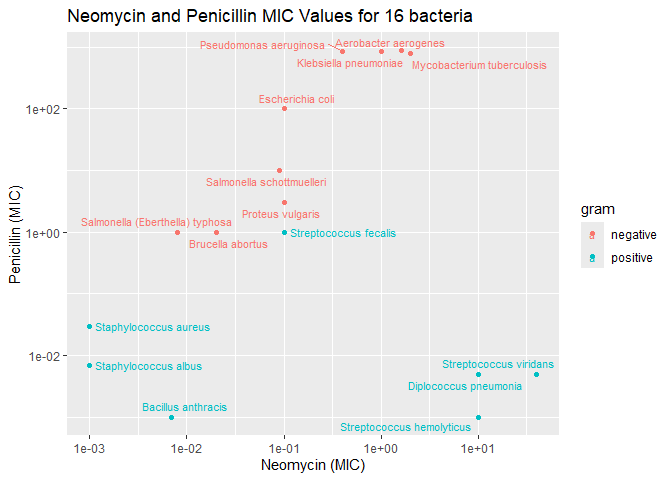

Antibiotics
================
Katherine Danielson
02-25-2025 Resubmitted (3-11-25)

*Purpose*: Creating effective data visualizations is an *iterative*
process; very rarely will the first graph you make be the most
effective. The most effective thing you can do to be successful in this
iterative process is to *try multiple graphs* of the same data.

Furthermore, judging the effectiveness of a visual is completely
dependent on *the question you are trying to answer*. A visual that is
totally ineffective for one question may be perfect for answering a
different question.

In this challenge, you will practice *iterating* on data visualization,
and will anchor the *assessment* of your visuals using two different
questions.

*Note*: Please complete your initial visual design **alone**. Work on
both of your graphs alone, and save a version to your repo *before*
coming together with your team. This way you can all bring a diversity
of ideas to the table!

<!-- include-rubric -->

# Grading Rubric

<!-- -------------------------------------------------- -->

Unlike exercises, **challenges will be graded**. The following rubrics
define how you will be graded, both on an individual and team basis.

## Individual

<!-- ------------------------- -->

| Category | Needs Improvement | Satisfactory |
|----|----|----|
| Effort | Some task **q**’s left unattempted | All task **q**’s attempted |
| Observed | Did not document observations, or observations incorrect | Documented correct observations based on analysis |
| Supported | Some observations not clearly supported by analysis | All observations clearly supported by analysis (table, graph, etc.) |
| Assessed | Observations include claims not supported by the data, or reflect a level of certainty not warranted by the data | Observations are appropriately qualified by the quality & relevance of the data and (in)conclusiveness of the support |
| Specified | Uses the phrase “more data are necessary” without clarification | Any statement that “more data are necessary” specifies which *specific* data are needed to answer what *specific* question |
| Code Styled | Violations of the [style guide](https://style.tidyverse.org/) hinder readability | Code sufficiently close to the [style guide](https://style.tidyverse.org/) |

## Submission

<!-- ------------------------- -->

Make sure to commit both the challenge report (`report.md` file) and
supporting files (`report_files/` folder) when you are done! Then submit
a link to Canvas. **Your Challenge submission is not complete without
all files uploaded to GitHub.**

``` r
library(tidyverse)
```

    ## ── Attaching core tidyverse packages ──────────────────────── tidyverse 2.0.0 ──
    ## ✔ dplyr     1.1.4     ✔ readr     2.1.5
    ## ✔ forcats   1.0.0     ✔ stringr   1.5.1
    ## ✔ ggplot2   3.5.1     ✔ tibble    3.2.1
    ## ✔ lubridate 1.9.4     ✔ tidyr     1.3.1
    ## ✔ purrr     1.0.2     
    ## ── Conflicts ────────────────────────────────────────── tidyverse_conflicts() ──
    ## ✖ dplyr::filter() masks stats::filter()
    ## ✖ dplyr::lag()    masks stats::lag()
    ## ℹ Use the conflicted package (<http://conflicted.r-lib.org/>) to force all conflicts to become errors

``` r
library(ggrepel)
```

*Background*: The data\[1\] we study in this challenge report the
[*minimum inhibitory
concentration*](https://en.wikipedia.org/wiki/Minimum_inhibitory_concentration)
(MIC) of three drugs for different bacteria. The smaller the MIC for a
given drug and bacteria pair, the more practical the drug is for
treating that particular bacteria. An MIC value of *at most* 0.1 is
considered necessary for treating human patients.

These data report MIC values for three antibiotics—penicillin,
streptomycin, and neomycin—on 16 bacteria. Bacteria are categorized into
a genus based on a number of features, including their resistance to
antibiotics.

``` r
## NOTE: If you extracted all challenges to the same location,
## you shouldn't have to change this filename
filename <- "./data/antibiotics.csv"

## Load the data
df_antibiotics <- read_csv(filename)
```

    ## Rows: 16 Columns: 5
    ## ── Column specification ────────────────────────────────────────────────────────
    ## Delimiter: ","
    ## chr (2): bacteria, gram
    ## dbl (3): penicillin, streptomycin, neomycin
    ## 
    ## ℹ Use `spec()` to retrieve the full column specification for this data.
    ## ℹ Specify the column types or set `show_col_types = FALSE` to quiet this message.

``` r
df_antibiotics %>% knitr::kable()
```

| bacteria                        | penicillin | streptomycin | neomycin | gram     |
|:--------------------------------|-----------:|-------------:|---------:|:---------|
| Aerobacter aerogenes            |    870.000 |         1.00 |    1.600 | negative |
| Brucella abortus                |      1.000 |         2.00 |    0.020 | negative |
| Bacillus anthracis              |      0.001 |         0.01 |    0.007 | positive |
| Diplococcus pneumonia           |      0.005 |        11.00 |   10.000 | positive |
| Escherichia coli                |    100.000 |         0.40 |    0.100 | negative |
| Klebsiella pneumoniae           |    850.000 |         1.20 |    1.000 | negative |
| Mycobacterium tuberculosis      |    800.000 |         5.00 |    2.000 | negative |
| Proteus vulgaris                |      3.000 |         0.10 |    0.100 | negative |
| Pseudomonas aeruginosa          |    850.000 |         2.00 |    0.400 | negative |
| Salmonella (Eberthella) typhosa |      1.000 |         0.40 |    0.008 | negative |
| Salmonella schottmuelleri       |     10.000 |         0.80 |    0.090 | negative |
| Staphylococcus albus            |      0.007 |         0.10 |    0.001 | positive |
| Staphylococcus aureus           |      0.030 |         0.03 |    0.001 | positive |
| Streptococcus fecalis           |      1.000 |         1.00 |    0.100 | positive |
| Streptococcus hemolyticus       |      0.001 |        14.00 |   10.000 | positive |
| Streptococcus viridans          |      0.005 |        10.00 |   40.000 | positive |

# Visualization

<!-- -------------------------------------------------- -->

### **q1** Prototype 5 visuals

To start, construct **5 qualitatively different visualizations of the
data** `df_antibiotics`. These **cannot** be simple variations on the
same graph; for instance, if two of your visuals could be made identical
by calling `coord_flip()`, then these are *not* qualitatively different.

For all five of the visuals, you must show information on *all 16
bacteria*. For the first two visuals, you must *show all variables*.

*Hint 1*: Try working quickly on this part; come up with a bunch of
ideas, and don’t fixate on any one idea for too long. You will have a
chance to refine later in this challenge.

*Hint 2*: The data `df_antibiotics` are in a *wide* format; it may be
helpful to `pivot_longer()` the data to make certain visuals easier to
construct.

#### Visual 1 (All variables)

In this visual you must show *all three* effectiveness values for *all
16 bacteria*. This means **it must be possible to identify each of the
16 bacteria by name.** You must also show whether or not each bacterium
is Gram positive or negative.

``` r
df_antibiotics %>%
  pivot_longer(
    names_to = "Antibiotics",
    values_to = "effectiveness",
    c(penicillin, streptomycin, neomycin)
  ) %>% 
  mutate(bacteria = fct_reorder(bacteria, effectiveness)) %>%
  ggplot(aes(effectiveness, bacteria, shape = gram, color = Antibiotics)) +
  geom_point() +
  scale_x_log10() +
  labs(
    title = "Antibiotic Effectiveness and Gram for Bacteria", 
    x = "Effectiveness (MIC)", 
    y = "Bacteria Name"
  )
```

<!-- -->

#### Visual 2 (All variables)

In this visual you must show *all three* effectiveness values for *all
16 bacteria*. This means **it must be possible to identify each of the
16 bacteria by name.** You must also show whether or not each bacterium
is Gram positive or negative.

Note that your visual must be *qualitatively different* from *all* of
your other visuals.

``` r
df_antibiotics %>% 
  pivot_longer(
    names_to = "Antibiotics",
    values_to = "effectiveness",
    c(penicillin, streptomycin, neomycin)
  ) %>% 
  mutate(bacteria = fct_reorder(bacteria, effectiveness)) %>%
  ggplot(aes(Antibiotics, effectiveness, fill = gram)) +
  geom_col() +
  facet_wrap(~bacteria) +
  scale_y_log10() +
  labs(
    title = "Effectiveness of Select Antibiotics on Bacteria",
    x = "Antibiotics",
    y = "Effectiveness (MIC)"
  ) +
  theme(
    axis.text.x = element_text(angle = 45, vjust = 1, hjust = 1),
    strip.text = element_text(size = 6.5)
    # panel.background = element_rect(fill = "white"),  ##changes background to white and lines to gray
    # panel.grid.major = element_line(color = "grey")
  )
```

<!-- -->

#### Visual 3 (Some variables)

In this visual you may show a *subset* of the variables (`penicillin`,
`streptomycin`, `neomycin`, `gram`), but you must still show *all 16
bacteria*.

Note that your visual must be *qualitatively different* from *all* of
your other visuals.

``` r
df_antibiotics %>% 
  ggplot(aes(neomycin, bacteria, fill = gram)) +
  geom_col() +
  scale_x_log10()+
  labs(
    title = "Neomycin Effectiveness and Gram For Different Bacteria", 
    x = "Neomycin (MIC)", 
    y = "Bacteria Name"
  )
```

<!-- -->

#### Visual 4 (Some variables)

In this visual you may show a *subset* of the variables (`penicillin`,
`streptomycin`, `neomycin`, `gram`), but you must still show *all 16
bacteria*.

Note that your visual must be *qualitatively different* from *all* of
your other visuals.

``` r
df_antibiotics %>%
  mutate(bacteria = fct_reorder(bacteria, streptomycin)) %>%
  ggplot(aes(bacteria, streptomycin)) +
  geom_point() +
  geom_hline(yintercept = 0.1, color = "blue") +
  facet_wrap(~gram, scale = "free_x") +
  labs(
    title = "Gram and Effectiveness of Streptomycin on Select Bacteria",
    y = "Streptomycin (MIC)",
    x = "Bacteria Names"
  ) +
  theme(
    axis.text.x = element_text(angle = 45, vjust = 1, hjust = 1),
    strip.text = element_text(size = 6.5)
  ) +
  scale_y_log10()
```

<!-- -->

#### Visual 5 (Some variables)

In this visual you may show a *subset* of the variables (`penicillin`,
`streptomycin`, `neomycin`, `gram`), but you must still show *all 16
bacteria*.

Note that your visual must be *qualitatively different* from *all* of
your other visuals.

``` r
df_antibiotics %>% 
  ggplot(aes(neomycin, penicillin, color = gram)) +
  geom_point() +
  geom_text_repel(aes(label = bacteria), size = 3, max.overlaps = 15) +  
  scale_x_log10() +
  scale_y_log10() +
  labs(
    title = "Neomycin and Penicillin MIC Values for 16 bacteria",
    y = "Penicillin (MIC)",
    x = "Neomycin (MIC)"
  )
```

<!-- -->

### **q2** Assess your visuals

There are **two questions** below; use your five visuals to help answer
both Guiding Questions. Note that you must also identify which of your
five visuals were most helpful in answering the questions.

*Hint 1*: It’s possible that *none* of your visuals is effective in
answering the questions below. You may need to revise one or more of
your visuals to answer the questions below!

*Hint 2*: It’s **highly unlikely** that the same visual is the most
effective at helping answer both guiding questions. **Use this as an
opportunity to think about why this is.**

#### Guiding Question 1

> How do the three antibiotics vary in their effectiveness against
> bacteria of different genera and Gram stain?

*Observations* -

What is your response to the question above?

- The three antibiotics vary largely in their effectiveness against
  bacteria of different genera. Pencillin has very varying results.
  While it appears to be the most effective for the Streptococcus and
  Bacillus bacterium (and *Diplococcus pneumoniae* which was renamed
  *Streptococcus pneumoniae*), it is generally the middle or worst for
  most other bacteria. Comparatively, both neomycin and streptomycin
  follow a similar trend for most bacteria. However, neomycin has
  slightly more variability in its trend of effectiveness, and tends to
  be the best antibiotic of the three antibiotics present for the
  Staphylococcus bacteria (lowest MIC required). Streptomycin is
  generally the middle antibiotic and is only the “best” option out of
  the three antibiotics for the Aerobacter bacteria. However, it should
  be noted that the majority of the time, the effectiveness/MIC value is
  not low enough for any of these three antibiotics. As mentioned
  earlier, an MIC value of *at most* 0.1 is considered necessary for
  treating human patients.

- The three antibiotics all follow the same gram strain for each
  bacteria. For example, all streptococcus bacterium require the
  positive gram strain for all three antibiotics. The same applies when
  the negative gram is considered.

Which of your visuals above (1 through 5) is **most effective** at
helping to answer this question?

- Visual number 1 is the most effective at helping me answer this
  question.

Why?

- This question required me to have an understanding of all variables:
  the effectiveness (across the three antibiotics), the bacteria, and
  the gram. Thus, I needed a graph that captured it all–leaving me to
  either visualization 1 or 2. Visualization 1 showed the different
  effectivenesses for the three antibiotics, and I reordered the plot so
  that they were arranged by mean effectiveness. This visualization
  allowed me to compare the three different antibiotics for each
  bacteria easily and compare the overall trends for each antibiotic
  (occasionally seen better by the isolation in graph 5, but not
  facetting allowed for better comparison). Further, by using the shape
  of a point to act as a distinction, it allowed me to easily see that
  all antibiotics for one bacteria were either gram-positive or
  negative. Consequently, the combination of a shared axis and different
  colors and shape for differentiation between antibiotics and gram,
  respectively, this graph was the best for answering the question.

#### Guiding Question 2

In 1974 *Diplococcus pneumoniae* was renamed *Streptococcus pneumoniae*,
and in 1984 *Streptococcus fecalis* was renamed *Enterococcus fecalis*
\[2\].

> Why was *Diplococcus pneumoniae* was renamed *Streptococcus
> pneumoniae*?

*Observations* -

What is your response to the question above?

- *Diplococcus pneumoniae* was renamed *Streptococcus pneumoniae* in
  1974 as it behavior and reaction to antibiotics is very similar to the
  *Streptococcus* genus.

- Both *Streptococcus viridans*, and *Streptococcus hemolyticus* have
  very similar properties to *Diplococcus pneumoniae* now *Streptococcus
  pneumoniae.* All three have very high MICs for neomycin and
  streptomycin, but have a low MIC for penicillin. Additionally, it is
  important to note that *Diplococcus pneumoniae* is also gram positive,
  another indicator of belonging to the *Streptococcus* genus. Further,
  one may additionally be concerned at first as *Streptococcus fecalis*
  does not group with the other bacteria. However in 1984,
  *Streptococcus fecalis*was renamed *Enterococcus fecalis* meaning that
  it belonged to a different genus.

Which of your visuals above (1 through 5) is **most effective** at
helping to answer this question?

- Visual 2 was the most effective in answering this question.

Why?

- Visual 2 compared showed all of the bacteria in a faceted column chart
  where each antibiotic’s effectiveness was shown on a log scale and the
  gram was noted by color. This representation reordered by the overall
  effectiveness as well, and *Streptococcus viridans*, *Streptococcus
  hemolyticus,* and *Diplococcus pneumoniae* all require have the
  highest reported MIC average effectiveness values. When looking at
  graph three, not only are they grouped closely, but they are all blue
  coloring for gram positive. Further, they have very similar heights to
  all of their three bars for antibiotics, meaning they require similar
  MICs for each different antibiotic; thus, hinting that they are from
  the same genus.

# References

<!-- -------------------------------------------------- -->

\[1\] Neomycin in skin infections: A new topical antibiotic with wide
antibacterial range and rarely sensitizing. Scope. 1951;3(5):4-7.

\[2\] Wainer and Lysen, “That’s Funny…” *American Scientist* (2009)
[link](https://www.americanscientist.org/article/thats-funny)’

``` r
#Additional graph I created that I later learned to be unhelpful in distinguishing data
df_antibiotics %>%
  pivot_longer(
    names_to = "drugs",
    values_to = "effectiveness",
    c(penicillin, streptomycin, neomycin)
  ) %>% 
  ggplot(aes(drugs, effectiveness, shape = gram, color = bacteria, group = bacteria)) +
  geom_point() +
  geom_line() +
  scale_y_log10() +
  labs(
    title = "Bacteria Effectiveness, Drug and Gram Type", 
    y = "Effectiveness (MIC)", 
    x = "Drugs"
  )
```

<!-- -->

``` r
df_antibiotics %>% 
  pivot_longer(
    names_to = "Antibiotics",
    values_to = "effectiveness",
    c(penicillin, streptomycin, neomycin)
  ) %>% 
    mutate(bacteria = fct_reorder(bacteria, effectiveness)) %>%

  ggplot(aes(effectiveness, bacteria)) +
  geom_point() +
  facet_grid(~Antibiotics) +
  scale_x_log10() +
  labs(
    title = "Effectiveness of Select Antibiotics on Bacteria",
    y = "Bacteria Names",
    x = "Effectiveness (MIC)"
  )
```

<!-- -->
