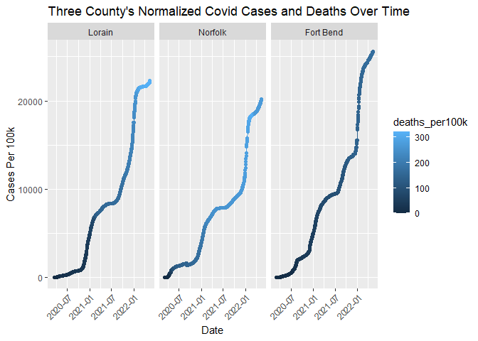
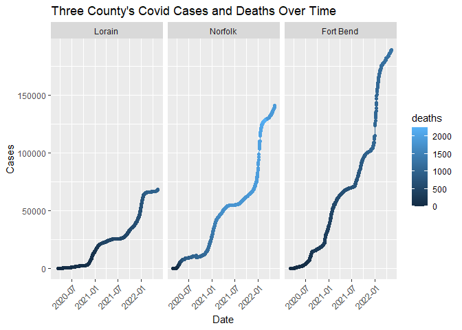

COVID-19
================
Katherine Danielson
03-03-2025

- [Grading Rubric](#grading-rubric)
  - [Individual](#individual)
  - [Submission](#submission)
- [The Big Picture](#the-big-picture)
- [Get the Data](#get-the-data)
  - [Navigating the Census Bureau](#navigating-the-census-bureau)
    - [**q1** Load Table `B01003` into the following tibble. Make sure
      the column names are
      `id, Geographic Area Name, Estimate!!Total, Margin of Error!!Total`.](#q1-load-table-b01003-into-the-following-tibble-make-sure-the-column-names-are-id-geographic-area-name-estimatetotal-margin-of-errortotal)
  - [Automated Download of NYT Data](#automated-download-of-nyt-data)
    - [**q2** Visit the NYT GitHub repo and find the URL for the **raw**
      US County-level data. Assign that URL as a string to the variable
      below.](#q2-visit-the-nyt-github-repo-and-find-the-url-for-the-raw-us-county-level-data-assign-that-url-as-a-string-to-the-variable-below)
- [Join the Data](#join-the-data)
  - [**q3** Process the `id` column of `df_pop` to create a `fips`
    column.](#q3-process-the-id-column-of-df_pop-to-create-a-fips-column)
  - [**q4** Join `df_covid` with `df_q3` by the `fips` column. Use the
    proper type of join to preserve *only* the rows in
    `df_covid`.](#q4-join-df_covid-with-df_q3-by-the-fips-column-use-the-proper-type-of-join-to-preserve-only-the-rows-in-df_covid)
- [Analyze](#analyze)
  - [Normalize](#normalize)
    - [**q5** Use the `population` estimates in `df_data` to normalize
      `cases` and `deaths` to produce per 100,000 counts \[3\]. Store
      these values in the columns `cases_per100k` and
      `deaths_per100k`.](#q5-use-the-population-estimates-in-df_data-to-normalize-cases-and-deaths-to-produce-per-100000-counts-3-store-these-values-in-the-columns-cases_per100k-and-deaths_per100k)
  - [Guided EDA](#guided-eda)
    - [**q6** Compute some summaries](#q6-compute-some-summaries)
    - [**q7** Find and compare the top
      10](#q7-find-and-compare-the-top-10)
  - [Self-directed EDA](#self-directed-eda)
    - [**q8** Drive your own ship: You’ve just put together a very rich
      dataset; you now get to explore! Pick your own direction and
      generate at least one punchline figure to document an interesting
      finding. I give a couple tips & ideas
      below:](#q8-drive-your-own-ship-youve-just-put-together-a-very-rich-dataset-you-now-get-to-explore-pick-your-own-direction-and-generate-at-least-one-punchline-figure-to-document-an-interesting-finding-i-give-a-couple-tips--ideas-below)
    - [Ideas](#ideas)
    - [Aside: Some visualization
      tricks](#aside-some-visualization-tricks)
    - [Geographic exceptions](#geographic-exceptions)
- [Notes](#notes)

*Purpose*: In this challenge, you’ll learn how to navigate the U.S.
Census Bureau website, programmatically download data from the internet,
and perform a county-level population-weighted analysis of current
COVID-19 trends. This will give you the base for a very deep
investigation of COVID-19, which we’ll build upon for Project 1.

<!-- include-rubric -->

# Grading Rubric

<!-- -------------------------------------------------- -->

Unlike exercises, **challenges will be graded**. The following rubrics
define how you will be graded, both on an individual and team basis.

## Individual

<!-- ------------------------- -->

| Category | Needs Improvement | Satisfactory |
|----|----|----|
| Effort | Some task **q**’s left unattempted | All task **q**’s attempted |
| Observed | Did not document observations, or observations incorrect | Documented correct observations based on analysis |
| Supported | Some observations not clearly supported by analysis | All observations clearly supported by analysis (table, graph, etc.) |
| Assessed | Observations include claims not supported by the data, or reflect a level of certainty not warranted by the data | Observations are appropriately qualified by the quality & relevance of the data and (in)conclusiveness of the support |
| Specified | Uses the phrase “more data are necessary” without clarification | Any statement that “more data are necessary” specifies which *specific* data are needed to answer what *specific* question |
| Code Styled | Violations of the [style guide](https://style.tidyverse.org/) hinder readability | Code sufficiently close to the [style guide](https://style.tidyverse.org/) |

## Submission

<!-- ------------------------- -->

Make sure to commit both the challenge report (`report.md` file) and
supporting files (`report_files/` folder) when you are done! Then submit
a link to Canvas. **Your Challenge submission is not complete without
all files uploaded to GitHub.**

``` r
library(tidyverse)
```

    ## ── Attaching core tidyverse packages ──────────────────────── tidyverse 2.0.0 ──
    ## ✔ dplyr     1.1.4     ✔ readr     2.1.5
    ## ✔ forcats   1.0.0     ✔ stringr   1.5.1
    ## ✔ ggplot2   3.5.1     ✔ tibble    3.2.1
    ## ✔ lubridate 1.9.4     ✔ tidyr     1.3.1
    ## ✔ purrr     1.0.2     
    ## ── Conflicts ────────────────────────────────────────── tidyverse_conflicts() ──
    ## ✖ dplyr::filter() masks stats::filter()
    ## ✖ dplyr::lag()    masks stats::lag()
    ## ℹ Use the conflicted package (<http://conflicted.r-lib.org/>) to force all conflicts to become errors

``` r
library(readxl)
```

*Background*:
[COVID-19](https://en.wikipedia.org/wiki/Coronavirus_disease_2019) is
the disease caused by the virus SARS-CoV-2. In 2020 it became a global
pandemic, leading to huge loss of life and tremendous disruption to
society. The New York Times (as of writing) publishes up-to-date data on
the progression of the pandemic across the United States—we will study
these data in this challenge.

*Optional Readings*: I’ve found this [ProPublica
piece](https://www.propublica.org/article/how-to-understand-covid-19-numbers)
on “How to understand COVID-19 numbers” to be very informative!

# The Big Picture

<!-- -------------------------------------------------- -->

We’re about to go through *a lot* of weird steps, so let’s first fix the
big picture firmly in mind:

We want to study COVID-19 in terms of data: both case counts (number of
infections) and deaths. We’re going to do a county-level analysis in
order to get a high-resolution view of the pandemic. Since US counties
can vary widely in terms of their population, we’ll need population
estimates in order to compute infection rates (think back to the
`Titanic` challenge).

That’s the high-level view; now let’s dig into the details.

# Get the Data

<!-- -------------------------------------------------- -->

1.  County-level population estimates (Census Bureau)
2.  County-level COVID-19 counts (New York Times)

## Navigating the Census Bureau

<!-- ------------------------- -->

**Steps**: Our objective is to find the 2018 American Community
Survey\[1\] (ACS) Total Population estimates, disaggregated by counties.
To check your results, this is Table `B01003`.

1.  Go to [data.census.gov](data.census.gov).
2.  Scroll down and click `View Tables`.
3.  Apply filters to find the ACS **Total Population** estimates,
    disaggregated by counties. I used the filters:

- `Topics > Populations and People > Counts, Estimates, and Projections > Population Total`
- `Geography > County > All counties in United States`

5.  Select the **Total Population** table and click the `Download`
    button to download the data; make sure to select the 2018 5-year
    estimates.
6.  Unzip and move the data to your `challenges/data` folder.

- Note that the data will have a crazy-long filename like
  `ACSDT5Y2018.B01003_data_with_overlays_2020-07-26T094857.csv`. That’s
  because metadata is stored in the filename, such as the year of the
  estimate (`Y2018`) and my access date (`2020-07-26`). **Your filename
  will vary based on when you download the data**, so make sure to copy
  the filename that corresponds to what you downloaded!

### **q1** Load Table `B01003` into the following tibble. Make sure the column names are `id, Geographic Area Name, Estimate!!Total, Margin of Error!!Total`.

*Hint*: You will need to use the `skip` keyword when loading these data!

``` r
## TASK: Load the census bureau data with the following tibble name.
file_path <- "./data/ACSDT5Y2018.B01003-Data.csv"

df_pop <- 
  read_csv(
    file_path,
    skip = 2,
    col_names = c("id", "Geographic Area Name", "Estimate!!Total", "Margin of Error!!Total")
  )
```

    ## Rows: 3220 Columns: 5
    ## ── Column specification ────────────────────────────────────────────────────────
    ## Delimiter: ","
    ## chr (3): id, Geographic Area Name, Margin of Error!!Total
    ## dbl (1): Estimate!!Total
    ## lgl (1): X5
    ## 
    ## ℹ Use `spec()` to retrieve the full column specification for this data.
    ## ℹ Specify the column types or set `show_col_types = FALSE` to quiet this message.

``` r
df_pop <-
  df_pop %>% 
  select(-"X5")
df_pop
```

    ## # A tibble: 3,220 × 4
    ##    id            `Geographic Area Name` `Estimate!!Total` Margin of Error!!Tot…¹
    ##    <chr>         <chr>                              <dbl> <chr>                 
    ##  1 0500000US010… Autauga County, Alaba…             55200 *****                 
    ##  2 0500000US010… Baldwin County, Alaba…            208107 *****                 
    ##  3 0500000US010… Barbour County, Alaba…             25782 *****                 
    ##  4 0500000US010… Bibb County, Alabama               22527 *****                 
    ##  5 0500000US010… Blount County, Alabama             57645 *****                 
    ##  6 0500000US010… Bullock County, Alaba…             10352 *****                 
    ##  7 0500000US010… Butler County, Alabama             20025 *****                 
    ##  8 0500000US010… Calhoun County, Alaba…            115098 *****                 
    ##  9 0500000US010… Chambers County, Alab…             33826 *****                 
    ## 10 0500000US010… Cherokee County, Alab…             25853 *****                 
    ## # ℹ 3,210 more rows
    ## # ℹ abbreviated name: ¹​`Margin of Error!!Total`

*Note*: You can find information on 1-year, 3-year, and 5-year estimates
[here](https://www.census.gov/programs-surveys/acs/guidance/estimates.html).
The punchline is that 5-year estimates are more reliable but less
current.

## Automated Download of NYT Data

<!-- ------------------------- -->

ACS 5-year estimates don’t change all that often, but the COVID-19 data
are changing rapidly. To that end, it would be nice to be able to
*programmatically* download the most recent data for analysis; that way
we can update our analysis whenever we want simply by re-running our
notebook. This next problem will have you set up such a pipeline.

The New York Times is publishing up-to-date data on COVID-19 on
[GitHub](https://github.com/nytimes/covid-19-data).

### **q2** Visit the NYT [GitHub](https://github.com/nytimes/covid-19-data) repo and find the URL for the **raw** US County-level data. Assign that URL as a string to the variable below.

``` r
## TASK: Find the URL for the NYT covid-19 county-level data
url_counties <- "https://raw.githubusercontent.com/nytimes/covid-19-data/refs/heads/master/us-counties.csv"
```

Once you have the url, the following code will download a local copy of
the data, then load the data into R.

``` r
## NOTE: No need to change this; just execute
## Set the filename of the data to download
filename_nyt <- "./data/nyt_counties.csv"

## Download the data locally
curl::curl_download(
        url_counties,
        destfile = filename_nyt
      )

## Loads the downloaded csv
df_covid <- read_csv(filename_nyt)
```

    ## Rows: 2502832 Columns: 6
    ## ── Column specification ────────────────────────────────────────────────────────
    ## Delimiter: ","
    ## chr  (3): county, state, fips
    ## dbl  (2): cases, deaths
    ## date (1): date
    ## 
    ## ℹ Use `spec()` to retrieve the full column specification for this data.
    ## ℹ Specify the column types or set `show_col_types = FALSE` to quiet this message.

You can now re-run the chunk above (or the entire notebook) to pull the
most recent version of the data. Thus you can periodically re-run this
notebook to check in on the pandemic as it evolves.

*Note*: You should feel free to copy-paste the code above for your own
future projects!

# Join the Data

<!-- -------------------------------------------------- -->

To get a sense of our task, let’s take a glimpse at our two data
sources.

``` r
## NOTE: No need to change this; just execute
df_pop %>% glimpse
```

    ## Rows: 3,220
    ## Columns: 4
    ## $ id                       <chr> "0500000US01001", "0500000US01003", "0500000U…
    ## $ `Geographic Area Name`   <chr> "Autauga County, Alabama", "Baldwin County, A…
    ## $ `Estimate!!Total`        <dbl> 55200, 208107, 25782, 22527, 57645, 10352, 20…
    ## $ `Margin of Error!!Total` <chr> "*****", "*****", "*****", "*****", "*****", …

``` r
df_covid %>% glimpse
```

    ## Rows: 2,502,832
    ## Columns: 6
    ## $ date   <date> 2020-01-21, 2020-01-22, 2020-01-23, 2020-01-24, 2020-01-24, 20…
    ## $ county <chr> "Snohomish", "Snohomish", "Snohomish", "Cook", "Snohomish", "Or…
    ## $ state  <chr> "Washington", "Washington", "Washington", "Illinois", "Washingt…
    ## $ fips   <chr> "53061", "53061", "53061", "17031", "53061", "06059", "17031", …
    ## $ cases  <dbl> 1, 1, 1, 1, 1, 1, 1, 1, 1, 1, 1, 1, 1, 1, 1, 1, 1, 1, 1, 1, 1, …
    ## $ deaths <dbl> 0, 0, 0, 0, 0, 0, 0, 0, 0, 0, 0, 0, 0, 0, 0, 0, 0, 0, 0, 0, 0, …

To join these datasets, we’ll need to use [FIPS county
codes](https://en.wikipedia.org/wiki/FIPS_county_code).\[2\] The last
`5` digits of the `id` column in `df_pop` is the FIPS county code, while
the NYT data `df_covid` already contains the `fips`.

### **q3** Process the `id` column of `df_pop` to create a `fips` column.

``` r
## TASK: Create a `fips` column by extracting the county code
#reference exercise 23 strings to look at regex
df_q3 <- 
  df_pop %>% 
  mutate(fips = str_extract(string = id, pattern = "\\d{5}$"))
df_q3
```

    ## # A tibble: 3,220 × 5
    ##    id      `Geographic Area Name` `Estimate!!Total` Margin of Error!!Tot…¹ fips 
    ##    <chr>   <chr>                              <dbl> <chr>                  <chr>
    ##  1 050000… Autauga County, Alaba…             55200 *****                  01001
    ##  2 050000… Baldwin County, Alaba…            208107 *****                  01003
    ##  3 050000… Barbour County, Alaba…             25782 *****                  01005
    ##  4 050000… Bibb County, Alabama               22527 *****                  01007
    ##  5 050000… Blount County, Alabama             57645 *****                  01009
    ##  6 050000… Bullock County, Alaba…             10352 *****                  01011
    ##  7 050000… Butler County, Alabama             20025 *****                  01013
    ##  8 050000… Calhoun County, Alaba…            115098 *****                  01015
    ##  9 050000… Chambers County, Alab…             33826 *****                  01017
    ## 10 050000… Cherokee County, Alab…             25853 *****                  01019
    ## # ℹ 3,210 more rows
    ## # ℹ abbreviated name: ¹​`Margin of Error!!Total`

Use the following test to check your answer.

``` r
## NOTE: No need to change this
## Check known county
assertthat::assert_that(
              (df_q3 %>%
              filter(str_detect(`Geographic Area Name`, "Autauga County")) %>%
              pull(fips)) == "01001"
            )
```

    ## [1] TRUE

``` r
print("Very good!")
```

    ## [1] "Very good!"

### **q4** Join `df_covid` with `df_q3` by the `fips` column. Use the proper type of join to preserve *only* the rows in `df_covid`.

``` r
## TASK: Join df_covid and df_q3 by fips.
df_q4 <-
  df_covid %>% 
  left_join(
    df_q3,
    by = "fips"
  )
df_q4
```

    ## # A tibble: 2,502,832 × 10
    ##    date       county      state  fips  cases deaths id    `Geographic Area Name`
    ##    <date>     <chr>       <chr>  <chr> <dbl>  <dbl> <chr> <chr>                 
    ##  1 2020-01-21 Snohomish   Washi… 53061     1      0 0500… Snohomish County, Was…
    ##  2 2020-01-22 Snohomish   Washi… 53061     1      0 0500… Snohomish County, Was…
    ##  3 2020-01-23 Snohomish   Washi… 53061     1      0 0500… Snohomish County, Was…
    ##  4 2020-01-24 Cook        Illin… 17031     1      0 0500… Cook County, Illinois 
    ##  5 2020-01-24 Snohomish   Washi… 53061     1      0 0500… Snohomish County, Was…
    ##  6 2020-01-25 Orange      Calif… 06059     1      0 0500… Orange County, Califo…
    ##  7 2020-01-25 Cook        Illin… 17031     1      0 0500… Cook County, Illinois 
    ##  8 2020-01-25 Snohomish   Washi… 53061     1      0 0500… Snohomish County, Was…
    ##  9 2020-01-26 Maricopa    Arizo… 04013     1      0 0500… Maricopa County, Ariz…
    ## 10 2020-01-26 Los Angeles Calif… 06037     1      0 0500… Los Angeles County, C…
    ## # ℹ 2,502,822 more rows
    ## # ℹ 2 more variables: `Estimate!!Total` <dbl>, `Margin of Error!!Total` <chr>

Use the following test to check your answer.

``` r
## NOTE: No need to change this
if (!any(df_q4 %>% pull(fips) %>% str_detect(., "02105"), na.rm = TRUE)) {
  assertthat::assert_that(TRUE)
} else {
  print(str_c(
    "Your df_q4 contains a row for the Hoonah-Angoon Census Area (AK),",
    "which is not in df_covid. You used the incorrect join type.",
    sep = " "
  ))
  assertthat::assert_that(FALSE)
}
```

    ## [1] TRUE

``` r
if (any(df_q4 %>% pull(fips) %>% str_detect(., "78010"), na.rm = TRUE)) {
  assertthat::assert_that(TRUE)
} else {
  print(str_c(
    "Your df_q4 does not include St. Croix, US Virgin Islands,",
    "which is in df_covid. You used the incorrect join type.",
    sep = " "
  ))
  assertthat::assert_that(FALSE)
}
```

    ## [1] TRUE

``` r
print("Very good!")
```

    ## [1] "Very good!"

For convenience, I down-select some columns and produce more convenient
column names.

``` r
## NOTE: No need to change; run this to produce a more convenient tibble
df_data <-
  df_q4 %>%
  select(
    date,
    county,
    state,
    fips,
    cases,
    deaths,
    population = `Estimate!!Total`
  )
df_data
```

    ## # A tibble: 2,502,832 × 7
    ##    date       county      state      fips  cases deaths population
    ##    <date>     <chr>       <chr>      <chr> <dbl>  <dbl>      <dbl>
    ##  1 2020-01-21 Snohomish   Washington 53061     1      0     786620
    ##  2 2020-01-22 Snohomish   Washington 53061     1      0     786620
    ##  3 2020-01-23 Snohomish   Washington 53061     1      0     786620
    ##  4 2020-01-24 Cook        Illinois   17031     1      0    5223719
    ##  5 2020-01-24 Snohomish   Washington 53061     1      0     786620
    ##  6 2020-01-25 Orange      California 06059     1      0    3164182
    ##  7 2020-01-25 Cook        Illinois   17031     1      0    5223719
    ##  8 2020-01-25 Snohomish   Washington 53061     1      0     786620
    ##  9 2020-01-26 Maricopa    Arizona    04013     1      0    4253913
    ## 10 2020-01-26 Los Angeles California 06037     1      0   10098052
    ## # ℹ 2,502,822 more rows

# Analyze

<!-- -------------------------------------------------- -->

Now that we’ve done the hard work of loading and wrangling the data, we
can finally start our analysis. Our first step will be to produce county
population-normalized cases and death counts. Then we will explore the
data.

## Normalize

<!-- ------------------------- -->

### **q5** Use the `population` estimates in `df_data` to normalize `cases` and `deaths` to produce per 100,000 counts \[3\]. Store these values in the columns `cases_per100k` and `deaths_per100k`.

``` r
## TASK: Normalize cases and deaths
df_normalized<- 
  df_data %>%
  mutate(
    cases_per100k = (cases / population) * 100000,
    deaths_per100k = (deaths / population) * 100000
  )
```

You may use the following test to check your work.

``` r
## NOTE: No need to change this
## Check known county data
if (any(df_normalized %>% pull(date) %>% str_detect(., "2020-01-21"))) {
  assertthat::assert_that(TRUE)
} else {
  print(str_c(
    "Date 2020-01-21 not found; did you download the historical data (correct),",
    "or just the most recent data (incorrect)?",
    sep = " "
  ))
  assertthat::assert_that(FALSE)
}
```

    ## [1] TRUE

``` r
if (any(df_normalized %>% pull(date) %>% str_detect(., "2022-05-13"))) {
  assertthat::assert_that(TRUE)
} else {
  print(str_c(
    "Date 2022-05-13 not found; did you download the historical data (correct),",
    "or a single year's data (incorrect)?",
    sep = " "
  ))
  assertthat::assert_that(FALSE)
}
```

    ## [1] TRUE

``` r
## Check datatypes
assertthat::assert_that(is.numeric(df_normalized$cases))
```

    ## [1] TRUE

``` r
assertthat::assert_that(is.numeric(df_normalized$deaths))
```

    ## [1] TRUE

``` r
assertthat::assert_that(is.numeric(df_normalized$population))
```

    ## [1] TRUE

``` r
assertthat::assert_that(is.numeric(df_normalized$cases_per100k))
```

    ## [1] TRUE

``` r
assertthat::assert_that(is.numeric(df_normalized$deaths_per100k))
```

    ## [1] TRUE

``` r
## Check that normalization is correct
assertthat::assert_that(
              abs(df_normalized %>%
               filter(
                 str_detect(county, "Snohomish"),
                 date == "2020-01-21"
               ) %>%
              pull(cases_per100k) - 0.127) < 1e-3
            )
```

    ## [1] TRUE

``` r
assertthat::assert_that(
              abs(df_normalized %>%
               filter(
                 str_detect(county, "Snohomish"),
                 date == "2020-01-21"
               ) %>%
              pull(deaths_per100k) - 0) < 1e-3
            )
```

    ## [1] TRUE

``` r
print("Excellent!")
```

    ## [1] "Excellent!"

## Guided EDA

<!-- ------------------------- -->

Before turning you loose, let’s complete a couple guided EDA tasks.

### **q6** Compute some summaries

Compute the mean and standard deviation for `cases_per100k` and
`deaths_per100k`. *Make sure to carefully choose **which rows** to
include in your summaries,* and justify why!

``` r
## TASK: Compute mean and sd for cases_per100k and deaths_per100k
df_normalized %>%
  summarise(
    mean_cases = mean(cases_per100k, na.rm = TRUE),
    sd_cases = sd(cases_per100k, na.rm = TRUE),
    mean_deaths = mean(deaths_per100k, na.rm = TRUE),
    sd_deaths = sd(deaths_per100k, na.rm = TRUE)
  )
```

    ## # A tibble: 1 × 4
    ##   mean_cases sd_cases mean_deaths sd_deaths
    ##        <dbl>    <dbl>       <dbl>     <dbl>
    ## 1      9975.    8449.        174.      159.

- Which rows did you pick?
  - I made sure to filter out the values that had NA values for
    `cases_per100k`, `deaths_per100k` or both.
- Why?
  - If I did not do so, the results would come inaccurate and show NA
    for the mean and sd. Thus, in order to properly calculate and return
    a value they were taken out.

### **q7** Find and compare the top 10

Find the top 10 counties in terms of `cases_per100k`, and the top 10 in
terms of `deaths_per100k`. Report the population of each county along
with the per-100,000 counts. Compare the counts against the mean values
you found in q6. Note any observations.

``` r
## TASK: Find the top 10 max cases_per100k counties; report populations as well
df_normalized %>%
  group_by(county) %>%
  slice_max(cases_per100k, n = 1, with_ties = FALSE) %>%  # Get the row with the highest cases_per100k per county
  ungroup() %>%
  select(county, population, cases_per100k, date) %>%  # Keep county, population, cases_per100k, and date
  arrange(desc(cases_per100k)) %>%
  slice_head(n = 10)
```

    ## # A tibble: 10 × 4
    ##    county                   population cases_per100k date      
    ##    <chr>                         <dbl>         <dbl> <date>    
    ##  1 Loving                          102       192157. 2022-05-12
    ##  2 Chattahoochee                 10767        69527. 2022-05-11
    ##  3 Nome Census Area               9925        62922. 2022-05-11
    ##  4 Northwest Arctic Borough       7734        62542. 2022-05-11
    ##  5 Crowley                        5630        59449. 2022-05-13
    ##  6 Bethel Census Area            18040        57439. 2022-05-11
    ##  7 Dewey                          5779        54317. 2022-03-30
    ##  8 Dimmit                        10663        54019. 2022-05-12
    ##  9 Jim Hogg                       5282        50133. 2022-05-12
    ## 10 Kusilvak Census Area           8198        49817. 2022-05-11

``` r
## TASK: Find the top 10 deaths_per100k counties; report populations as well
df_normalized %>%
  group_by(county) %>%
  slice_max(deaths_per100k, n = 1, with_ties = FALSE) %>%  # Get the row with the highest cases_per100k per county
  ungroup() %>%
  select(county, population, deaths_per100k, date) %>%  # Keep county, population, cases_per100k and date
  arrange(desc(deaths_per100k)) %>%
  slice_head(n = 10)
```

    ## # A tibble: 10 × 4
    ##    county            population deaths_per100k date      
    ##    <chr>                  <dbl>          <dbl> <date>    
    ##  1 McMullen                 662          1360. 2022-02-19
    ##  2 Galax city              6638          1175. 2022-04-27
    ##  3 Motley                  1156          1125. 2022-03-10
    ##  4 Hancock                 8535          1054. 2022-04-20
    ##  5 Emporia city            5381          1022. 2022-04-19
    ##  6 Towns                  11417          1016. 2022-04-27
    ##  7 Jerauld                 2029           986. 2022-02-14
    ##  8 Loving                   102           980. 2022-03-04
    ##  9 Robertson               2143           980. 2022-02-03
    ## 10 Martinsville city      13101           946. 2022-05-05

``` r
# ## Checking to see if the raw data with deaths, cases and population make sense for Loving
# df_data %>% 
#   filter(county == "Loving", date == "2022-05-12")
```

**Observations**:

- Compared to the mean values computed in q6, the top ten values for
  `cases_per100k` and `deaths_per100k` are much higher. For example, the
  lowest of the top ten `cases_per100k` county Kusilvak Census Area is
  nearly five times higher than that of the mean. The highest value for
  `cases_per100k` is from the `county` Loving where the value is
  192156.86 – they had nearly double the cases compared to their
  `population` (this could be due to people becoming positive multiple
  times or people traveling in and getting COVID or another reason). The
  `deaths_per100k` follows a similar trend, with the ten top highest
  counties with `deaths_per100k` reporting values that are ~5.5 to ~7.8
  times the mean value. This large variation can be expected as these
  are the top values, not anything near the mean. Further, they exceed
  that of the standard deviation of data, suggesting that these values
  are not “normal” and exceed the general standard deviation.
- When did these “largest values” occur?
  - These largest values occurred all in 2022 with the `cases_per100k`
    values mostly falling in May with one `county` showing a date in
    March while the `deaths_per100k` had slightly more variation and
    were seen ranging from February to May in 2022.

## Self-directed EDA

<!-- ------------------------- -->

### **q8** Drive your own ship: You’ve just put together a very rich dataset; you now get to explore! Pick your own direction and generate at least one punchline figure to document an interesting finding. I give a couple tips & ideas below:

### Ideas

<!-- ------------------------- -->

- Look for outliers.
- Try web searching for news stories in some of the outlier counties.
- Investigate relationships between county population and counts.
- Do a deep-dive on counties that are important to you (e.g. where you
  or your family live).
- Fix the *geographic exceptions* noted below to study New York City.
- Your own idea!

**DO YOUR OWN ANALYSIS HERE**

``` r
## Analyzing Lorain, Norfolk and Fort Bend counties -- counties where I either lived or would live.
df_normalized %>% 
  filter(county == "Fort Bend" | county == "Lorain" | county == "Norfolk") %>% 
  mutate(county = fct_reorder(county, population)) %>% 
  ggplot(aes(date, cases_per100k, color = deaths_per100k)) +
  geom_point() +
  geom_line() +
  facet_wrap(~county) +
  labs(
    title = "Three County's Normalized Covid Cases and Deaths Over Time",
    y = "Cases Per 100k",
    x = "Date"
  ) +
  theme(
    axis.text.x = element_text(angle = 45, vjust = 1, hjust = 1)
  )
```

<!-- -->

``` r
df_data %>% 
  filter(county == "Fort Bend" | county == "Lorain" | county == "Norfolk") %>% 
  mutate(county = fct_reorder(county, population)) %>% 
  ggplot(aes(date, cases, color = deaths)) +
  geom_point() +
  geom_line() +
  facet_wrap(~county) +
  labs(
    title = "Three County's Covid Cases and Deaths Over Time",
    y = "Cases",
    x = "Date"
  ) +
  theme(
    axis.text.x = element_text(angle = 45, vjust = 1, hjust = 1)
  )
```

<!-- -->

``` r
df_data %>% 
  group_by(county) %>% 
  filter(county == "Fort Bend" | county == "Lorain" | county == "Norfolk") %>% 
  summarize(med_pop = median(population))
```

    ## # A tibble: 3 × 2
    ##   county    med_pop
    ##   <chr>       <dbl>
    ## 1 Fort Bend  739342
    ## 2 Lorain     306713
    ## 3 Norfolk    698249

**Observations:**

- I decided to look into three counties that are near and dear to me.
  Lorain county was the county I lived in in Ohio during the start of
  COVID and Fort Bend was where I transferred partway through COVID
  (~end of 2020). While I did not live in Needham during COVID, I
  thought it would be interesting to see how Olin/Norfolk county was
  doing at the same time. I thought this would be an interesting
  comparison to see if there were any differences between counties of
  various sizes (Lorain’s median population of the years sampled is
  306,713, while Norfolk’s is 698,249 and Fort Bend’s is 739,342) and
  geographical locations (which tie in different political and economic
  factors).

- To analyze the trends of cases and the deaths that followed, I decided
  to create two plots with the same axes. Both plots have date along
  their x-axis and a color gradient bar indicating the amount of
  `deaths`/`deaths_per100k` at the time – darker indicating less
  `deaths` /`deaths_per100k` and lighter blue indicating more. Further,
  both plots are organized/reordered based on `population` size with
  Lorain (the smallest `county`) at the left and Fort Bend (the biggest
  `county`) at the right). The difference between the two plots is that
  the first uses the normalized dataset with `cases_per100k` and
  `deaths_per100k` while the second uses the raw data which does not
  normalize the `cases` nor `deaths`. Consequently, the first normalized
  graph is better for comparing trends of severity across the counties
  while the second non-normalized places `cases` and `deaths` in a
  context of true size (the second graph does not show a proportion of
  sorts, but rather raw data). Both plots were chosen to be line graphs
  with points placed over it to see if there were any large case jumps
  between days while still capturing the overall disease pathway.

- **Normalized Graph:**

  - All three countries show a very similarly shaped trend where the
    cases_per100k increase over time. Fort Bend ends with the highest
    `cases_per100k`, then Lorain, then Norfolk. However, the value of
    `deaths_per100k` is most prevalent in Norfolk, then Lorain and
    lastly Fort Bend. All three countries have a very low start to
    `deaths_per100k`–this is likely due to the lag time of deaths in
    relation to cases. Similarly, all three counties have a more gradual
    start to their `cases_per100k` and then it sharply picks up – the
    constant gradual increases with a sharp spike pattern seen
    throughout is likely representative of the disease growing and then
    rapidly spreading before being relatively controlled again. This is
    then likely restarted when a new strain comes around or people
    loosen up their restrictions as they think the cases aren’t
    increasing rapidly. The “flatter” `cases_per100k` periods seem
    slightly longer in Lorain than Norfolk and Fort Bend, this is
    possibly due to the population size being smaller. More individuals
    may need to be contaminated before it spreads quickly; however, as
    the population is small, as soon as it spreads quickly, it catches
    like wildfire. When looking at `deaths_per100k`, Norfolk has the
    highest values, then Lorain and Lastly Fort Bend. No conclusive
    reasoning can be drawn from the graph, but it could be possible each
    location had different restrictions, and possibly was exposed to
    different deadlier strains.

- **Non-Normalized Graph:**

  - This graph does not comment too much on the trends between the three
    counties, but shows while the proportions of cases_per100k were
    relatively similar in the prior graph, the actual number of `cases`
    was very different. This is due to the respect of the `population`
    size–thus, Lorain had the fewest `cases`, then Norfolk, then Fort
    Bend. This graph further shows that Norfolk had the number of
    `deaths` between the three counties during the middle section of
    dates–as indicated by the light blue coloring of the dots.

### Aside: Some visualization tricks

<!-- ------------------------- -->

These data get a little busy, so it’s helpful to know a few `ggplot`
tricks to help with the visualization. Here’s an example focused on
Massachusetts.

``` r
# ## NOTE: No need to change this; just an example
# df_normalized %>%
#   filter(
#     state == "Massachusetts", # Focus on Mass only
#     !is.na(fips), # fct_reorder2 can choke with missing data
#   ) %>%
# 
#   ggplot(
#     aes(date, cases_per100k, color = fct_reorder2(county, date, cases_per100k))
#   ) +
#   geom_line() +
#   scale_y_log10(labels = scales::label_number_si()) +
#   scale_color_discrete(name = "County") +
#   theme_minimal() +
#   labs(
#     x = "Date",
#     y = "Cases (per 100,000 persons)"
#   )
```

*Tricks*:

- I use `fct_reorder2` to *re-order* the color labels such that the
  color in the legend on the right is ordered the same as the vertical
  order of rightmost points on the curves. This makes it easier to
  reference the legend.
- I manually set the `name` of the color scale in order to avoid
  reporting the `fct_reorder2` call.
- I use `scales::label_number_si` to make the vertical labels more
  readable.
- I use `theme_minimal()` to clean up the theme a bit.
- I use `labs()` to give manual labels.

### Geographic exceptions

<!-- ------------------------- -->

The NYT repo documents some [geographic
exceptions](https://github.com/nytimes/covid-19-data#geographic-exceptions);
the data for New York, Kings, Queens, Bronx and Richmond counties are
consolidated under “New York City” *without* a fips code. Thus the
normalized counts in `df_normalized` are `NA`. To fix this, you would
need to merge the population data from the New York City counties, and
manually normalize the data.

# Notes

<!-- -------------------------------------------------- -->

\[1\] The census used to have many, many questions, but the ACS was
created in 2010 to remove some questions and shorten the census. You can
learn more in [this wonderful visual
history](https://pudding.cool/2020/03/census-history/) of the census.

\[2\] FIPS stands for [Federal Information Processing
Standards](https://en.wikipedia.org/wiki/Federal_Information_Processing_Standards);
these are computer standards issued by NIST for things such as
government data.

\[3\] Demographers often report statistics not in percentages (per 100
people), but rather in per 100,000 persons. This is [not always the
case](https://stats.stackexchange.com/questions/12810/why-do-demographers-give-rates-per-100-000-people)
though!
