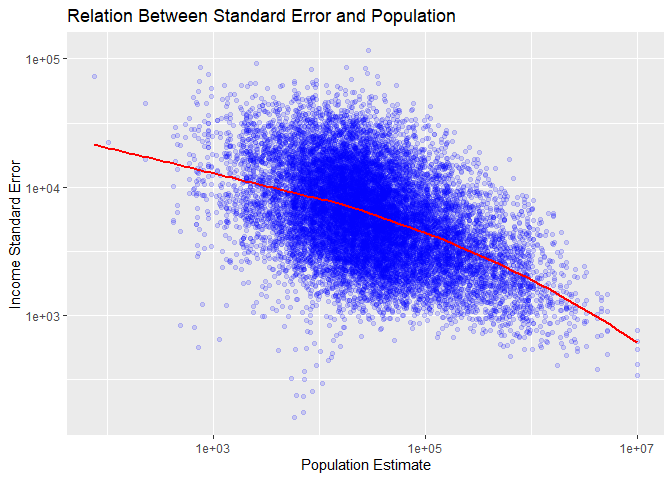

US Income
================
Katherine Danielson
04-03-2025

- [Grading Rubric](#grading-rubric)
  - [Individual](#individual)
  - [Submission](#submission)
- [Setup](#setup)
  - [**q1** Load the population data from c06; simply replace
    `filename_pop`
    below.](#q1-load-the-population-data-from-c06-simply-replace-filename_pop-below)
  - [**q2** Obtain median income data from the Census
    Bureau:](#q2-obtain-median-income-data-from-the-census-bureau)
  - [**q3** Tidy the `df_income` dataset by completing the code below.
    Pivot and rename the columns to arrive at the column names
    `id, geographic_area_name, category, income_estimate, income_moe`.](#q3-tidy-the-df_income-dataset-by-completing-the-code-below-pivot-and-rename-the-columns-to-arrive-at-the-column-names-id-geographic_area_name-category-income_estimate-income_moe)
  - [**q4** Convert the margin of error to standard error. Additionally,
    compute a 99% confidence interval on income, and normalize the
    standard error to `income_CV = income_SE / income_estimate`. Provide
    these columns with the names
    `income_SE, income_lo, income_hi, income_CV`.](#q4-convert-the-margin-of-error-to-standard-error-additionally-compute-a-99-confidence-interval-on-income-and-normalize-the-standard-error-to-income_cv--income_se--income_estimate-provide-these-columns-with-the-names-income_se-income_lo-income_hi-income_cv)
  - [**q5** Join `df_q4` and `df_pop`.](#q5-join-df_q4-and-df_pop)
- [Analysis](#analysis)
  - [**q6** Study the following graph, making sure to note what you can
    *and can’t* conclude based on the estimates and confidence
    intervals. Document your observations below and answer the
    questions.](#q6-study-the-following-graph-making-sure-to-note-what-you-can-and-cant-conclude-based-on-the-estimates-and-confidence-intervals-document-your-observations-below-and-answer-the-questions)
  - [**q7** Plot the standard error against population for all counties.
    Create a visual that effectively highlights the trends in the data.
    Answer the questions under *observations*
    below.](#q7-plot-the-standard-error-against-population-for-all-counties-create-a-visual-that-effectively-highlights-the-trends-in-the-data-answer-the-questions-under-observations-below)
- [Going Further](#going-further)
  - [**q8** Pose your own question about the data. Create a
    visualization (or table) here, and document your
    observations.](#q8-pose-your-own-question-about-the-data-create-a-visualization-or-table-here-and-document-your-observations)
- [References](#references)

*Purpose*: We’ve been learning how to quantify uncertainty in estimates
through the exercises; now its time to put those skills to use studying
real data. In this challenge we’ll use concepts like confidence
intervals to help us make sense of census data.

*Reading*: - [Using ACS Estimates and Margin of
Error](https://www.census.gov/data/academy/webinars/2020/calculating-margins-of-error-acs.html)
(Optional, see the PDF on the page) - [Patterns and Causes of
Uncertainty in the American Community
Survey](https://www.sciencedirect.com/science/article/pii/S0143622813002518?casa_token=VddzQ1-spHMAAAAA:FTq92LXgiPVloJUVjnHs8Ma1HwvPigisAYtzfqaGbbRRwoknNq56Y2IzszmGgIGH4JAPzQN0)
(Optional, particularly the *Uncertainty in surveys* section under the
Introduction.)

<!-- include-rubric -->

# Grading Rubric

<!-- -------------------------------------------------- -->

Unlike exercises, **challenges will be graded**. The following rubrics
define how you will be graded, both on an individual and team basis.

## Individual

<!-- ------------------------- -->

| Category | Needs Improvement | Satisfactory |
|----|----|----|
| Effort | Some task **q**’s left unattempted | All task **q**’s attempted |
| Observed | Did not document observations, or observations incorrect | Documented correct observations based on analysis |
| Supported | Some observations not clearly supported by analysis | All observations clearly supported by analysis (table, graph, etc.) |
| Assessed | Observations include claims not supported by the data, or reflect a level of certainty not warranted by the data | Observations are appropriately qualified by the quality & relevance of the data and (in)conclusiveness of the support |
| Specified | Uses the phrase “more data are necessary” without clarification | Any statement that “more data are necessary” specifies which *specific* data are needed to answer what *specific* question |
| Code Styled | Violations of the [style guide](https://style.tidyverse.org/) hinder readability | Code sufficiently close to the [style guide](https://style.tidyverse.org/) |

## Submission

<!-- ------------------------- -->

Make sure to commit both the challenge report (`report.md` file) and
supporting files (`report_files/` folder) when you are done! Then submit
a link to Canvas. **Your Challenge submission is not complete without
all files uploaded to GitHub.**

# Setup

<!-- ----------------------------------------------------------------------- -->

``` r
library(tidyverse)
```

    ## ── Attaching core tidyverse packages ──────────────────────── tidyverse 2.0.0 ──
    ## ✔ dplyr     1.1.4     ✔ readr     2.1.5
    ## ✔ forcats   1.0.0     ✔ stringr   1.5.1
    ## ✔ ggplot2   3.5.1     ✔ tibble    3.2.1
    ## ✔ lubridate 1.9.4     ✔ tidyr     1.3.1
    ## ✔ purrr     1.0.2     
    ## ── Conflicts ────────────────────────────────────────── tidyverse_conflicts() ──
    ## ✖ dplyr::filter() masks stats::filter()
    ## ✖ dplyr::lag()    masks stats::lag()
    ## ℹ Use the conflicted package (<http://conflicted.r-lib.org/>) to force all conflicts to become errors

### **q1** Load the population data from c06; simply replace `filename_pop` below.

``` r
## TODO: Give the filename for your copy of Table B01003
filename_pop <- "./data/ACSDT5Y2018.B01003-Data.csv"

## NOTE: No need to edit
df_pop <-
  read_csv(
    filename_pop,
    skip = 1,
  ) %>% 
  rename(
    population_estimate = `Estimate!!Total`
  )
```

    ## New names:
    ## Rows: 3220 Columns: 5
    ## ── Column specification
    ## ──────────────────────────────────────────────────────── Delimiter: "," chr
    ## (3): Geography, Geographic Area Name, Margin of Error!!Total dbl (1):
    ## Estimate!!Total lgl (1): ...5
    ## ℹ Use `spec()` to retrieve the full column specification for this data. ℹ
    ## Specify the column types or set `show_col_types = FALSE` to quiet this message.
    ## • `` -> `...5`

``` r
df_pop <-
  df_pop %>% 
  select(-"...5")
df_pop
```

    ## # A tibble: 3,220 × 4
    ##    Geography   `Geographic Area Name` population_estimate Margin of Error!!Tot…¹
    ##    <chr>       <chr>                                <dbl> <chr>                 
    ##  1 0500000US0… Autauga County, Alaba…               55200 *****                 
    ##  2 0500000US0… Baldwin County, Alaba…              208107 *****                 
    ##  3 0500000US0… Barbour County, Alaba…               25782 *****                 
    ##  4 0500000US0… Bibb County, Alabama                 22527 *****                 
    ##  5 0500000US0… Blount County, Alabama               57645 *****                 
    ##  6 0500000US0… Bullock County, Alaba…               10352 *****                 
    ##  7 0500000US0… Butler County, Alabama               20025 *****                 
    ##  8 0500000US0… Calhoun County, Alaba…              115098 *****                 
    ##  9 0500000US0… Chambers County, Alab…               33826 *****                 
    ## 10 0500000US0… Cherokee County, Alab…               25853 *****                 
    ## # ℹ 3,210 more rows
    ## # ℹ abbreviated name: ¹​`Margin of Error!!Total`

You might wonder why the `Margin of Error` in the population estimates
is listed as `*****`. From the [documentation (PDF
link)](https://www.google.com/url?sa=t&rct=j&q=&esrc=s&source=web&cd=&cad=rja&uact=8&ved=2ahUKEwj81Omy16TrAhXsguAKHTzKDQEQFjABegQIBxAB&url=https%3A%2F%2Fwww2.census.gov%2Fprograms-surveys%2Facs%2Ftech_docs%2Faccuracy%2FMultiyearACSAccuracyofData2018.pdf%3F&usg=AOvVaw2TOrVuBDlkDI2gde6ugce_)
for the ACS:

> If the margin of error is displayed as ‘\*\*\*\*\*’ (five asterisks),
> the estimate has been controlled to be equal to a fixed value and so
> it has no sampling error. A standard error of zero should be used for
> these controlled estimates when completing calculations, such as those
> in the following section.

This means that for cases listed as `*****` the US Census Bureau
recommends treating the margin of error (and thus standard error) as
zero.

### **q2** Obtain median income data from the Census Bureau:

- `Filter > Topics > Income and Poverty > Income and Poverty`
- `Filter > Geography > County > All counties in United States`
- Look for `Median Income in the Past 12 Months` (Table S1903)
- Download the 2018 5-year ACS estimates; save to your `data` folder and
  add the filename below.

``` r
## TODO: Give the filename for your copy of Table S1903
filename_income <- "./data/ACSST5Y2018.S1903-Data.csv"

## NOTE: No need to edit
df_income <-
  read_csv(filename_income, skip = 1)
```

    ## New names:
    ## • `` -> `...243`

    ## Warning: One or more parsing issues, call `problems()` on your data frame for details,
    ## e.g.:
    ##   dat <- vroom(...)
    ##   problems(dat)

    ## Rows: 3220 Columns: 243
    ## ── Column specification ────────────────────────────────────────────────────────
    ## Delimiter: ","
    ## chr  (66): Geography, Geographic Area Name, Estimate!!Median income (dollars...
    ## dbl (176): Estimate!!Number!!HOUSEHOLD INCOME BY RACE AND HISPANIC OR LATINO...
    ## lgl   (1): ...243
    ## 
    ## ℹ Use `spec()` to retrieve the full column specification for this data.
    ## ℹ Specify the column types or set `show_col_types = FALSE` to quiet this message.

``` r
df_income
```

    ## # A tibble: 3,220 × 243
    ##    Geography      `Geographic Area Name`   Estimate!!Number!!HOUSEHOLD INCOME …¹
    ##    <chr>          <chr>                                                    <dbl>
    ##  1 0500000US01001 Autauga County, Alabama                                  21115
    ##  2 0500000US01003 Baldwin County, Alabama                                  78622
    ##  3 0500000US01005 Barbour County, Alabama                                   9186
    ##  4 0500000US01007 Bibb County, Alabama                                      6840
    ##  5 0500000US01009 Blount County, Alabama                                   20600
    ##  6 0500000US01011 Bullock County, Alabama                                   3609
    ##  7 0500000US01013 Butler County, Alabama                                    6708
    ##  8 0500000US01015 Calhoun County, Alabama                                  45033
    ##  9 0500000US01017 Chambers County, Alabama                                 13516
    ## 10 0500000US01019 Cherokee County, Alabama                                 10606
    ## # ℹ 3,210 more rows
    ## # ℹ abbreviated name:
    ## #   ¹​`Estimate!!Number!!HOUSEHOLD INCOME BY RACE AND HISPANIC OR LATINO ORIGIN OF HOUSEHOLDER!!Households`
    ## # ℹ 240 more variables:
    ## #   `Margin of Error!!Number MOE!!HOUSEHOLD INCOME BY RACE AND HISPANIC OR LATINO ORIGIN OF HOUSEHOLDER!!Households` <dbl>,
    ## #   `Estimate!!Number!!HOUSEHOLD INCOME BY RACE AND HISPANIC OR LATINO ORIGIN OF HOUSEHOLDER!!Households!!One race--!!White` <dbl>,
    ## #   `Margin of Error!!Number MOE!!HOUSEHOLD INCOME BY RACE AND HISPANIC OR LATINO ORIGIN OF HOUSEHOLDER!!Households!!One race--!!White` <dbl>, …

Use the following test to check that you downloaded the correct file:

``` r
## NOTE: No need to edit, use to check you got the right file.
assertthat::assert_that(
  df_income %>%
    filter(Geography == "0500000US01001") %>%
    pull(`Estimate!!Percent Distribution!!FAMILY INCOME BY FAMILY SIZE!!2-person families`)
  == 45.6
)
```

    ## [1] TRUE

``` r
print("Well done!")
```

    ## [1] "Well done!"

This dataset is in desperate need of some *tidying*. To simplify the
task, we’ll start by considering the `\\d-person families` columns
first.

### **q3** Tidy the `df_income` dataset by completing the code below. Pivot and rename the columns to arrive at the column names `id, geographic_area_name, category, income_estimate, income_moe`.

*Hint*: You can do this in a single pivot using the `".value"` argument
and a `names_pattern` using capture groups `"()"`. Remember that you can
use an OR operator `|` in a regex to allow for multiple possibilities in
a capture group, for example `"(Estimate|Margin of Error)"`.

``` r
df_q3 <-
  df_income %>%
  select(
    Geography,
    contains("Geographic"),
    # This will select only the numeric d-person family columns;
    # it will ignore the annotation columns
    contains("median") & matches("\\d-person families") & !contains("Annotation of")
  ) %>% 
  mutate(across(contains("median"), as.numeric)) %>%
# ## TODO: Pivot the data, rename the columns
  rename(
    id = "Geography",
    geographic_area_name = "Geographic Area Name"
  ) %>% 
 
  pivot_longer(
    cols = contains("median"),  # Pivot only the median columns
    names_to = c(".value", "category"),  # Split into category and value
    names_pattern = "(Estimate|Margin of Error)!!.*!!(.*)"  
  ) %>%
    # Rename pivoted columns to desired names
  rename(
    income_estimate = "Estimate",
    income_moe = "Margin of Error"
  )
```

    ## Warning: There were 8 warnings in `mutate()`.
    ## The first warning was:
    ## ℹ In argument: `across(contains("median"), as.numeric)`.
    ## Caused by warning:
    ## ! NAs introduced by coercion
    ## ℹ Run `dplyr::last_dplyr_warnings()` to see the 7 remaining warnings.

``` r
glimpse(df_q3)
```

    ## Rows: 16,100
    ## Columns: 5
    ## $ id                   <chr> "0500000US01001", "0500000US01001", "0500000US010…
    ## $ geographic_area_name <chr> "Autauga County, Alabama", "Autauga County, Alaba…
    ## $ category             <chr> "2-person families", "3-person families", "4-pers…
    ## $ income_estimate      <dbl> 64947, 80172, 85455, 88601, 103787, 63975, 79390,…
    ## $ income_moe           <dbl> 6663, 14181, 10692, 20739, 12387, 2297, 8851, 519…

``` r
df_q3 
```

    ## # A tibble: 16,100 × 5
    ##    id             geographic_area_name    category    income_estimate income_moe
    ##    <chr>          <chr>                   <chr>                 <dbl>      <dbl>
    ##  1 0500000US01001 Autauga County, Alabama 2-person f…           64947       6663
    ##  2 0500000US01001 Autauga County, Alabama 3-person f…           80172      14181
    ##  3 0500000US01001 Autauga County, Alabama 4-person f…           85455      10692
    ##  4 0500000US01001 Autauga County, Alabama 5-person f…           88601      20739
    ##  5 0500000US01001 Autauga County, Alabama 6-person f…          103787      12387
    ##  6 0500000US01003 Baldwin County, Alabama 2-person f…           63975       2297
    ##  7 0500000US01003 Baldwin County, Alabama 3-person f…           79390       8851
    ##  8 0500000US01003 Baldwin County, Alabama 4-person f…           88458       5199
    ##  9 0500000US01003 Baldwin County, Alabama 5-person f…           91259       7011
    ## 10 0500000US01003 Baldwin County, Alabama 6-person f…           69609      23175
    ## # ℹ 16,090 more rows

``` r
## Identify and remove na values
# map(
#   df_q3,
#   ~ sum(is.na(.))
# )
# df_q3 %>%
#   filter(is.na(income_estimate) | is.na(income_moe))
# df_q3
```

Use the following tests to check your work:

``` r
## NOTE: No need to edit
assertthat::assert_that(setequal(
  names(df_q3),
  c("id", "geographic_area_name", "category", "income_estimate", "income_moe")
))
```

    ## [1] TRUE

``` r
assertthat::assert_that(
  df_q3 %>%
    filter(id == "0500000US01001", category == "2-person families") %>%
    pull(income_moe)
  == 6663
)
```

    ## [1] TRUE

``` r
print("Nice!")
```

    ## [1] "Nice!"

The data gives finite values for the Margin of Error, which is closely
related to the Standard Error. The Census Bureau documentation gives the
following relationship between Margin of Error and Standard Error:

$$\text{MOE} = 1.645 \times \text{SE}.$$

### **q4** Convert the margin of error to standard error. Additionally, compute a 99% confidence interval on income, and normalize the standard error to `income_CV = income_SE / income_estimate`. Provide these columns with the names `income_SE, income_lo, income_hi, income_CV`.

``` r
C <- 0.99
q <- qnorm(1 - (1 - C) / 2)

df_q4 <-
  df_q3 %>% 
  mutate(
    income_SE = income_moe / 1.645,
    income_lo = income_estimate - q * income_SE,
    income_hi = income_estimate + q * income_SE,
    income_CV = income_SE / income_estimate
  )
df_q4
```

    ## # A tibble: 16,100 × 9
    ##    id         geographic_area_name category income_estimate income_moe income_SE
    ##    <chr>      <chr>                <chr>              <dbl>      <dbl>     <dbl>
    ##  1 0500000US… Autauga County, Ala… 2-perso…           64947       6663     4050.
    ##  2 0500000US… Autauga County, Ala… 3-perso…           80172      14181     8621.
    ##  3 0500000US… Autauga County, Ala… 4-perso…           85455      10692     6500.
    ##  4 0500000US… Autauga County, Ala… 5-perso…           88601      20739    12607.
    ##  5 0500000US… Autauga County, Ala… 6-perso…          103787      12387     7530.
    ##  6 0500000US… Baldwin County, Ala… 2-perso…           63975       2297     1396.
    ##  7 0500000US… Baldwin County, Ala… 3-perso…           79390       8851     5381.
    ##  8 0500000US… Baldwin County, Ala… 4-perso…           88458       5199     3160.
    ##  9 0500000US… Baldwin County, Ala… 5-perso…           91259       7011     4262.
    ## 10 0500000US… Baldwin County, Ala… 6-perso…           69609      23175    14088.
    ## # ℹ 16,090 more rows
    ## # ℹ 3 more variables: income_lo <dbl>, income_hi <dbl>, income_CV <dbl>

Use the following tests to check your work:

``` r
## NOTE: No need to edit
assertthat::assert_that(setequal(
  names(df_q4),
  c("id", "geographic_area_name", "category", "income_estimate", "income_moe",
    "income_SE", "income_lo", "income_hi", "income_CV")
))
```

    ## [1] TRUE

``` r
assertthat::assert_that(
  abs(
    df_q4 %>%
    filter(id == "0500000US01001", category == "2-person families") %>%
    pull(income_SE) - 4050.456
  ) / 4050.456 < 1e-3
)
```

    ## [1] TRUE

``` r
assertthat::assert_that(
  abs(
    df_q4 %>%
    filter(id == "0500000US01001", category == "2-person families") %>%
    pull(income_lo) - 54513.72
  ) / 54513.72 < 1e-3
)
```

    ## [1] TRUE

``` r
assertthat::assert_that(
  abs(
    df_q4 %>%
    filter(id == "0500000US01001", category == "2-person families") %>%
    pull(income_hi) - 75380.28
  ) / 75380.28 < 1e-3
)
```

    ## [1] TRUE

``` r
assertthat::assert_that(
  abs(
    df_q4 %>%
    filter(id == "0500000US01001", category == "2-person families") %>%
    pull(income_CV) - 0.06236556
  ) / 0.06236556 < 1e-3
)
```

    ## [1] TRUE

``` r
print("Nice!")
```

    ## [1] "Nice!"

One last wrangling step: We need to join the two datasets so we can
compare population with income.

### **q5** Join `df_q4` and `df_pop`.

``` r
## TODO: Join df_q4 and df_pop by the appropriate column

df_data <- 
  df_q4 %>%
  left_join(
    df_pop %>%
      select(Geography, population_estimate),  # Select only the relevant columns from df_pop
    by = c("id" = "Geography")
  )
df_data
```

    ## # A tibble: 16,100 × 10
    ##    id         geographic_area_name category income_estimate income_moe income_SE
    ##    <chr>      <chr>                <chr>              <dbl>      <dbl>     <dbl>
    ##  1 0500000US… Autauga County, Ala… 2-perso…           64947       6663     4050.
    ##  2 0500000US… Autauga County, Ala… 3-perso…           80172      14181     8621.
    ##  3 0500000US… Autauga County, Ala… 4-perso…           85455      10692     6500.
    ##  4 0500000US… Autauga County, Ala… 5-perso…           88601      20739    12607.
    ##  5 0500000US… Autauga County, Ala… 6-perso…          103787      12387     7530.
    ##  6 0500000US… Baldwin County, Ala… 2-perso…           63975       2297     1396.
    ##  7 0500000US… Baldwin County, Ala… 3-perso…           79390       8851     5381.
    ##  8 0500000US… Baldwin County, Ala… 4-perso…           88458       5199     3160.
    ##  9 0500000US… Baldwin County, Ala… 5-perso…           91259       7011     4262.
    ## 10 0500000US… Baldwin County, Ala… 6-perso…           69609      23175    14088.
    ## # ℹ 16,090 more rows
    ## # ℹ 4 more variables: income_lo <dbl>, income_hi <dbl>, income_CV <dbl>,
    ## #   population_estimate <dbl>

# Analysis

<!-- ----------------------------------------------------------------------- -->

We now have both estimates and confidence intervals for
`\\d-person families`. Now we can compare cases with quantified
uncertainties: Let’s practice!

### **q6** Study the following graph, making sure to note what you can *and can’t* conclude based on the estimates and confidence intervals. Document your observations below and answer the questions.

``` r
## NOTE: No need to edit; run and inspect
wid <- 0.5

df_data %>%
  filter(str_detect(geographic_area_name, "Massachusetts")) %>%
  mutate(
    county = str_remove(geographic_area_name, " County,.*$"),
    county = fct_reorder(county, income_estimate)
  ) %>%

  ggplot(aes(county, income_estimate, color = category)) +
  geom_errorbar(
    aes(ymin = income_lo, ymax = income_hi),
    position = position_dodge(width = wid)
  ) +
  geom_point(position = position_dodge(width = wid)) +

  coord_flip() +
  labs(
    x = "County",
    y = "Median Household Income"
  )
```

    ## Warning: There was 1 warning in `mutate()`.
    ## ℹ In argument: `county = fct_reorder(county, income_estimate)`.
    ## Caused by warning:
    ## ! `fct_reorder()` removing 2 missing values.
    ## ℹ Use `.na_rm = TRUE` to silence this message.
    ## ℹ Use `.na_rm = FALSE` to preserve NAs.

    ## Warning: Removed 2 rows containing missing values or values outside the scale range
    ## (`geom_point()`).

<!-- -->

**Observations**:

- Document your observations here.
  - For the most part, two-person families have the lowest median
    household income, then three-person, and then four-person families.
    After that, it depends on the county where five-person or six-person
    families lay on the trend of median household incomes. This is
    likely the case as larger person families need more money to sustain
    themselves. One trend that remains consistent across different
    counties is that larger-person families have larger confidence
    intervals/variance in their median household incomes. This is likely
    due to the fact that with larger families there is a greater chance
    to earn money and yet a much larger expense is required–it is likely
    that some families that are larger are not prepared for that
    expense, while others earn a lot and are able to sustain it.
    Additionally, there is a relative trend within counties–some
    counties have much more variation in their median household incomes
    than others and have much wider confidence intervals. Generally, a
    city either has wide confidence intervals or smaller ones, but still
    follows the general trend of increasing the width of confidence
    intervals as the family size increases.
- Can you confidently distinguish between household incomes in Suffolk
  county? Why or why not?
  - I cannot confidently distinguish between household incomes in
    Suffolk county. While the median dot still follows the overarching
    trend of increasing as household size increases, all of the
    confidence intervals overlap with each other. Thus, this data is not
    statistically significant from one another and there is no way to
    confidently distinguish between household incomes, as in actuality,
    different size households could fall anywhere on their confidence
    interval (all of which overlap)l.
- Which counties have the widest confidence intervals?
  - The county with the widest confidence intervals is Nantucket which
    has very wide confidence intervals for households of all sizes. In
    addition, Dukes has very wide confidence intervals for all
    households as well while Hampshire, Berkshire and minorly Franklin
    have quite wide confidence intervals only for their five and
    six-person households.

In the next task you’ll investigate the relationship between population
and uncertainty.

### **q7** Plot the standard error against population for all counties. Create a visual that effectively highlights the trends in the data. Answer the questions under *observations* below.

*Hint*: Remember that standard error is a function of *both* variability
(e.g. variance) and sample size.

``` r
df_data %>%
  group_by(geographic_area_name) %>%
  ggplot(aes(population_estimate, income_SE)) +
  geom_point(alpha = 0.15, color = "blue") +
  geom_smooth(method = "loess", color = "red", se = FALSE) +  # Trend line
  scale_x_log10() +
  labs(
    title = "Relation Between Standard Error and Population", 
    x = "Population Estimate",
    y = "Income Standard Error"
  )
```

    ## `geom_smooth()` using formula = 'y ~ x'

    ## Warning: Removed 814 rows containing non-finite outside the scale range
    ## (`stat_smooth()`).

    ## Warning: Removed 814 rows containing missing values or values outside the scale range
    ## (`geom_point()`).

<!-- -->

**Observations**:

- What *overall* trend do you see between `SE` and population? Why might
  this trend exist?
  - Overall, I see a trend of decreasing income standard error as
    population size increases. This is likely the case as smaller
    populations “handle” variability worse. Often smaller populations
    come with an associated smaller sample size. When fluctuations
    happen in smaller sample sizes, the results are often skewed much
    farther. As standard error measures the variability of an estimate
    due to sampling, standard error is high in small populations as the
    estimates are highly varied. Comparatively, larger populations tend
    to have larger sample sizes which encompasses a lot more variation.
    When a population is large, sample estimates tend to be more stable
    and precise, leading to lower standard errors.
- What does this *overall* trend tell you about the relative ease of
  studying small vs large counties?
  - The overall trend tells us that it is often easier to study large
    counties compared to smaller counties. Large counties have a much
    smaller standard error which can make data analysis and conclusion
    formation much simpler. While there may be more smaller counties (at
    least sampled here), you need to draw on a much larger sample size
    compared to the total population when looking at smaller counties
    compared to large counties. Additionally, with smaller counties, it
    is can be much harder to draw conclusions as the small size can lead
    to large fluctuations in median income and would likely need to do
    multi-year studies (more intensive) to gain conclusions that mirror
    the quality of large population county conclusions drawn from a much
    shorter analysis period.

# Going Further

<!-- ----------------------------------------------------------------------- -->

Now it’s your turn! You have income data for every county in the United
States: Pose your own question and try to answer it with the data.

### **q8** Pose your own question about the data. Create a visualization (or table) here, and document your observations.

``` r
## TODO: Pose and answer your own question about the data
df_data %>% 
  filter(
    str_detect(geographic_area_name, "Fairfax County|Lorain|Fort Bend|Cumberland County, Maine|Nevada County, California"),
    category == "4-person families" | category == "5-person families"  
  ) %>%
  mutate(
    county = str_remove(geographic_area_name, " County,.*$"),
    county = fct_reorder(county, income_estimate)
  ) %>% 
 ggplot(aes(county, income_estimate, color = category)) +
  geom_errorbar(
    aes(ymin = income_lo, ymax = income_hi),
    position = position_dodge(width = wid)
  ) +
  geom_point(position = position_dodge(width = wid)) +
  coord_flip() +
  labs(
    x = "County",
    y = "Median Household Income",
    title = "Median Household Income in Select Counties"
  )
```

<!-- -->

``` r
df_data %>% 
  filter(
    str_detect(geographic_area_name, "Fairfax County|Lorain|Fort Bend|Cumberland County, Maine|Nevada County, California"),
    category == "4-person families" | category == "5-person families"
  ) %>%
   mutate(
    county = str_remove(geographic_area_name, " County,.*$"),
    county = fct_reorder(county, population_estimate)
  ) %>% 
  group_by(county) %>%  
  summarise(
    population_estimate = mean(population_estimate, na.rm = TRUE)  # Use mean to average values
  )
```

    ## # A tibble: 5 × 2
    ##   county     population_estimate
    ##   <fct>                    <dbl>
    ## 1 Nevada                   99092
    ## 2 Cumberland              290944
    ## 3 Lorain                  306713
    ## 4 Fort Bend               739342
    ## 5 Fairfax                1143529

**Question:**

- How does median household income differ between 4 and 5-person
  families in Fairfax County, Lorain County, Fort Bend County, Nevada
  County and Cumberland County (three places I have lived and two that
  my family is considering moving to)?

\*I wanted to do this question and work to understand the average
incomes and how (ignoring any of my parent’s job classifications) the
median household income may have shifted considering the growth and
decline of my family with my younger brother being born and my older
brother no longer being considered an independent.

**Observations**:

- Overarchingly, there is a large amount of overlap between the median
  incomes of households both wihtin and between each county. The only
  county that holds an exception is Fairfax County. Fairfax County is
  high enough in the median household income that its confidence
  intervals do not overlap with any other counties. Additionally,
  Fairfax County is the only county that does not have overlap between
  the 4-person and 5-person median household incomes in the county. The
  only county that comes close to this is Fort Bend County where there
  is very limited overlap between the four and five-person family median
  household incomes. It is interesting to note that Nevada County is the
  only county where the middle dot on the confidence interval of
  four-person families is below that of five-person families.

- For the most part, the trend we had analyzed in prior graphs still
  holds. On average, five-person families tend to have a much wider
  confidence interval than four-person families do. While this is the
  case, there is still a large amount of variance between the different
  counties in the size of their confidence intervals. That is,
  comparatively Nevada County has much wider confidence intervals than
  Fairfax County. This trend holds similar when looking at Lorain as
  well. To try to understand this better, I pulled a table illustrating
  the county population_estimate of each county.

- When adding in this additional aspect of population and analyzing the
  graph and table side to side, many interesting observations can be
  reached. Nevada County is the smallest, then Cumberland, then Lorain,
  then Fort Bend and lastly Fairfax. Fairfax appears to have the
  smallest confidence intervals in the graph and Nevda has the largest
  confidence intervals. This can likely be explained by the income_SE
  variance we saw with smaller counties having a much larger income_SE
  compared to larger counties. This trend remains similar for the rest
  of the three counties. It is additionally intersting to note that for
  the most part, with the exception of Lorain, the population size
  appears to determine the trend of the median household income with the
  larger counties generally having a higher median household income.
  However, without further data analysis we cannot fully draw this
  conclusion, and we would need to have a larger sample size. It would
  be interesting to look at the geographic location in combination with
  population to see if that helps to determine median household income.
  When simply using the knowledge I have, Fairfax is near DC and Fort
  Bend is near Houston – both large cities with high levels of economic
  activity. Comparatively, Nevada County is near Tahoe, Lorain near
  Cleveland and Cumberland near Portland. While all three counties are
  near or include known cities, they are comparatively more rural and
  smaller than both DC and Houston. With more data analysis, the
  population and geographic local in comparison to rural and urban could
  have a large influence.

# References

<!-- ----------------------------------------------------------------------- -->

\[1\] Spielman SE, Folch DC, Nagle NN (2014) Patterns and causes of
uncertainty in the American Community Survey. Applied Geography 46:
147–157. <pmid:25404783>
[link](https://www.sciencedirect.com/science/article/pii/S0143622813002518?casa_token=VddzQ1-spHMAAAAA:FTq92LXgiPVloJUVjnHs8Ma1HwvPigisAYtzfqaGbbRRwoknNqZ6Y2IzszmGgIGH4JAPzQN0)
