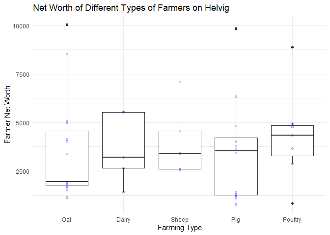
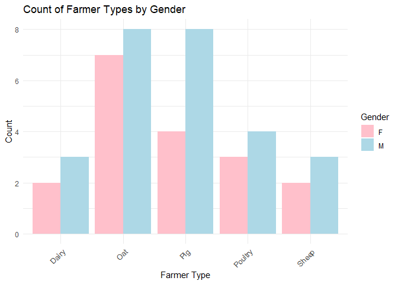
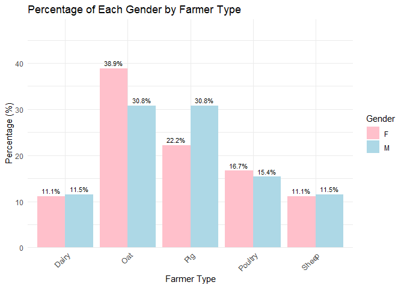
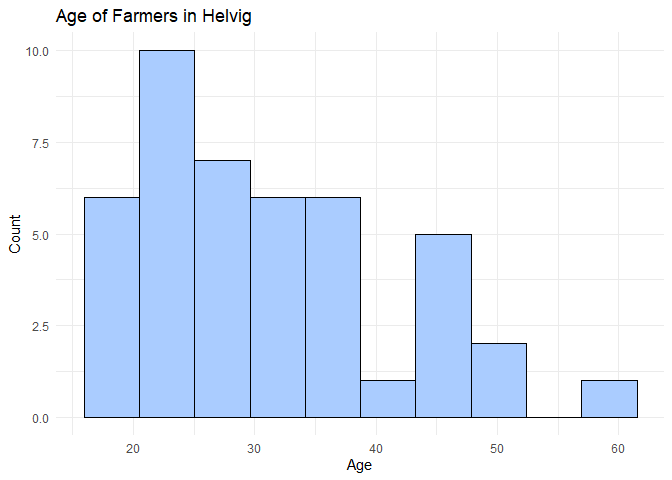
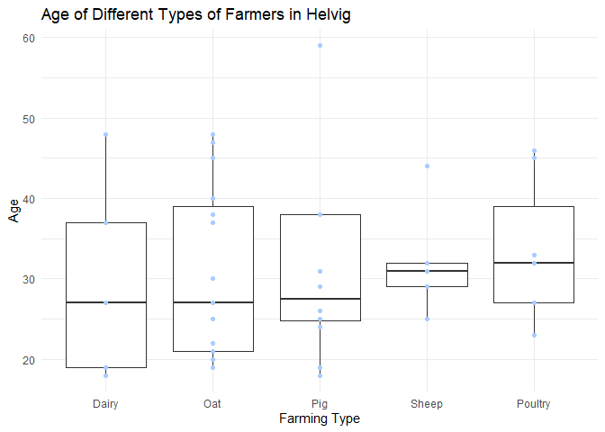
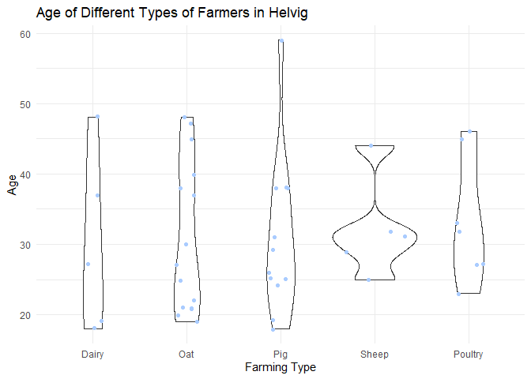
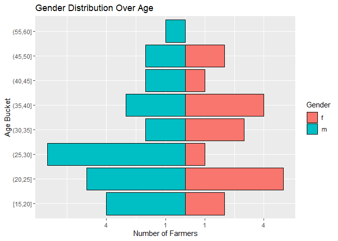
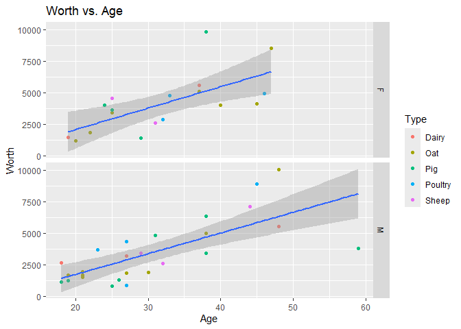

The Islands, Part 2: Study
================
Katherine Danielson, Olivia Smith, Dakota Chang, Cooper Penkava
04-10-2025

- [Grading Rubric](#grading-rubric)
  - [Individual](#individual)
  - [Submission](#submission)
- [Setup](#setup)
  - [**q1** Planning a study (TEAMWORK)](#q1-planning-a-study-teamwork)
  - [**q2** EDA](#q2-eda)
  - [**q3** Key Analyses](#q3-key-analyses)
  - [**q4** Answers](#q4-answers)

*Purpose*: This is part 2 of 2. In part 1 you *planed* your statistical
project, particularly your data collection. In this part you will give
updates on your plan, and report your findings.

This challenge is deliberately shorter so you have time to collect and
analyze your data.

*Important note*: While we expect that you did your data collection with
your team, you need to complete your own individual report for c10.

<!-- include-rubric -->

# Grading Rubric

<!-- -------------------------------------------------- -->

Unlike exercises, **challenges will be graded**. The following rubrics
define how you will be graded, both on an individual and team basis.

## Individual

<!-- ------------------------- -->

| Category | Needs Improvement | Satisfactory |
|----|----|----|
| Effort | Some task **q**’s left unattempted | All task **q**’s attempted |
| Observed | Did not document observations, or observations incorrect | Documented correct observations based on analysis |
| Supported | Some observations not clearly supported by analysis | All observations clearly supported by analysis (table, graph, etc.) |
| Assessed | Observations include claims not supported by the data, or reflect a level of certainty not warranted by the data | Observations are appropriately qualified by the quality & relevance of the data and (in)conclusiveness of the support |
| Specified | Uses the phrase “more data are necessary” without clarification | Any statement that “more data are necessary” specifies which *specific* data are needed to answer what *specific* question |
| Code Styled | Violations of the [style guide](https://style.tidyverse.org/) hinder readability | Code sufficiently close to the [style guide](https://style.tidyverse.org/) |

## Submission

<!-- ------------------------- -->

Make sure to commit both the challenge report (`report.md` file) and
supporting files (`report_files/` folder) when you are done! Then submit
a link to Canvas. **Your Challenge submission is not complete without
all files uploaded to GitHub.**

# Setup

<!-- ----------------------------------------------------------------------- -->

``` r
library(tidyverse)
```

    ## ── Attaching core tidyverse packages ──────────────────────── tidyverse 2.0.0 ──
    ## ✔ dplyr     1.1.4     ✔ readr     2.1.5
    ## ✔ forcats   1.0.0     ✔ stringr   1.5.1
    ## ✔ ggplot2   3.5.1     ✔ tibble    3.2.1
    ## ✔ lubridate 1.9.4     ✔ tidyr     1.3.1
    ## ✔ purrr     1.0.2     
    ## ── Conflicts ────────────────────────────────────────── tidyverse_conflicts() ──
    ## ✖ dplyr::filter() masks stats::filter()
    ## ✖ dplyr::lag()    masks stats::lag()
    ## ℹ Use the conflicted package (<http://conflicted.r-lib.org/>) to force all conflicts to become errors

``` r
library(rsample)
library(ggforce)
```

    ## Warning: package 'ggforce' was built under R version 4.4.3

``` r
# TODO: Include any other packages you need
```

### **q1** Planning a study (TEAMWORK)

While you provided this plan in c08 (Part 1), please include your plan
here. In particular, describe how you updated your plan in response to
feedback.

#### **Population**

- We will be studying only the farmers of Helvig as our population.

*We updated this to be uniform between all members–we want our
population to be solely the farmers of Helvig.*

#### **Quantity of interest**

- Our main quantity of interest is worth. This value can be viewed when
  clicking on an islander’s profile.

**Covariates**

- There are several covariates. They can all be viewed by clicking on an
  islander’s profile:

  - Age

  - Gender

  - Occupation

#### **Observation or experiment?**

The Islands allows you to ask islanders to complete tasks. If you just
take measurements on your participants, then it’s an observational
study. But if you also introduce something that’s meant to change the
outcome of a measurement (e.g., drinking coffee before taking a test),
that’s called an experimental study. You need to decide whether your
study is observational or experimental.

- This study is a strictly observational study as we are just collecting
  the data from our participants.

#### **Question / Hypothesis**

- How are farming occupation and islander worth related for the
  residents of Helvig?

- **We believe that certain farming occupations increase islander
  individual worth.** We are also investigating gender and age in
  conjunction to isolate the effects of farming occupation and worth.

#### **Sampling plan**

- What steps will you take to collect the data?

There are five farming occupations in Helvig: Dairy, Oats, Pigs,
Poultry, and Sheep. We copied and pasted the list from the Bureau of
Helvig in the respective order, and the names are ordered alphabetically
based on last names. This list is then put into an Excel spreadsheet,
where each person is located along with that islanders corresponding
farming occupation.

We will then use R’s random number generator with a seed of 101 to
select the individuals for our sample based on assigned numbers. We are
going to choose 44 random islanders, stratified by the proportions of
the population that each type of farming makes up within the whole of
Helvig farmers. After the generation of these 44 stratified random
numbers, we will collect the data for each assigned person–occupation,
worth, gender, and age. To do so, we will go to the Helvig Bureau, go to
“Registers,” find each individual’s name under their farming occupation,
click on their name, and note their gender, age and worth. This data
will then go into a spreadsheet that we will later turn into a csv file
for data analysis. 

As this is an observational study, not an experimental one, the
introduction of bias is very limited as we are simply collecting four
pieces of data from each person.

- How will you ensure the data is representative of your chosen
  population?

We will take a stratified random sample of 44 individuals (roughly half
of the population). We placed all of the farming occupations and their
names into a sheet. Once we do this, we randomly select 44 individuals
from the (stratified) total farming population. By using a larger random
sample, this will ensure we are able to capture demographics and
information from all of the different farming groups (which range in
size 10-31 individuals). This will additionally capture the variance in
gender and age based on population demographics. 

- How will you choose your sample size?

We will choose a sample size of 44 individuals as we want to be fairly
confident in our results. As the population size is 92 individuals and
we have four members on our team, each collecting roughly 11 people’s
worth of data is attainable.

- **How did the plan change?**

*We went away from the random number generator idea so that we could do
a stratified random sample instead. For this, we just calculated the
proportion that each type of farming makes of the whole of farming and
then randomly selected those filtered populations up to that proportion
times 44, our total sample size. We also specified how you can find the
data in relation to the islander at hand.*

### **q2** EDA

Conduct an EDA on your data. Add as many code chunks as you need. Ensure
your EDA gives enough context of the data for us to understand what
comes next in this report.

**General Population EDA**

The general population EDA was performed to understand the quantities of
each type of farmer and determine the proportions for our stratified
sample.

``` r
farmerdata_pop <- "./data/c10_farmerdata.csv"

#Load the general population data and rename
df_pop <-
  read_csv(
    farmerdata_pop,
  )
```

    ## Rows: 92 Columns: 2
    ## ── Column specification ────────────────────────────────────────────────────────
    ## Delimiter: ","
    ## chr (2): Name, Type
    ## 
    ## ℹ Use `spec()` to retrieve the full column specification for this data.
    ## ℹ Specify the column types or set `show_col_types = FALSE` to quiet this message.

``` r
glimpse(df_pop)
```

    ## Rows: 92
    ## Columns: 2
    ## $ Name <chr> "Kirstie Eklund", "Pranay Ganaka", "Brenda Lund", "Takahiro McCar…
    ## $ Type <chr> "Dairy", "Dairy", "Dairy", "Dairy", "Dairy", "Dairy", "Dairy", "D…

``` r
#Identify the number of distinct names in the Full_Names
df_pop %>% 
  distinct(Name)
```

    ## # A tibble: 92 × 1
    ##    Name              
    ##    <chr>             
    ##  1 Kirstie Eklund    
    ##  2 Pranay Ganaka     
    ##  3 Brenda Lund       
    ##  4 Takahiro McCarthy 
    ##  5 Isabella Moore    
    ##  6 Kanehiro Nishimura
    ##  7 Conor Sato        
    ##  8 Saeed Sharma      
    ##  9 Sigrid Sorensen   
    ## 10 Joshua Yamada     
    ## # ℹ 82 more rows

``` r
#Identify the different Farmer_Types and count for each of them 
df_pop %>%
  count(Type)
```

    ## # A tibble: 5 × 2
    ##   Type        n
    ##   <chr>   <int>
    ## 1 Dairy      10
    ## 2 Oat        31
    ## 3 Pig        25
    ## 4 Poultry    15
    ## 5 Sheep      11

*Observations*

- `Name`: This identifies the name of the farmer. There are a total of
  92 farmers on Helvig. None of them hold two different kinds of farming
  jobs at once–they all have only one kind of farming that they do.

- `Type`: This identifies the type of farmer. There are 5 different
  types of farmers: Dairy, Oat, Pig, Poultry, and Sheep.

  - There are 10 Dairy farmers, 11 Sheep farmers, 15 Poultry farmers, 25
    Pig farmers, and 31 Oat farmers.

- We used the data collected here to create a proportional stratified
  sample. This stratified sample has an EDA performed as well below.

**Collection of Stratified Sampling**

Determining proportions of each type of farmer.

``` r
# summarise df and count values of column type then mutate to include proportions 
df_summary <- df_pop %>%
  group_by(Type) %>%
  summarise(count = n()) %>%
  mutate(Prop = count / sum(count))

df_summary
```

    ## # A tibble: 5 × 3
    ##   Type    count  Prop
    ##   <chr>   <int> <dbl>
    ## 1 Dairy      10 0.109
    ## 2 Oat        31 0.337
    ## 3 Pig        25 0.272
    ## 4 Poultry    15 0.163
    ## 5 Sheep      11 0.120

Creation of the stratified sample and selection of the 44 people.

``` r
# randomly draw numbers from each proportion count to get a stratified random sample

# set sample size
total_sample_size <- 45  

# calculate sample size per stratum
df_summary <- df_summary %>%
  mutate(sample_size = round(Prop * total_sample_size))

# stratified sampling
set.seed(101)

stratified_sample <- df_pop %>%
  group_by(Type) %>%
  group_split() %>%
  map2_df(df_summary$sample_size, ~ .x[sample(nrow(.x), .y), ])

# view result
stratified_sample
```

    ## # A tibble: 44 × 2
    ##    Name               Type 
    ##    <chr>              <chr>
    ##  1 Sigrid Sorensen    Dairy
    ##  2 Joshua Yamada      Dairy
    ##  3 Kanehiro Nishimura Dairy
    ##  4 Conor Sato         Dairy
    ##  5 Kirstie Eklund     Dairy
    ##  6 Bianka Schulte     Oat  
    ##  7 Michael Solberg    Oat  
    ##  8 Lukas Solberg      Oat  
    ##  9 Kari Solberg       Oat  
    ## 10 James Morris       Oat  
    ## # ℹ 34 more rows

``` r
# export result
write_csv(stratified_sample, "stratified_sample.csv")
```

**Sample Population EDA**

This EDA is on the stratified sample.

``` r
farmerdata_samp <- "./data/c10_farmersample.csv"

#Load the general population data and rename
df_samp <-
  read_csv(
    farmerdata_samp,
  ) %>% 
  rename(
    Worth = "Net Worth"
  )
```

    ## Rows: 44 Columns: 5
    ## ── Column specification ────────────────────────────────────────────────────────
    ## Delimiter: ","
    ## chr (3): Name, Type, Gender
    ## dbl (2): Net Worth, Age
    ## 
    ## ℹ Use `spec()` to retrieve the full column specification for this data.
    ## ℹ Specify the column types or set `show_col_types = FALSE` to quiet this message.

``` r
glimpse(df_samp)
```

    ## Rows: 44
    ## Columns: 5
    ## $ Name   <chr> "Sigrid Sorensen", "Joshua Yamada", "Kanehiro Nishimura", "Cono…
    ## $ Type   <chr> "Dairy", "Dairy", "Dairy", "Dairy", "Dairy", "Oat", "Oat", "Oat…
    ## $ Worth  <dbl> 1425, 3196, 5537, 2642, 5556, 4129, 10034, 4993, 3383, 1949, 16…
    ## $ Age    <dbl> 19, 27, 48, 18, 37, 45, 48, 38, 25, 21, 19, 21, 47, 22, 37, 27,…
    ## $ Gender <chr> "F", "M", "M", "M", "F", "F", "M", "M", "F", "M", "M", "M", "F"…

``` r
#Idenitfy the number of farmers in each Type
df_samp %>% 
  count(Type)
```

    ## # A tibble: 5 × 2
    ##   Type        n
    ##   <chr>   <int>
    ## 1 Dairy       5
    ## 2 Oat        15
    ## 3 Pig        12
    ## 4 Poultry     7
    ## 5 Sheep       5

``` r
#Idenitfy the number of each Gender
df_samp %>% 
  count(Gender)
```

    ## # A tibble: 2 × 2
    ##   Gender     n
    ##   <chr>  <int>
    ## 1 F         18
    ## 2 M         26

``` r
#Identify the mean, sd and IQR of Age
df_samp %>% 
  summarize(
    min_age = min(Age),
    max_age = max(Age),
    mean_age = mean(Age),
    sd_age = sd(Age),
    IQR_age = IQR(Age)
  )
```

    ## # A tibble: 1 × 5
    ##   min_age max_age mean_age sd_age IQR_age
    ##     <dbl>   <dbl>    <dbl>  <dbl>   <dbl>
    ## 1      18      59     31.2   10.1    14.2

``` r
#Identify the mean, sd and IQR of Worth
df_samp %>% 
  summarize(
    min_worth = min(Worth),
    max_worth = max(Worth),
    mean_worth = mean(Worth),
    sd_worth = sd(Worth),
    IQR_worth = IQR(Worth)
  )
```

    ## # A tibble: 1 × 5
    ##   min_worth max_worth mean_worth sd_worth IQR_worth
    ##       <dbl>     <dbl>      <dbl>    <dbl>     <dbl>
    ## 1       794     10034      3735.    2391.     3073.

*Observations*

- `Name`: There are names (first and last name) of the 44 indiviudals in
  the sample. They represent farmers from five different `Type`s of
  farming on Helvig.

- `Type`: This represents the five different types of farming in Helvig:
  Dairy farming, Oat farming, Pig farming, Poultry farming and Sheep
  farming. The number of individuals from each farming `Type` was
  selected using a proportional stratified sample.

  - Dairy farming has 5 individuals represented in the sample

  - Oat farming has 15 individuals represented in the sample

  - Pig farming has 12 individuals represented in the sample

  - Poultry farming has 7 individuals represented in the sample

  - Sheep farming has 5 individuals represented in the sample

- `Gender`: This represents the gender of the individual and is (from
  what we sample) a gender binary

  - There are 18 females

  - There are 26 males

- `Net Worth` / `Worth`: This variable was changed to `Worth` and
  represents the net worth of individuals in the sample. This is a
  widely ranging number with the maximum being ~12.6 times higher than
  the minimum.

  - The minimum worth is \$794

  - The maximum worth is \$10034

  - The sample has a mean worth of \$3734.864 and has a high standard
    deviation of \$2391.152 with an IQR of \$3073.25.

- `Age`: This variable illustrates the age of each individual in the
  sample, and ranges quite widely.

  - The minimum age is 18

  - The maximum age is 59

  - The mean age is 31.22727 with a standard deviation of 10.09689 and
    an IQR of 14.25.

### **q3** Key Analyses

Present the key analyses that support your questions / hypotheses. This
could include summary statistics (e.g., a proportion of Islanders),
grouped summary statistics (e.g., a proportion for group A, and for
group B), or visualizations (e.g., a histogram). This section should be
short, and every analysis should directly relate to q4.

``` r
df_samp %>% 
  mutate(Type = fct_reorder(Type, Worth)) %>% 
  ggplot(aes(Type, Worth)) +
  geom_boxplot() +
  geom_point(color = "blue", alpha = 0.2) +
  labs(
    x = "Farming Type",
    y = "Farmer Net Worth",
    title = "Net Worth of Different Types of Farmers on Helvig"
  ) +
  theme_minimal()
```

<!-- -->

``` r
anova_result_WT <- aov(Worth ~ Type, data = df_samp)
summary(anova_result_WT)
```

    ##             Df    Sum Sq Mean Sq F value Pr(>F)
    ## Type         4   4178523 1044631   0.169  0.953
    ## Residuals   39 241678701 6196890

*Observations*

- As illustrated by the anova test there is no statistically significant
  difference in `Worth` between farmer `Type`. The F-value is 0.169
  showing very little difference between group means compared to the
  variation within groups. The p-value of 0.953 shows there is no
  statistical significance between `Type` and `Worth`.
- While there is not a statistically significant difference between
  farming-type median net `Worth`s, there is a trend in the median
  earnings. Oat farming generally has the lowest median `Worth` – coming
  in below 2500. However, while Oat farming produces the lowest median
  new `Worth`, it also contains the highest outlier. Dairy, Sheep, and
  Pig farming all have very similar median `Worth` values, however,
  Dairy makes the lowest median of the three, then Sheep, then Pig.
  Poultry has a decently higher median `Worth`, but has a smaller sample
  size compared to that of Oat and Pig.
- All types of farming have quite a large distribution of individual
  worth. Specifically, the largest distribution of `Worth` appears to be
  within Oat and Pig farming. It should be noted that these two Types of
  farming had the largest proportional stratified sample size at 15 and
  12, respectively. The remaining three have smaller distributions, with
  Poultry having the smallest distribution. Poultry had a smaller sample
  size (7), but has the highest median net Worth and has 5 very
  concentrated points. It would be interesting to look at the total
  population to see if this trend remains the same.
  - One other interesting thing of note in this graph is the
    concentration of individuals within Oat and Pig farming (the two
    largest distributions). Both of them appear to have a lower and
    upper cluster within the box plot. It would be interesting to see
    what possibly causes this clustering–whether it be age, gender,
    etc..

``` r
# Boxplot of Worth by Gender
worth_boxplot <- ggplot(df_samp, aes(x = Gender, y = Worth, fill = Gender)) +
  geom_boxplot() +
  labs(title = "Net Worth Distribution by Gender",
       x = "Gender",
       y = "Net Worth") +
  scale_fill_manual(values = c("F" = "pink", "M" = "lightblue")) +
  theme_minimal()

# Count plot of farmer Type by Gender
type_count_plot <- ggplot(df_samp, aes(x = Type, fill = Gender)) +
  geom_bar(position = "dodge") +
  labs(title = "Count of Farmer Types by Gender",
       x = "Farmer Type",
       y = "Count") +
  scale_fill_manual(values = c("F" = "pink", "M" = "lightblue")) +
  theme_minimal() +
  theme(axis.text.x = element_text(angle = 45, hjust = 1))


df_perc <- df_samp %>%
  count(Type, Gender) %>%  
  group_by(Gender) %>%         
  mutate(Percentage = n / sum(n) * 100) %>%
  ungroup()                       

type_percentage_plot <- ggplot(df_perc, aes(x = Type, y = Percentage, fill = Gender)) +
  geom_col(position = "dodge") +  # Dodged bars (side-by-side)
  geom_text(
    aes(label = paste0(round(Percentage, 1), "%")),  # Add % labels
    position = position_dodge(width = 0.9),          # Align with bars
    vjust = -0.5,                                    # Place above bars
    size = 3
  ) +
  scale_y_continuous(
    limits = c(0, 45), 
    expand = expansion(mult = c(0, 0.1))  
  ) +
  labs(
    title = "Percentage of Each Gender by Farmer Type",
    x = "Farmer Type",
    y = "Percentage (%)"
  ) +
  scale_fill_manual(values = c("F" = "pink", "M" = "lightblue")) +
  theme_minimal() +
  theme(axis.text.x = element_text(angle = 45, hjust = 1))

anova_gender <-
  aov(Worth ~ Gender + Type, df_samp)

anova_type <- 
  aov(
    Gender_bool ~ Type, 
    df_samp %>% 
      mutate(Gender_bool = (Gender == "F"))
  )

summary(anova_gender)
```

    ##             Df    Sum Sq Mean Sq F value Pr(>F)
    ## Gender       1   3936193 3936193   0.629  0.433
    ## Type         4   4016942 1004236   0.160  0.957
    ## Residuals   38 237904088 6260634

``` r
summary(anova_type)
```

    ##             Df Sum Sq Mean Sq F value Pr(>F)
    ## Type         4  0.122 0.03052   0.113  0.977
    ## Residuals   39 10.514 0.26960

``` r
print(worth_boxplot)
```

<!-- -->

``` r
print(type_count_plot)
```

<!-- -->

``` r
print(type_percentage_plot)
```

<!-- -->

*Observations*

- The box plot shows a slight difference between the median and bounds
  on the IQR between male and female islanders, although it is quite
  slight. Given the fact that there are only 22 data points here, it is
  hard to tell if this difference is significant or not. According to
  the anova we ran, there is a p-value of 0.413, which indicates that
  this is not significant enough to raise any flags. So, the data
  collected by us gives the impression that there is not significant
  enough data difference to come to the conclusion that there is a
  difference between worth across gender.

- The dodged bar chart shows that there is also not a very significant
  difference in the counts of the two - just off by one for most
  categories except pig. But we realized that plotting counts might not
  be absolutely the most real way of representing the data we
  collected - because of random sampling, we may not have gotten the
  same amount of males as females, so we decided to create the
  percentages plot.

- After making it based on percentages, some differences become
  clearer - because of the differing counts, the percentages for oat and
  pig farmers are a little different actually. That wasn’t so clear
  before with just the counts! Running another anova shows that there is
  not really a significant correlation between male and female and the
  type of farmer (P = 0.977), so we just keep going.

``` r
# age distribution of farmers in Helvig
df_samp %>% 
  ggplot(aes(Age)) +
  geom_histogram(bins = 10, fill = "#aaccff", color = "black") +
  labs(
    x = "Age",
    y = "Count",
    title = "Age of Farmers in Helvig"
  ) +
  theme_minimal()
```

<!-- -->

``` r
# age distribution over different types
df_samp %>% 
  mutate(Type = fct_reorder(Type, Age)) %>% 
  ggplot(aes(Type, Age)) +
  geom_boxplot() +
  geom_point(color = "#aaccff") +
  labs(
    x = "Farming Type",
    y = "Age",
    title = "Age of Different Types of Farmers in Helvig"
  ) +
  theme_minimal()
```

<!-- -->

``` r
# age distribution over different types sina plot

df_samp %>% 
  mutate(Type = fct_reorder(Type, Age)) %>% 
  ggplot(aes(Type, Age)) +
  geom_violin() +
  geom_sina(color = "#aaccff") +
  labs(
    x = "Farming Type",
    y = "Age",
    title = "Age of Different Types of Farmers in Helvig"
  ) +
  theme_minimal()
```

<!-- -->

*Observations*

- Farmers in Helvig tend to lean on the younger side, with most of them
  being between 18-38, with a spike at 48. There are no farmers above
  the age of 59.

- There is little to no correlation between age and type of farming,
  this is found in both the box plot and also the anova analysis, where
  the p-value is high at 0.949. This indicates that there is no
  statistically significant difference between the ages of the different
  types of farmers.

- In the sina plot, we can see that there is a slight clustering of ages
  within the Sheep farmers. However, that might be attributed to the
  small sample size of 5 or possible age distribution as noted in the
  prior graph.

``` r
m <-
  df_samp %>% 
  filter(Gender == "M") %>% 
  tibble(
    age_bucket = cut_width(Age, width = 5, boundary = .0)
  ) %>% 
  group_by(age_bucket) %>% 
  summarize(n = -n()) %>% 
  mutate(Gender = "m")

f <- 
  df_samp %>% 
  filter(Gender == "F") %>% 
  tibble(
   age_bucket = cut_width(Age, width = 5, boundary = .0)
  )  %>% 
  group_by(age_bucket) %>% 
  summarise(n = n()) %>% 
  mutate(Gender = "f")


bind_rows(m, f) %>% 
  ggplot() +
  geom_col(aes(x = age_bucket, y = n, fill = Gender), position = 'stack',
                 color = 'black') +
  scale_y_continuous(
    breaks = c(-8, -4, -1, +1, +4, +8),
    labels = c("8", "4", "1", "1", "4", "8")
  ) +
  labs(
    title = "Gender Distribution Over Age",
    y = "Number of Farmers",
    x = "Age Bucket"
  ) +
  coord_flip()
```

<!-- -->

``` r
g <-
  df_samp %>% 
  ggplot(aes(x = Age, y = Worth)) +
  geom_point(
    aes(x = Age, y = Worth, color = Type)
  ) + 
  geom_smooth(method = "lm") +
  labs(title = "Worth vs. Age") 

g + facet_grid(rows = vars(Gender))
```

    ## `geom_smooth()` using formula = 'y ~ x'

<!-- -->

*Observations*

Gender Distribution Over Age

- The ratio between female and male farmers is relatively even, except
  for the 25 to 30 age range where there are seven times more men than
  women. 

- The most farmers are in the 20-30 age range

- There is only one farmer in the 50-60 age range

- Female farmers have the highest probability of being in the 20-25 age
  range

- Male farmers have the highest probability of being in the 25-30 age
  range

Worth vs. Age

- Men and women farmers have roughly the same progression of net worth

- Male farmers have a slightly lower standard error in their predicted
  wealth than female farmers

- Farmers’ wealth does not seem to correlate with farming type or gender

- Predicted worth increases with age, suggesting farmers can accumulate
  wealth throughout their life

- For both male and female farmers, the max worth is a data point around
  \$10,000. Perhaps this is the max amount of wealth one can accumulate
  in Helvig. 

### **q4** Answers

Connect your Key Analyses to your questions / hypotheses. What did you
conclude from your study?

Our guiding question for this analysis was: “How are farming occupation
and islander worth related for the residents of Helvig?” In turn, this
led to a null hypothesis of:

- There is no statistical difference between the `Worth` in various
  farming `Type`s in Helvig.

From our key analyses about we fail to reject the null hypothesis.

As seen from our graph “Net Worth of Different Types of Farmers on
Helvig,” and its consequent ANOVA, the p-value is 0.953, meaning that
there is no statistical significance between farming `Type` and `Worth`.
While there is a small trend in the median as illustrated in the box
plot, no true statistical trend can be captured. Thus, we decided to
analyze other factors including `Gender` and `Age` to see their impact
on each other and farming `Type` and `Worth`.

When looking at gender, we also can fail to show any real correlation
between it and occupation or worth, as seen with the plots “Net Worth
Distribution by Gender” and “Percentage of Each Gender by Farmer Type,”
along with their associated ANOVA tests (p-values of .433, .957, and
.977). The plots also visually describe a lack of correlation besides
vague and minor differences, most likely do to random sampling.

In terms of `Age`, we see virtually no difference across different
`Type`s of farmers. However, we do see that the farmers of Helvig lean
towards the younger side, with most being between the ages of 18-38.

There is not a significant discrepancy between `Gender` proportion in
the wider farming profession too. In the `Gender` Distribution Over
`Age` histogram, we can see that there are roughly the same proportions
of men and women farmers. There are a few outlier `Age` ranges, for
example, the 25-30 age range where there are 7 times as many men as
women, suggesting some sort of trend in farming popularity amongst
genders. However, taken as a whole there are roughly the same amount of
men and women in farming. This further suggests that gender is not a
factor in farmer demographic. However, from the graph we can see that
most farmers are clustered near the bottom in the younger age ranges,
again suggesting farmers tend to be younger in age. 

Further, from the `Worth` vs. `Age` graph, we can see that men and women
in every farming distribution can accumulate wealth with roughly the
same effectiveness. The trend line has a similar slope for both genders,
and the farming occupations do not seem to be correlated with worth or
gender in both graphs. This further suggests that `Worth` is not
affected by `Gender` or `Type`, but is instead by the accumulation of
wealth over time, i.e. age. 

Despite all this analysis, `Worth` appears to be largely unaffected by
other variables on Helvig and there appears to be very little covariance
other than between the variables of `Worth` and `Age`. We continue to
fail to reject our null hypothesis and conclude that different farming
`Type`s on Helvig do not have an impact on individual `Worth`.
