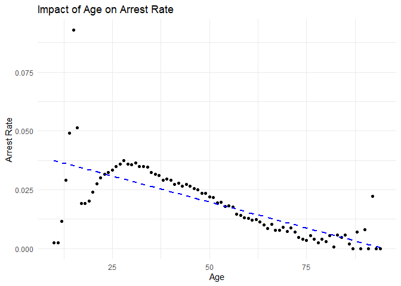

Massachusetts Highway Stops
================
Katherine Danielson
04-22-2025

- [Grading Rubric](#grading-rubric)
  - [Individual](#individual)
  - [Submission](#submission)
- [Setup](#setup)
  - [**q1** Go to the Stanford Open Policing Project page and download
    the Massachusetts State Police records in `Rds` format. Move the
    data to your `data` folder and match the `filename` to load the
    data.](#q1-go-to-the-stanford-open-policing-project-page-and-download-the-massachusetts-state-police-records-in-rds-format-move-the-data-to-your-data-folder-and-match-the-filename-to-load-the-data)
- [EDA](#eda)
  - [**q2** Do your “first checks” on the dataset. What are the basic
    facts about this
    dataset?](#q2-do-your-first-checks-on-the-dataset-what-are-the-basic-facts-about-this-dataset)
  - [**q3** Check the set of factor levels for `subject_race` and
    `raw_Race`. What do you note about overlap / difference between the
    two
    sets?](#q3-check-the-set-of-factor-levels-for-subject_race-and-raw_race-what-do-you-note-about-overlap--difference-between-the-two-sets)
  - [**q4** Check whether `subject_race` and `raw_Race` match for a
    large fraction of cases. Which of the two hypotheses above is most
    likely, based on your
    results?](#q4-check-whether-subject_race-and-raw_race-match-for-a-large-fraction-of-cases-which-of-the-two-hypotheses-above-is-most-likely-based-on-your-results)
  - [Vis](#vis)
    - [**q5** Compare the *arrest rate*—the fraction of total cases in
      which the subject was arrested—across different factors. Create as
      many visuals (or tables) as you need, but make sure to check the
      trends across all of the `subject` variables. Answer the questions
      under *observations*
      below.](#q5-compare-the-arrest-ratethe-fraction-of-total-cases-in-which-the-subject-was-arrestedacross-different-factors-create-as-many-visuals-or-tables-as-you-need-but-make-sure-to-check-the-trends-across-all-of-the-subject-variables-answer-the-questions-under-observations-below)
- [Modeling](#modeling)
  - [**q6** Run the following code and interpret the regression
    coefficients. Answer the the questions under *observations*
    below.](#q6-run-the-following-code-and-interpret-the-regression-coefficients-answer-the-the-questions-under-observations-below)
  - [**q7** Re-fit the logistic regression from q6 setting `"white"` as
    the reference level for `subject_race`. Interpret the the model
    terms and answer the questions
    below.](#q7-re-fit-the-logistic-regression-from-q6-setting-white-as-the-reference-level-for-subject_race-interpret-the-the-model-terms-and-answer-the-questions-below)
  - [**q8** Re-fit the model using a factor indicating the presence of
    contraband in the subject’s vehicle. Answer the questions under
    *observations*
    below.](#q8-re-fit-the-model-using-a-factor-indicating-the-presence-of-contraband-in-the-subjects-vehicle-answer-the-questions-under-observations-below)
  - [**q9** Go deeper: Pose at least one more question about the data
    and fit at least one more model in support of answering that
    question.](#q9-go-deeper-pose-at-least-one-more-question-about-the-data-and-fit-at-least-one-more-model-in-support-of-answering-that-question)
  - [Further Reading](#further-reading)

*Purpose*: In this last challenge we’ll focus on using logistic
regression to study a large, complicated dataset. Interpreting the
results of a model can be challenging—both in terms of the statistics
and the real-world reasoning—so we’ll get some practice in this
challenge.

<!-- include-rubric -->

# Grading Rubric

<!-- -------------------------------------------------- -->

Unlike exercises, **challenges will be graded**. The following rubrics
define how you will be graded, both on an individual and team basis.

## Individual

<!-- ------------------------- -->

| Category | Needs Improvement | Satisfactory |
|----|----|----|
| Effort | Some task **q**’s left unattempted | All task **q**’s attempted |
| Observed | Did not document observations, or observations incorrect | Documented correct observations based on analysis |
| Supported | Some observations not clearly supported by analysis | All observations clearly supported by analysis (table, graph, etc.) |
| Assessed | Observations include claims not supported by the data, or reflect a level of certainty not warranted by the data | Observations are appropriately qualified by the quality & relevance of the data and (in)conclusiveness of the support |
| Specified | Uses the phrase “more data are necessary” without clarification | Any statement that “more data are necessary” specifies which *specific* data are needed to answer what *specific* question |
| Code Styled | Violations of the [style guide](https://style.tidyverse.org/) hinder readability | Code sufficiently close to the [style guide](https://style.tidyverse.org/) |

## Submission

<!-- ------------------------- -->

Make sure to commit both the challenge report (`report.md` file) and
supporting files (`report_files/` folder) when you are done! Then submit
a link to Canvas. **Your Challenge submission is not complete without
all files uploaded to GitHub.**

*Background*: We’ll study data from the [Stanford Open Policing
Project](https://openpolicing.stanford.edu/data/), specifically their
dataset on Massachusetts State Patrol police stops.

``` r
library(tidyverse)
```

    ## ── Attaching core tidyverse packages ──────────────────────── tidyverse 2.0.0 ──
    ## ✔ dplyr     1.1.4     ✔ readr     2.1.5
    ## ✔ forcats   1.0.0     ✔ stringr   1.5.1
    ## ✔ ggplot2   3.5.1     ✔ tibble    3.2.1
    ## ✔ lubridate 1.9.4     ✔ tidyr     1.3.1
    ## ✔ purrr     1.0.2     
    ## ── Conflicts ────────────────────────────────────────── tidyverse_conflicts() ──
    ## ✖ dplyr::filter() masks stats::filter()
    ## ✖ dplyr::lag()    masks stats::lag()
    ## ℹ Use the conflicted package (<http://conflicted.r-lib.org/>) to force all conflicts to become errors

``` r
library(broom)
```

# Setup

<!-- -------------------------------------------------- -->

### **q1** Go to the [Stanford Open Policing Project](https://openpolicing.stanford.edu/data/) page and download the Massachusetts State Police records in `Rds` format. Move the data to your `data` folder and match the `filename` to load the data.

*Note*: An `Rds` file is an R-specific file format. The function
`readRDS` will read these files.

``` r
## TODO: Download the data, move to your data folder, and load it
filename <- "./data/yg821jf8611_ma_statewide_2020_04_01.rds"
df_data <- readRDS(filename)
df_data
```

    ## # A tibble: 3,416,238 × 24
    ##    raw_row_number date       location      county_name  subject_age subject_race
    ##    <chr>          <date>     <chr>         <chr>              <int> <fct>       
    ##  1 1              2007-06-06 MIDDLEBOROUGH Plymouth Co…          33 white       
    ##  2 2              2007-06-07 SEEKONK       Bristol Cou…          36 white       
    ##  3 3              2007-06-07 MEDFORD       Middlesex C…          56 white       
    ##  4 4              2007-06-07 MEDFORD       Middlesex C…          37 white       
    ##  5 5              2007-06-07 EVERETT       Middlesex C…          22 hispanic    
    ##  6 6              2007-06-07 MEDFORD       Middlesex C…          34 white       
    ##  7 7              2007-06-07 SOMERVILLE    Middlesex C…          54 hispanic    
    ##  8 8              2007-06-07 HOPKINTON     Middlesex C…          31 hispanic    
    ##  9 9              2007-06-07 SOMERVILLE    Middlesex C…          21 white       
    ## 10 10             2007-06-06 BARNSTABLE    Barnstable …          56 white       
    ## # ℹ 3,416,228 more rows
    ## # ℹ 18 more variables: subject_sex <fct>, type <fct>, arrest_made <lgl>,
    ## #   citation_issued <lgl>, warning_issued <lgl>, outcome <fct>,
    ## #   contraband_found <lgl>, contraband_drugs <lgl>, contraband_weapons <lgl>,
    ## #   contraband_alcohol <lgl>, contraband_other <lgl>, frisk_performed <lgl>,
    ## #   search_conducted <lgl>, search_basis <fct>, reason_for_stop <chr>,
    ## #   vehicle_type <chr>, vehicle_registration_state <fct>, raw_Race <chr>

# EDA

<!-- -------------------------------------------------- -->

### **q2** Do your “first checks” on the dataset. What are the basic facts about this dataset?

``` r
glimpse(df_data)
```

    ## Rows: 3,416,238
    ## Columns: 24
    ## $ raw_row_number             <chr> "1", "2", "3", "4", "5", "6", "7", "8", "9"…
    ## $ date                       <date> 2007-06-06, 2007-06-07, 2007-06-07, 2007-0…
    ## $ location                   <chr> "MIDDLEBOROUGH", "SEEKONK", "MEDFORD", "MED…
    ## $ county_name                <chr> "Plymouth County", "Bristol County", "Middl…
    ## $ subject_age                <int> 33, 36, 56, 37, 22, 34, 54, 31, 21, 56, 56,…
    ## $ subject_race               <fct> white, white, white, white, hispanic, white…
    ## $ subject_sex                <fct> male, male, female, male, female, male, mal…
    ## $ type                       <fct> vehicular, vehicular, vehicular, vehicular,…
    ## $ arrest_made                <lgl> FALSE, FALSE, FALSE, FALSE, FALSE, FALSE, F…
    ## $ citation_issued            <lgl> TRUE, FALSE, FALSE, FALSE, TRUE, TRUE, TRUE…
    ## $ warning_issued             <lgl> FALSE, TRUE, TRUE, TRUE, FALSE, FALSE, FALS…
    ## $ outcome                    <fct> citation, warning, warning, warning, citati…
    ## $ contraband_found           <lgl> NA, FALSE, NA, NA, NA, NA, NA, NA, NA, NA, …
    ## $ contraband_drugs           <lgl> NA, FALSE, NA, NA, NA, NA, NA, NA, NA, NA, …
    ## $ contraband_weapons         <lgl> NA, FALSE, NA, NA, NA, NA, NA, NA, NA, NA, …
    ## $ contraband_alcohol         <lgl> FALSE, FALSE, FALSE, FALSE, FALSE, FALSE, F…
    ## $ contraband_other           <lgl> NA, FALSE, NA, NA, NA, NA, NA, NA, NA, NA, …
    ## $ frisk_performed            <lgl> NA, FALSE, NA, NA, NA, NA, NA, NA, NA, NA, …
    ## $ search_conducted           <lgl> FALSE, TRUE, FALSE, FALSE, FALSE, FALSE, FA…
    ## $ search_basis               <fct> NA, other, NA, NA, NA, NA, NA, NA, NA, NA, …
    ## $ reason_for_stop            <chr> "Speed", NA, NA, NA, NA, "Speed", NA, NA, N…
    ## $ vehicle_type               <chr> "Passenger", "Commercial", "Passenger", "Co…
    ## $ vehicle_registration_state <fct> MA, MA, MA, MA, MA, MA, MA, MA, MA, MA, MA,…
    ## $ raw_Race                   <chr> "White", "White", "White", "White", "Hispan…

``` r
summary(df_data)               # Statistical summary of numeric columns
```

    ##  raw_row_number          date              location         county_name       
    ##  Length:3416238     Min.   :2007-01-01   Length:3416238     Length:3416238    
    ##  Class :character   1st Qu.:2009-04-22   Class :character   Class :character  
    ##  Mode  :character   Median :2011-07-08   Mode  :character   Mode  :character  
    ##                     Mean   :2011-07-16                                        
    ##                     3rd Qu.:2013-08-27                                        
    ##                     Max.   :2015-12-31                                        
    ##                                                                               
    ##   subject_age                     subject_race     subject_sex     
    ##  Min.   :10.00    asian/pacific islander: 166842   male  :2362238  
    ##  1st Qu.:25.00    black                 : 351610   female:1038377  
    ##  Median :34.00    hispanic              : 338317   NA's  :  15623  
    ##  Mean   :36.47    white                 :2529780                   
    ##  3rd Qu.:46.00    other                 :  11008                   
    ##  Max.   :94.00    unknown               :  17017                   
    ##  NA's   :158006   NA's                  :   1664                   
    ##          type         arrest_made     citation_issued warning_issued 
    ##  pedestrian:      0   Mode :logical   Mode :logical   Mode :logical  
    ##  vehicular :3416238   FALSE:3323303   FALSE:1244039   FALSE:2269244  
    ##                       TRUE :92019     TRUE :2171283   TRUE :1146078  
    ##                       NA's :916       NA's :916       NA's :916      
    ##                                                                      
    ##                                                                      
    ##                                                                      
    ##      outcome        contraband_found contraband_drugs contraband_weapons
    ##  warning :1146078   Mode :logical    Mode :logical    Mode :logical     
    ##  citation:2171283   FALSE:28256      FALSE:36296      FALSE:53237       
    ##  summons :      0   TRUE :27474      TRUE :19434      TRUE :2493        
    ##  arrest  :  92019   NA's :3360508    NA's :3360508    NA's :3360508     
    ##  NA's    :   6858                                                       
    ##                                                                         
    ##                                                                         
    ##  contraband_alcohol contraband_other frisk_performed search_conducted
    ##  Mode :logical      Mode :logical    Mode :logical   Mode :logical   
    ##  FALSE:3400070      FALSE:51708      FALSE:51029     FALSE:3360508   
    ##  TRUE :16168        TRUE :4022       TRUE :3602      TRUE :55730     
    ##                     NA's :3360508    NA's :3361607                   
    ##                                                                      
    ##                                                                      
    ##                                                                      
    ##          search_basis     reason_for_stop    vehicle_type      
    ##  k9            :      0   Length:3416238     Length:3416238    
    ##  plain view    :      0   Class :character   Class :character  
    ##  consent       :   6903   Mode  :character   Mode  :character  
    ##  probable cause:  25898                                        
    ##  other         :  18228                                        
    ##  NA's          :3365209                                        
    ##                                                                
    ##  vehicle_registration_state   raw_Race        
    ##  MA     :3053713            Length:3416238    
    ##  CT     :  82906            Class :character  
    ##  NY     :  69059            Mode  :character  
    ##  NH     :  51514                              
    ##  RI     :  39375                              
    ##  (Other): 109857                              
    ##  NA's   :   9814

``` r
sapply(df_data, function(x) sum(is.na(x)))  # Count missing values per column
```

    ##             raw_row_number                       date 
    ##                          0                          0 
    ##                   location                county_name 
    ##                       6666                       6666 
    ##                subject_age               subject_race 
    ##                     158006                       1664 
    ##                subject_sex                       type 
    ##                      15623                          0 
    ##                arrest_made            citation_issued 
    ##                        916                        916 
    ##             warning_issued                    outcome 
    ##                        916                       6858 
    ##           contraband_found           contraband_drugs 
    ##                    3360508                    3360508 
    ##         contraband_weapons         contraband_alcohol 
    ##                    3360508                          0 
    ##           contraband_other            frisk_performed 
    ##                    3360508                    3361607 
    ##           search_conducted               search_basis 
    ##                          0                    3365209 
    ##            reason_for_stop               vehicle_type 
    ##                    1659589                       4963 
    ## vehicle_registration_state                   raw_Race 
    ##                       9814                       1664

**Observations**:

- This dataset has 3416238 rows and 24 columns and analyzes police stops
  in the state of Massachusetts.

- Variables inputs are composed of logicals, characters and numericals

  - Many missing values in variables related to contraband and
    search/frisk activity (likely due to not being relevant in most
    stops).

  - Reason for stop is missing in about half the rows.

- Categorical values like `subject_race`, `subject_sex`, and
  `vehicle_type` are mostly consistent but should still be cleaned for
  analysis.

  - This correlates to the comment later where `raw_Race` and
    `subject_race` need to be analyzed to determine how/if they are
    related to one another.

- Variables like `subject_age` are highly ranging and start at 10 and
  end at 94 – Illustrating high bounds outside of what would be
  considered “normal”

- `subject_race` includes white, hispanic, black, asian/pacific
  islander, other, NA and unknown.

- `vehicle_registration_state` illustrates that vehicles are not only
  from Massachusetts but there are many individuals stopped with out of
  state plates

Beneath is a table with the variables, a description I wrote and the
number of missing values in each column.

| Variable | Description | Missing Values |
|----|----|----|
| `date` | Date of the stop | 0 |
| `location`, `county_name` | Where the stop happened | 6,666 |
| `subject_age` | Age of the person stopped (min: 10, max: 98) | 158,006 |
| `subject_race` | Race of the subject (e.g., White, Black, Hispanic, etc.) | 1,664 |
| `subject_sex` | Sex of the subject | 15,623 |
| `vehicle_type` | Vehicle vs pedestrian | 4,963 |
| `arrest_made` | Boolean – was an arrest made? | 916 |
| `citation_issued` | Boolean – was a citation issued? | 916 |
| `warning_issued` | Boolean – was a warning issued? | 916 |
| `contraband_*` | Various types of contraband (drugs, weapons, alcohol, other) | ~3.3M each (alcohol is an exception) |
| `frisk_performed` | Was a frisk performed | ~3.36M |
| `search_conducted` | Was a search conducted | 0 |
| `search_basis` | Reason for the search | ~3.36M |
| `reason_for_stop` | Speeding, etc. | 1,659,589 |
| `vehicle_registration_state` | MA, CT, NH, NY, RI, etc. | 9,814 |
| `raw_Race` | Raw form of race | 1,664 |

Note that we have both a `subject_race` and `race_Raw` column. There are
a few possibilities as to what `race_Raw` represents:

- `race_Raw` could be the race of the police officer in the stop
- `race_Raw` could be an unprocessed version of `subject_race`

Let’s try to distinguish between these two possibilities.

### **q3** Check the set of factor levels for `subject_race` and `raw_Race`. What do you note about overlap / difference between the two sets?

``` r
## TODO: Determine the factor levels for subject_race and raw_Race
# Extract the columns
subject_race <- df_data %>% pull(subject_race)
raw_race <- df_data %>% pull(raw_Race)

df_data %>% 
  distinct(subject_race)
```

    ## # A tibble: 7 × 1
    ##   subject_race          
    ##   <fct>                 
    ## 1 white                 
    ## 2 hispanic              
    ## 3 black                 
    ## 4 asian/pacific islander
    ## 5 other                 
    ## 6 <NA>                  
    ## 7 unknown

``` r
df_data %>% 
  distinct(raw_Race)
```

    ## # A tibble: 9 × 1
    ##   raw_Race                                     
    ##   <chr>                                        
    ## 1 White                                        
    ## 2 Hispanic                                     
    ## 3 Black                                        
    ## 4 Asian or Pacific Islander                    
    ## 5 Middle Eastern or East Indian (South Asian)  
    ## 6 American Indian or Alaskan Native            
    ## 7 <NA>                                         
    ## 8 None - for no operator present citations only
    ## 9 A

**Observations**:

- What are the unique values for `subject_race`?
  - `subject_race` has white, hispanic, black, asian/pacific islander,
    other, NA and unknown.
    - The terms unknown and other are the only two that are fully
      unique/distinct in naming convention. However, due to spelling and
      punctuation, no name of `subject_race` truly matches with that of
      `raw_Race`.
- What are the unique values for `raw_Race`?
  - `raw_Race` has White, Hispanic, Black, Asian or Pacific Islander,
    Middle Eastern or East Indian (South Asian), American Indian or
    Alaskan Native, NA, None - for no operator present citations only,
    and A.
    - The terms, Middle Eastern or East Indian (South Asian), American
      Indian or Alaskan Native, None - for no operator present citations
      only, and A are the unique terms. However, due to spelling and
      punctuation, no name of `subject_race` truly matches with that of
      `raw_Race`. It can likely be assumed that races like Middle
      Eastern or East Indian (South Asian) would fit into the other
      category.
- What is the overlap between the two sets?
  - If we ignore punctuation, the races that directly correspond between
    the two sets are white, hispanic, black, asian/pacific islander and
    NA.
- What is the difference between the two sets?
  - Between the two sets there is a difference in capitalization,
    punctuation and grouping that could make the seeming differences fit
    together. For example, the “other” race in `subject_race` could
    include Middle Eastern or East Indian (South Asian), American Indian
    or Alaskan Native and possibly A from `raw_Race`.

### **q4** Check whether `subject_race` and `raw_Race` match for a large fraction of cases. Which of the two hypotheses above is most likely, based on your results?

*Note*: Just to be clear, I’m *not* asking you to do a *statistical*
hypothesis test.

``` r
## TODO: Devise your own way to test the hypothesis posed above.
df_race_compare <- df_data %>%
  mutate(
    subject_race_clean = tolower(as.character(subject_race)),
    raw_race_clean = case_when(
      str_to_lower(raw_Race) == "white" ~ "white",
      str_to_lower(raw_Race) == "hispanic" ~ "hispanic",
      str_to_lower(raw_Race) == "black" ~ "black",
      str_to_lower(raw_Race) == "asian or pacific islander" ~ "asian/pacific islander",
      str_to_lower(raw_Race) == "middle eastern or east indian (south asian)" ~ "other",
      str_to_lower(raw_Race) == "american indian or alaskan native" ~ "other",
      str_to_lower(raw_Race) == "none - for no operator present citations only" ~ "unknown",
      str_to_lower(raw_Race) == "a" ~ NA_character_,
      is.na(raw_Race) ~ NA_character_
    )
  )

# Check how often the cleaned values match
df_race_compare %>%
  mutate(match = subject_race_clean == raw_race_clean) %>%
  summarise(
    total = n(),
    matches = sum(match, na.rm = TRUE),
    match_rate = mean(match, na.rm = TRUE)
  )
```

    ## # A tibble: 1 × 3
    ##     total matches match_rate
    ##     <int>   <int>      <dbl>
    ## 1 3416238 3350022      0.981

**Observations**

Between the two hypotheses:

- `race_Raw` could be the race of the police officer in the stop
- `race_Raw` could be an unprocessed version of `subject_race`

which is most plausible, based on your results?

- Based on the fact that I have achieved a 98.1% match rate between
  `race_Raw` and `subject_race`, it is likely that `race_Raw` is an
  unprocessed version of `subject_race`. If `race_Raw` and
  `subject_race` were the race of the police officer in the stop and the
  race of the subject in the stop, it is highly unlikely that tehre
  would be such a high `match_rate` between the two.

## Vis

<!-- ------------------------- -->

### **q5** Compare the *arrest rate*—the fraction of total cases in which the subject was arrested—across different factors. Create as many visuals (or tables) as you need, but make sure to check the trends across all of the `subject` variables. Answer the questions under *observations* below.

(Note: Create as many chunks and visuals as you need)

``` r
# Helper: compute arrest rate for a given grouping variable
arrest_rate_by <- function(df, group_var) {
  df %>%
    group_by(.data[[group_var]]) %>%
    summarise(
      n_cases       = n(),
      n_arrests     = sum(arrest_made, na.rm = TRUE),
      arrest_rate   = n_arrests / n_cases
    ) %>%
    arrange(desc(arrest_rate))
}

# List of subject-level factors to compare
factors <- c("subject_age", "subject_race", "subject_sex", "vehicle_type")

# Compute summaries for each factor
arrest_summaries <- lapply(factors, function(f) {
  arrest_rate_by(df_race_compare, f) %>% mutate(factor = f)
 })

# View the arrest_rates
arrest_summaries
```

    ## [[1]]
    ## # A tibble: 86 × 5
    ##    subject_age n_cases n_arrests arrest_rate factor     
    ##          <int>   <int>     <int>       <dbl> <chr>      
    ##  1          15     474        44      0.0928 subject_age
    ##  2          16    2049       105      0.0512 subject_age
    ##  3          14     306        15      0.0490 subject_age
    ##  4          28  103177      3850      0.0373 subject_age
    ##  5          31   86418      3143      0.0364 subject_age
    ##  6          29   97563      3512      0.0360 subject_age
    ##  7          27  107790      3865      0.0359 subject_age
    ##  8          30   92693      3301      0.0356 subject_age
    ##  9          26  114595      4011      0.0350 subject_age
    ## 10          33   77540      2709      0.0349 subject_age
    ## # ℹ 76 more rows
    ## 
    ## [[2]]
    ## # A tibble: 7 × 5
    ##   subject_race           n_cases n_arrests arrest_rate factor      
    ##   <fct>                    <int>     <int>       <dbl> <chr>       
    ## 1 hispanic                338317     20085     0.0594  subject_race
    ## 2 black                   351610     12225     0.0348  subject_race
    ## 3 other                    11008       310     0.0282  subject_race
    ## 4 <NA>                      1664        42     0.0252  subject_race
    ## 5 white                  2529780     56540     0.0223  subject_race
    ## 6 asian/pacific islander  166842      2748     0.0165  subject_race
    ## 7 unknown                  17017        69     0.00405 subject_race
    ## 
    ## [[3]]
    ## # A tibble: 3 × 5
    ##   subject_sex n_cases n_arrests arrest_rate factor     
    ##   <fct>         <int>     <int>       <dbl> <chr>      
    ## 1 male        2362238     75920     0.0321  subject_sex
    ## 2 female      1038377     16005     0.0154  subject_sex
    ## 3 <NA>          15623        94     0.00602 subject_sex
    ## 
    ## [[4]]
    ## # A tibble: 8 × 5
    ##   vehicle_type n_cases n_arrests arrest_rate factor      
    ##   <chr>          <int>     <int>       <dbl> <chr>       
    ## 1 <NA>            4963       310     0.0625  vehicle_type
    ## 2 Motorcycle     12528       502     0.0401  vehicle_type
    ## 3 Passenger    3176867     89186     0.0281  vehicle_type
    ## 4 Commercial    194192      1883     0.00970 vehicle_type
    ## 5 Taxi/Livery    19544       115     0.00588 vehicle_type
    ## 6 Trailer         8142        23     0.00282 vehicle_type
    ## 7 66                 1         0     0       vehicle_type
    ## 8 91                 1         0     0       vehicle_type

``` r
#Race against Arrest Rate
arrest_rate_by(df_race_compare, "subject_race") %>%
  ggplot(aes(x = reorder(subject_race, arrest_rate), y = arrest_rate)) +
  geom_col(fill = "steelblue") +
  coord_flip() +
  labs(
    x = "Race",
    y = "Arrest Rate",
    title = "The Impact of Race On Arrest Rate"
  ) +
  theme_minimal()
```

<!-- -->

``` r
#Age and Arrest Rate
arrest_rate_by(df_race_compare, "subject_age") %>%
  ggplot(aes(subject_age, arrest_rate)) +
  geom_point() +
  geom_smooth(method = "lm", se = FALSE, color = "blue", linetype = "dashed") +
  labs(
    x = "Age",
    y = "Arrest Rate",
    title = "Impact of Age on Arrest Rate"
  ) +
  theme_minimal()
```

    ## `geom_smooth()` using formula = 'y ~ x'

    ## Warning: Removed 1 row containing non-finite outside the scale range
    ## (`stat_smooth()`).

    ## Warning: Removed 1 row containing missing values or values outside the scale range
    ## (`geom_point()`).

<!-- -->

``` r
#Sex and Arrest Rate
arrest_rate_by(df_race_compare, "subject_sex") %>%
  ggplot(aes(x = reorder(subject_sex, arrest_rate), y = arrest_rate, fill = subject_sex)) +
  geom_col() +
  coord_flip() +
  labs(
    x = "Sex",
    y = "Arrest Rate",
    title = "The Impact of Sex On Arrest Rate"
  ) +
  theme_minimal()
```

<!-- -->

``` r
#Vehicle Type and Arrest Rate
arrest_rate_by(df_race_compare, "vehicle_type") %>%
  ggplot(aes(x = reorder(vehicle_type, arrest_rate), y = arrest_rate)) +
  geom_col(fill = "pink") +
  coord_flip() +
  labs(
    x = "Vehicle Type",
    y = "Arrest Rate",
    title = "The Impact of Vehicle Type On Arrest Rate"
  ) +
  theme_minimal()
```

<!-- -->

**Observations**:

- How does `arrest_rate` tend to vary with `subject_age`?
  - The overall trend seen with `subject_age` and `arrest_rate` declines
    as the subject gets older. However, there are more outliers at the
    end ranges of the age spectrum. It appears that aside from the
    outliers at the beginning (which could be students learning to
    drive), there is a quick rise where `arrest_rate` with age peaks
    slightly past 25 and then declines steadily until ~85. When the
    subject reaches 85 there is a lot more variability in `arrest_rate`
    this could be due to varying levels of competence as drivers get
    older.
- How does `arrest_rate` tend to vary with `subject_sex`?
  - When looking at `subject_sex`, males have the highest `arrest_rate`
    at ~32% of all stops resulting in arrest while females are roughly
    half of that at ~15.5%. Lastly, the NA sex has the lowest
    `arrest_rate`. It is quite possible that this NA has the lowest
    `arrest_rate` as often arrests would require sex being taken down as
    it is in a lot of arrest documentation.
- How does `arrest_rate` tend to vary with `subject_race`?
  - `arrest_rate` varies widely with `subject_race`. Hispanics have the
    highest `arrest_rate` with a little less than 60% of all subjects
    being arrested upon stop. After that, individuals who are black are
    arrested roughly 35% of the time, then “other” who are arrested ~28%
    of the time, then the NA category, then white individuals at ~22%,
    followed by pacific Islanders at ~16.5% and lastly unknown.

# Modeling

<!-- -------------------------------------------------- -->

We’re going to use a model to study the relationship between `subject`
factors and arrest rate, but first we need to understand a bit more
about *dummy variables*

### **q6** Run the following code and interpret the regression coefficients. Answer the the questions under *observations* below.

``` r
## NOTE: No need to edit; inspect the estimated model terms.
fit_q6 <-
  glm(
    formula = arrest_made ~ subject_age + subject_race + subject_sex,
    data = df_data %>%
      filter(
        !is.na(arrest_made),
        subject_race %in% c("white", "black", "hispanic")
      ),
    family = "binomial"
  )

fit_q6 %>% tidy()
```

    ## # A tibble: 5 × 5
    ##   term                 estimate std.error statistic   p.value
    ##   <chr>                   <dbl>     <dbl>     <dbl>     <dbl>
    ## 1 (Intercept)           -2.67    0.0132      -202.  0        
    ## 2 subject_age           -0.0142  0.000280     -50.5 0        
    ## 3 subject_racehispanic   0.513   0.0119        43.3 0        
    ## 4 subject_racewhite     -0.380   0.0103       -37.0 3.12e-299
    ## 5 subject_sexfemale     -0.755   0.00910      -83.0 0

**Observations**:

- Which `subject_race` levels are included in fitting the model?
  - The `subject_race` levels that are included in fitting the model are
    “white,” “black,” and “hispanic.”
- Which `subject_race` levels have terms in the model?
  - “Hispanic” and “white” are the only two `subject_race` levels that
    have terms in the model. That means “black” is treated as the
    reference category and is not shown as a term in the model.

You should find that each factor in the model has a level *missing* in
its set of terms. This is because R represents factors against a
*reference level*: The model treats one factor level as “default”, and
each factor model term represents a change from that “default” behavior.
For instance, the model above treats `subject_sex==male` as the
reference level, so the `subject_sexfemale` term represents the *change
in probability* of arrest due to a person being female (rather than
male).

The this reference level approach to coding factors is necessary for
[technical
reasons](https://www.andrew.cmu.edu/user/achoulde/94842/lectures/lecture10/lecture10-94842.html#why-is-one-of-the-levels-missing-in-the-regression),
but it complicates interpreting the model results. For instance; if we
want to compare two levels, neither of which are the reference level, we
have to consider the difference in their model coefficients. But if we
want to compare all levels against one “baseline” level, then we can
relevel the data to facilitate this comparison.

By default `glm` uses the first factor level present as the reference
level. Therefore we can use
`mutate(factor = fct_relevel(factor, "desired_level"))` to set our
`"desired_level"` as the reference factor.

### **q7** Re-fit the logistic regression from q6 setting `"white"` as the reference level for `subject_race`. Interpret the the model terms and answer the questions below.

``` r
## TODO: Re-fit the logistic regression, but set "white" as the reference
## level for subject_race
# Set "white" as the reference level
df_data_relevel <- df_data %>%
  filter(
    !is.na(arrest_made),
    subject_race %in% c("white", "black", "hispanic")
  ) %>%
  mutate(subject_race = relevel(factor(subject_race), ref = "white"))

# Re-fit logistic regression
fit_q7 <- glm(
  arrest_made ~ subject_age + subject_race + subject_sex,
  data = df_data_relevel,
  family = "binomial"
)

fit_q7 %>% tidy()
```

    ## # A tibble: 5 × 5
    ##   term                 estimate std.error statistic   p.value
    ##   <chr>                   <dbl>     <dbl>     <dbl>     <dbl>
    ## 1 (Intercept)           -3.05    0.0109      -279.  0        
    ## 2 subject_age           -0.0142  0.000280     -50.5 0        
    ## 3 subject_raceblack      0.380   0.0103        37.0 3.12e-299
    ## 4 subject_racehispanic   0.893   0.00859      104.  0        
    ## 5 subject_sexfemale     -0.755   0.00910      -83.0 0

**Observations**:

- Which `subject_race` level has the highest probability of being
  arrested, according to this model? Which has the lowest probability?
  - According to this model, the `subject_race` with the highest
    probability of being arrested is hispanic while the lowest is white.
- What could explain this difference in probabilities of arrest across
  race? List **multiple** possibilities.
  - There are a wide variety of reasons that could explain this
    difference in probabilities of arrest across race. One of the
    largest things is racial profiling. There is a long history of
    racial profiling in policing which makes people of color much more
    likely to be stopped, searched and arrested compared to white
    individuals. Additionally, things like `subject_sex`, `subject_age`,
    `vehicle_type` and most importantly `contraband_found` could
    influence the rate of arrest across race.
- Look at the set of variables in the dataset; do any of the columns
  relate to a potential explanation you listed?
  - `contraband_found` relates to the potential explanation I listed.
    Arresting is related to if contraband was found versus if it was
    not. Often, if contraband was not found, individuals would get off
    with a warning. Whereas if contraband was found an individual was
    often arrested.

One way we can explain differential arrest rates is to include some
measure indicating the presence of an arrestable offense. We’ll do this
in a particular way in the next task.

### **q8** Re-fit the model using a factor indicating the presence of contraband in the subject’s vehicle. Answer the questions under *observations* below.

``` r
## TODO: Repeat the modeling above, but control for whether contraband was found
## during the police stop
fit_q8 <- glm(
  arrest_made ~ subject_age + subject_race + subject_sex + contraband_found,
  data = df_data_relevel,
  family = "binomial"
)

fit_q8 %>% tidy()
```

    ## # A tibble: 6 × 5
    ##   term                 estimate std.error statistic   p.value
    ##   <chr>                   <dbl>     <dbl>     <dbl>     <dbl>
    ## 1 (Intercept)           -1.72    0.0339      -50.8  0        
    ## 2 subject_age            0.0225  0.000866     26.0  2.19e-149
    ## 3 subject_raceblack     -0.0511  0.0270       -1.90 5.80e-  2
    ## 4 subject_racehispanic   0.221   0.0237        9.31 1.32e- 20
    ## 5 subject_sexfemale     -0.306   0.0257      -11.9  1.06e- 32
    ## 6 contraband_foundTRUE   0.609   0.0192       31.7  4.29e-221

**Observations**:

- How does controlling for found contraband affect the `subject_race`
  terms in the model?
  - When only looking at `subject_race` and keeping “white” as the
    reference level, white individuals were the least likely to be
    arrested, then black individuals, then hispanics. However, when
    introducing the term `contraband_found`, black drivers were less
    likely than white drivers to be have contraband be found and be
    arrested for it. Further, the percentage of hispanic drivers went
    down from ~89% to ~22%.
- What does the *finding of contraband* tell us about the stop? What
  does it *not* tell us about the stop?
  - Finding contraband tells us that a search had to happen at the stop,
    but it does not tell us anything about the search rate. There is a
    high likelihood that due to racial profiling there are differences
    in search rates between races and a wide difference in the severity
    of punishment.

### **q9** Go deeper: Pose at least one more question about the data and fit at least one more model in support of answering that question.

``` r
df_data_new <- df_data %>%
  filter(
    !is.na(arrest_made),
    vehicle_type %in% c("Commercial", "Passenger", "Motorcycle", "Taxi/Livery", "Trailer")
  ) %>%
  mutate(vehicle_type = relevel(factor(vehicle_type), ref = "Passenger"))

fit_q9 <- glm(
  arrest_made ~ vehicle_type,
  data = df_data_new,
  family = "binomial"
)

fit_q9 %>% tidy()
```

    ## # A tibble: 5 × 5
    ##   term                    estimate std.error statistic  p.value
    ##   <chr>                      <dbl>     <dbl>     <dbl>    <dbl>
    ## 1 (Intercept)               -3.54    0.00340  -1043.   0       
    ## 2 vehicle_typeCommercial    -1.08    0.0234     -46.2  0       
    ## 3 vehicle_typeMotorcycle     0.368   0.0457       8.06 7.51e-16
    ## 4 vehicle_typeTaxi/Livery   -1.59    0.0936     -16.9  2.10e-64
    ## 5 vehicle_typeTrailer       -2.32    0.207      -11.2  3.68e-29

**Observations**:

What terms are included in fitting the model?

- The terms in `vehicle_type` that are used to fit the model are
  “Commercial”, “Passenger”, “Motorcycle”, “Taxi/Livery”, and “Trailer.”

What terms are included in the model? What is the reference level?

- The terms from `vehicle_type` that are included in the model are
  “Commercial”, “Motorcycle”, “Taxi/Livery”, and “Trailer.” Thus, this
  makes “Passenger” the reference level in the model.

How does vehicle type influence arrest rates?

- `vehicle_type` appears to have an influence on arrest rates. Out of
  the included vehicle types, trailers have the lowest arrest rate by
  far whereas motorcycles have a much higher arrest rate. This is likely
  as many commercial vehicles, trailers and taxis are driving for their
  job and thus, often are carrying other people and/or cargo and need to
  be much safer. Comparatively, motorcycles are often viewed as risky
  and dangerous and it is likely that this stereotype could increase
  profiling that occurs and contributes to arrests.

## Further Reading

<!-- -------------------------------------------------- -->

- Stanford Open Policing Project
  [findings](https://openpolicing.stanford.edu/findings/).
